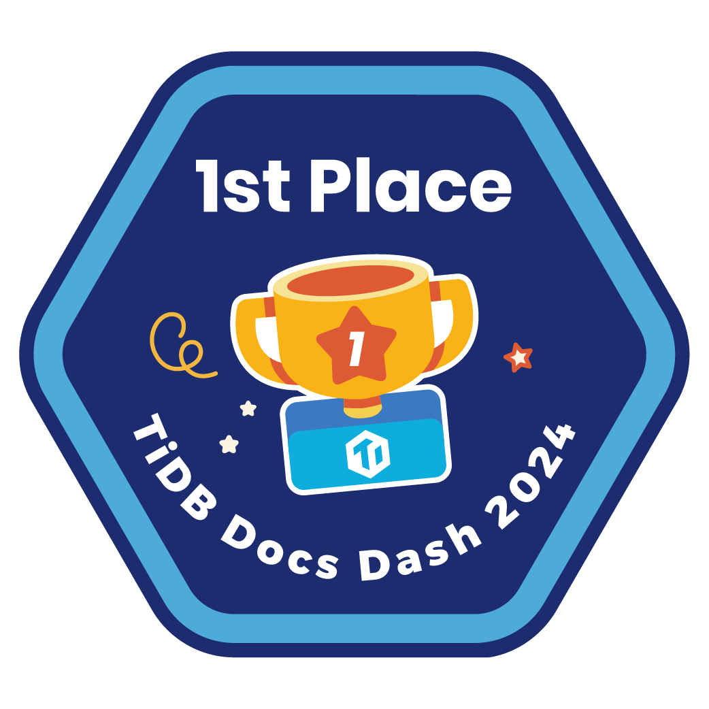

# How to Add TiDB Docs Dash Badges to your GitHub Profile

Your [GitHub profile](https://docs.github.com/en/account-and-profile/setting-up-and-managing-your-github-profile/customizing-your-profile/about-your-profile) is more than just a collection of repositories; it is your professional identity in the coding world.

This guide walks you through the steps of adding [TiDB Docs Dash 2024](https://www.pingcap.com/event/tidb-docs-dash/) badges to your GitHub profile.

### Adding a Profile README

Your GitHub profile is more than just a collection of repositories;
it's your professional identity in the coding world.
With Vaunt, you can take this identity to the next level by seamlessly
integrating a dynamic SVG Developer Card and Community Board directly into your GitHub README.
Let's get started:

See the [GitHub Docs](https://docs.github.com/en/account-and-profile/setting-up-and-managing-your-github-profile/customizing-your-profile/managing-your-profile-readme)
for more information about managing your profile README.

#### Create a New Repository

- In the upper-right corner of any page, click on the "+" icon, then select "New repository"
- Enter a repository name that matches your GitHub username (e.g., "yourusername")
- Choose Public for visibility
- Check the "Initialize this repository with a README file" option
- Click "Create repository"

### Editing a Profile README

#### Edit Your README

- After creating the repository, click on "Edit README" above the right sidebar
- Your README file is now open for editing

#### Integrate the Achievement Card



- Add this code to your README file and replace `{{github_username}}` with your username

```HTML
<p>
  
</p>
```

#### Integrate the Vaunt Developer Card (Optional)

<p>
    <a href="https://vaunt.dev">
        
    </a>
</p>

Add this code to your README file and replace `{{github_username}}` with your username

```HTML
<p>
    <a href="https://vaunt.dev">
        
    </a>
</p>
```

#### Integrate Community Boards (Optional)

[](https://community.vaunt.dev/board/pingcap)

Take collaboration to the next level by integrating Vaunt's Community Board.

- Explore [Your Own Community Boards](https://community.vaunt.dev/)
- Add this code to your README file and replace `{{github_username}}` with your username

```Markdown
[](https://community.vaunt.dev/board/{{github_username}})
```

### Commit Changes

- Once you've added Vaunt elements to your README, scroll up and commit the changes directly from GitHub.

Your GitHub profile now proudly displays a dynamic Developer Card and Community Board, offering a snapshot of your contributions and achievements.

## Install Vaunt on GitHub Marketplace

By integrating Vaunt into your README, you're not just showcasing your code; you're telling the story of your coding journey.
Unlock the full potential of your GitHub profile with Vaunt and make your mark in the open-source community.

[Install Vaunt](https://github.com/marketplace/vaunt-dev) today and start showcasing more of your contributions!

**TIP**

We recommend installing Vaunt on all owned repositories.
This ensures that your contributions are counted accurately.
That said, by default all public contributions will be counted.
