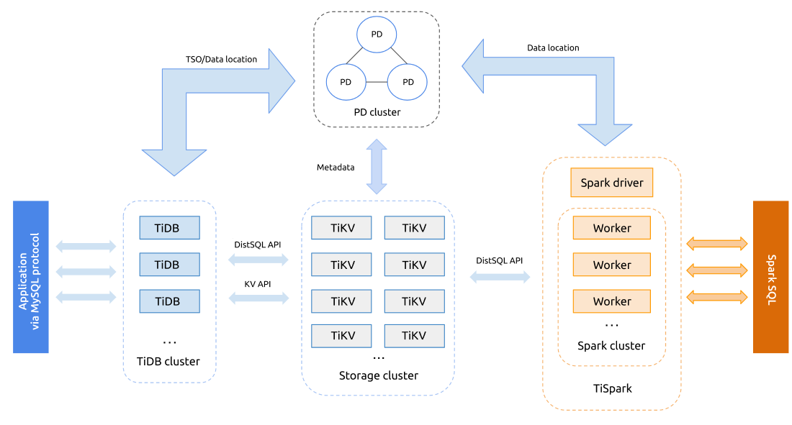

-   [About TiDB](#about-tidb)
-   [About this guide](#about-this-guide)
-   [Deploy a TiDB cluster](#deploy-a-tidb-cluster)
    -   [1. Prepare the systems](#1-prepare-the-systems)
    -   [2. Install Ansible in the Control
        Machine](#2-install-ansible-in-the-control-machine)
    -   [3. Download TiDB-Ansible to the Control
        Machine](#3-download-tidb-ansible-to-the-control-machine)
    -   [4. Allocate machine resources and edit the `inventory.ini` file
        in the Control
        Machine](#4-allocate-machine-resources-and-edit-the-inventory.ini-file-in-the-control-machine)
    -   [5. Deploy the TiDB cluster](#5-deploy-the-tidb-cluster)
    -   [6. Start the cluster](#6-start-the-cluster)
-   [Try TiDB](#try-tidb)
    -   [Create, show, and drop a
        database](#create-show-and-drop-a-database)
    -   [Create, show, and drop a table](#create-show-and-drop-a-table)
    -   [Create, show, and drop an
        index](#create-show-and-drop-an-index)
    -   [Insert, select, update, and delete
        data](#insert-select-update-and-delete-data)
    -   [Create, authorize, and delete a
        user](#create-authorize-and-delete-a-user)
-   [Monitoring a TiDB cluster](#monitoring-a-tidb-cluster)
    -   [About the key metrics](#about-the-key-metrics)
-   [Scale the TiDB cluster](#scale-the-tidb-cluster)
-   [Destroy the cluster](#destroy-the-cluster)

## About TiDB

TiDB is a distributed open source SQL database and supports the best features of both Traditional RDBMS and NoSQL. TiDB is compatible with MySQL and features in infinite horizontal scalability, strong consistency, and high availability. The goal of TiDB is to serve as a one-stop solution for online transactions and analysis.

## About this guide

This guide outlines how to perform a quick deployment of a TiDB cluster using TiDB-Ansible and walks you through the basic TiDB operations and administrations.


## Deploy a TiDB cluster

This section describes how to deploy a TiDB cluster. A TiDB cluster consists of different components: TiDB servers, TiKV servers, and Placement Driver (PD) servers.

The architecture is as follows:




### 1. Prepare the systems

Before you start, make sure that you have:

1.1 A Control Machine with the following requirements:

- Python 2.6 or Python 2.7

- Python Jinja2 2.7.2 and MarkupSafe 0.11 packages. You can use the following commands to install the packages:
	```
	pip install Jinja2 == 2.7.2 MarkupSafe == 0.11
	```
	
- Access to the managed nodes via SSH using password login or SSH authorized_key login. 
	
1.2  Several managed nodes with the following requirements:

- 4 or more machines. At least 3 instances for TiKV. Don’t deploy TiKV together with TiDB or PD on the same machine. See [deploying recommendations](https://github.com/pingcap/docs/blob/master/op-guide/recommendation.md).
   
- Operating system:
   		
	- Ubuntu, CentOS 7.2 or later, or Docker
	   		
	- X86_64 architecture (AMD64)
	   		
	- Kernel version 3.10 or later
			
	- Ext4 file system. 

- Network between machines. Turn off the firewalls and iptables when deploying and turn them on after the deployment.

- The same time and time zone for all machines with the NTP service on to synchronize the correct time.

- A remote user account which you can use to login from the Control Machine to connect to the managed nodes via SSH. It can be the root user or a user account with sudo privileges. 

- Python 2.6 or Python 2.7

**Note:** The Control Machine can be one of the managed nodes with access to external network to download binary.

### 2. Install Ansible in the Control Machine

Install Ansible 2.3 or later to your platform: 

- PPA source on Ubuntu:
	
	```
	sudo add-apt-repository ppa:ansible/ansible
	sudo apt-get update
	sudo apt-get install ansible
	```
 
- EPEL source on CentOS:
	
	```
	yum install epel-release
	yum update
	yum install ansible
	```
 
- Homebrew on macOS:
	
	To install Homebrew, see [Homebrew]( https://brew.sh ).
	 
	```
	brew update
	brew install ansible
	```
 
- Docker
	
	Install and configure Docker for your own platform.
	```
	docker run -v `pwd`:/playbook --rm -it williamyeh/ansible:ubuntu16.04 /bin/bash
	cd /playbook # 
	```
	**Note:** The above command mounts the current working directory as the /playbook directory in the container.
		
 You can use the `ansible –version` command to see the version information.

For more information, see [Ansible Documentation](http://docs.ansible.com/ansible/intro_installation.html).


### 3. Download TiDB-Ansible to the Control Machine
Download the latest master version of the ZIP package from GitHub [TiDB-Ansible project](https://github.com/pingcap/tidb-ansible) or [click to download]( https://github.com/pingcap/tidb-ansible/Archive/master.zip).
 
 
### 4. Allocate machine resources and edit the `inventory.ini` file in the Control Machine

The standard Cluster has 6 machines: 

- 2 TiDB instances, the first TiDB instance is used as a monitor 
- 3 PD instances
- 3 TiKV instances
 
The cluster topology is as follows:

| Name | Host IP | Services |
| ---- | ------- | -------- |
| node1 | 172.16.10.1 | PD1, TiDB1 |
| node2 | 172.16.10.2 | PD2, TiDB2 |
| node3 | 172.16.10.3 | PD3 |
| node4 | 172.16.10.4 | TiKV1 |
| node5 | 172.16.10.5 | TiKV2 |
| node6 | 172.16.10.6 | TiKV3 |
 
Edit the `inventory.ini` file:
 
```
[tidb_servers]
172.16.10.1
172.16.10.2
 
[pd_servers]
172.16.10.1
172.16.10.2
172.16.10.3
 
[tikv_servers]
172.16.10.4
172.16.10.5
172.16.10.6
 
[monitored_servers:children]
tidb_servers
tikv_servers
pd_servers
 
[monitoring_servers]
172.16.10.1
 
[grafana_servers]
172.16.10.1
```
 
### 5. Deploy the TiDB cluster

Use the normal user with the sudo privileges to deploy TiDB:
	
5.1 Edit the `inventory.ini` file as follows:
	
	 ```
	  ## Connection
	  # ssh via root:
	  # ansible_user = root
	  # ansible_become = true
	  # ansible_become_user = tidb
	  
	  # ssh via normal user
	  ansible_user = tidb
	 ```
5.2 Connect to the network and download the TiDB, TiKV, and PD binaries:
		
		ansible-playbook local_prepare.yml
	                                           
5.3 Initialize the system environment of the target machines and modify the kernel parameters:
	
		ansible-playbook bootstrap.yml -k -K
	 
**Note:** 
	- Add the `-k` (lowercase) parameter if password is needed to connect to the managed node. This applies to other playbooks as well.
	- Add the `-K`(uppercase) parameter because this playbook needs root privileges.
	            
5.4 Deploy the TiDB cluster:
	 
	    ansible-playbook deploy.yml -k

### 6. Start the cluster
	
Start the TiDB cluster: 
		
	ansible-playbook start.yml -k

Use the MySQL client to connect to the TiDB cluster:
	  	
	  mysql -u root-h 172.16.10.1 -P 4000
	  
**Note:** The TiDB service default port is 4000.
	  

## Try TiDB

After the TiDB cluster is deployed, you can
This section describes some basic CRUD operations in TiDB.

### Create, show, and drop a database

You can use the `CREATE DATABASE` statement to create a database. 

The Syntax is as follows:

    CREATE DATABASE db_name [options];
  
For example, the following statement creates a database with the name `samp_db`:

	CREATE DATABASE IF NOT EXISTS samp_db;

You can use the `SHOW DATABASES` statement to show the databases:

    SHOW DATABASES;

You can use the `DROP DATABASE` statement to delete a database, for example:

    DROP DATABASE samp_db;

### Create, show, and drop a table

Use the `CREATE TABLE` statement to create a table. The Syntax is as follows:

	`CREATE TABLE table_name column_name data_type constraint`
 
For example:

    CREATE TABLE person (
    number INT(11),
    name VARCHAR(255),
    birthday DATE
    );

Add `IF NOT EXISTS` to prevent an error if the table exists:

    CREATE TABLE IF NOT EXISTS person (
      number INT(11),
      name VARCHAR(255),
    birthday DATE
    );

Use the `SHOW CREATE` statement to see the statement that creates the table. For example:

    SHOW CREATE table person;

Use the `SHOW FULL COLUMNS` statement to display the information about a table. For example:

    SHOW FULL COLUMNS FROM person;

Use the `DROP TABLE` statement to delete a table. For example:

    DROP TABLE person;

or

    DROP TABLE IF EXISTS person;

Use the `samp_db` statement to show all the tables in a database. For example:

    SHOW TABLES FROM samp_db;


### Create, show, and drop an index

For the columns whose value is not unique, you can use the `CREATE INDEX` or `ALTER TABLE` statements. For example:

    CREATE INDEX person_num ON person (number);
    
or

    ALTER TABLE person ADD INDEX person_num (number)；

You can also create unique indexes for the columns whose value is unique. For example:

    CREATE UNIQUE INDEX person_num ON person (number);
   
or 
   
    ALTER TABLE person ADD UNIQUE person_num  on (number);
    
Use the `SHOW INDEX` to display all the indexes in a table:

	SHOW INDEX from person;

Use the `ALTER TABLE` or `DROP INDEX` to delete an index. Like the `CREATE INDEX` statement, `DROP INDEX` can also be embedded in the `ALTER TABLE` statement. For example:

    DROP INDEX person_num ON person;
    ALTER TABLE person DROP INDEX person_num;

### Insert, select, update, and delete data

Use the `INSERT` statement to insert data into a table. For example: 

    INSERT INTO person VALUES("1","tom","20170912");
    
Use the `SELECT` statement to see the data in a table. For example:     
    
    SELECT * FROM person;
    +--------+------+------------+
    | number | name | birthday   |
    +--------+------+------------+
    |      1 | tom  | 2017-09-12 |
    +--------+------+------------+

Use the `UPDATE ` statement to update the data in a table. For example:

    UPDATE person SET birthday='20171010' WHERE name='tom';
    
    SELECT * FROM person;
    +--------+------+------------+
    | number | name | birthday   |
    +--------+------+------------+
    |      1 | tom  | 2017-10-10 |
    +--------+------+------------+

Use the `DELETE` statement to delete the data in a table. For example:

    DELETE FROM person WHERE number=1;
    SELECT * FROM person;
    Empty set (0.00 sec)


### Create, authorize, and delete a user

Use the `CREATE USER` statement to create a user named `tiuser` with the passwword `1236456`:

    CREATE USER 'tiuser'@'localhost' IDENTIFIED BY '123456';

Grant `tiuser` to privilege to retrieve the tables in the `samp_db` database:

    GRANT SELECT ON samp_db .* TO 'tiuser'@'localhost';
 
Check the privileges of `tiuser`:

    show grants for tiuser@localhost;

Delete `tiuser`:

    DROP USER 'tiuser'@'localhost';
    
## Monitoring a TiDB cluster

Open a browser to access the monitoring platform:

	http://172.16.10.1:3000
	    
The default account and password are: admin/admin.


### About the key metrics
 

| Service| Metric| Description | Normal Range |
| -------- |-------------| ---- |-----|
|TiDB  |99% tidb\_server\_handle\_query\_duration\_seconds| the 99th percentile query response time of | less than 100ms|
|TiDB  |90% tidb\_server\_handle\_query\_duration\_seconds| the 90th percentile query response time |less than 10ms|
|TiDB  | memory usage | the memory usage of TiDB | The normal range is from dozens of MB to hundreds of MB. If the memory usage of a TiDB server surges, there must be a large transaction.|
|TiDB  | TiDB server QPS| the QPS of the cluster | application specific|
|TiDB  | Client connection count | the number of connections from application servers to the database | Application specific. If the number of connections hops, you need to find out the reasons. If it drops to `0`, you can check if the network is broken; if it surges, you need to check the application.|
|TiDB  | Schema Lease Error| If TiDB does not access the schema in TiKV in time, this error is displayed. If the value of this metric is not `0`, you need to find out the reason. It might be because it is slow to access TiKV, or because the value of the `--lease` option in TiDB is set to be too small.| 0|
|TiKV  | 99% scheduler command duration| the 99th percentile command duration | less than 50ms|
|TiKV  | 99.99% scheduler command duration| the 99.99th percentile command duration | less than 100ms |
|TiKV  | 99% storage async_request duration| the 99th percentile Raft command duration | less than 50ms |
|TiKV  | 99.99% storage async_request duration| the 99.99th percentile Raft command duration  | less than 100ms |
|TiKV  | server report failure message | There might be an issue with the network or the message might not come from this cluster.| If there are large amount of messages which contains `unreachable`, there might be an issue with the network. If the message contains `store not match`, the message does not come from this cluster.|
|TiKV  | Vote | the frequency of the Raft vote | Usually, the value only changes when there is a split. If the value of `Vote` remains high for a long time, the system might have a severe issue and some nodes are not working.|
|TiKV  | 99% and 99.99% coprocessor request duration| the 99th percentile and the 99.99th percentile coprocessor request duration | Application specific. Usually, the value does not remain high.|
|TiKV  | channel full| The channel is full and the threads are too busy. | If the value is bigger than `0` , the threads are too busy. |
|PD  | 99% etcd\_disk\_wal\_fsync\_duration\_seconds_bucket | the 99th percentile duration to flush etcd | less than 50ms|
|PD  |99.99% etcd\_disk\_wal\_fsync\_duration\_seconds\_bucket | the 99.99th percentile duration to flush etcd | less than 100ms|
|PD  | 99% pd\_cmd\_handle\_completed\_cmds\_duration\_seconds\_bucket | the 99th percentile duration to complete a pd-server request | less than 5ms|
|PD  | 99.99% pd\_cmd\_handle\_completed\_cmds\_duration\_seconds\_bucket| the 99.99th percentile duration to complete a pd-server request | less than 50ms|
|PD  |99% pd\_client\_request\_handle\_requests\_duration\_seconds\_bucket | the 99th percentile duration to complete a pd-client request | less than 5ms|
|PD  | 99.99% pd\_client_request\_handle\_requests\_duration\_seconds\_bucket|the 99.99th percentile duration to complete a pd-client request | less than 50ms|
|PD  | pd\_cluster\_status{type="store\_max\_diff\_storage\_ratio"} | the storage ratio difference of the nodes with the biggest storage ratio and the smallest storage ratio | The value fluctuate around `0.05`. If it's stable, the value is smaller than 0.05.|
|PD  | pd\_cluster\_status{type=”store\_max\_diff\_leader\_ratio”} | the storage ratio difference of the nodes with the biggest storage ratio and the smallest storage ratio | The value fluctuate around `0.05`. If it's stable, the value is smaller than 0.05.|


## Scale the TiDB cluster
The capacity of a TiDB cluster can be increased or reduced without affecting the online services.

For example, if you want to add a TiDB node with the IP address: 172.16.10.101. You can use the following procedure:

1. Edit the `inventory.ini` file and append the node information:
 
	```
	[tidb_servers]
	172.16.10.1
	172.16.10.2
	172.16.10.101
	 
	[pd_servers]
	172.16.10.1
	172.16.10.2
	172.16.10.3
	 
	[tikv_servers]
	172.16.10.4
	172.16.10.5
	172.16.10.6
	 
	[monitored_servers:children]
	tidb_servers
	tikv_servers
	pd_servers
	 
	[monitoring_servers]
	172.16.10.1
	 
	[grafana_servers]
	172.16.10.1
	```
	Now you the topology is as follows:
	
	| Name | Host IP | Services |
	| ---- | ------- | -------- |
	| node1 | 172.16.10.1 | PD1, TiDB1 |
	| node2 | 172.16.10.2 | PD2, TiDB2 |
	| node3 | 172.16.10.3 | PD3 |
	| node3 | 172.16.10.101 | TiDB3 |
	| node4 | 172.16.10.4 | TiKV1 |
	| node5 | 172.16.10.5 | TiKV2 |
	| node6 | 172.16.10.6 | TiKV3 |
	
2. Initialize the newly added node:
	
		ansible-playbook bootstrap.yml -k
3. Edit the inventory.ini file as follows:

	```
	  ## Connection
	  # ssh via root:
	  # ansible_user = root
	    ansible_become = true
	  # ansible_become_user = tidb
		
	  # ssh via normal user
	  ansible_user = tidb
		  
	```
4. Deploy the cluster:
		
		ansible-playbook deploy.yml -k
5. Roll upgrade the entire cluster:
		
		ansible-playbook rolling_update.yml -k
6. Monitor the status of the entire cluster and the newly added node by opening a browser to access the monitoring platform:
	http://172.16.10.1:3000

You can use the same procedure to add a TiKV node. But to add a PD node, some configuration files need to be manually updated. 

To add a PD node with the IP address: 172.16.10.102. You can use the following procedure:

1. Edit the `inventory.ini` file and append the node information:
 
	```
	[tidb_servers]
	172.16.10.1
	172.16.10.2
	 
	[pd_servers]
	172.16.10.1
	172.16.10.2
	172.16.10.3
	172.16.10.102
	 
	[tikv_servers]
	172.16.10.4
	172.16.10.5
	172.16.10.6
	 
	[monitored_servers:children]
	tidb_servers
	tikv_servers
	pd_servers
	 
	[monitoring_servers]
	172.16.10.1
	 
	[grafana_servers]
	172.16.10.1
	```
	
	Now you the topology is as follows:
	
	| Name | Host IP | Services |
	| ---- | ------- | -------- |
	| node1 | 172.16.10.1 | PD1, TiDB1 |
	| node2 | 172.16.10.2 | PD2, TiDB2 |
	| node3 | 172.16.10.3 | PD3 |
	| node3 | 172.16.10.102 | PD4 |
	| node4 | 172.16.10.4 | TiKV1 |
	| node5 | 172.16.10.5 | TiKV2 |
	| node6 | 172.16.10.6 | TiKV3 |
	
2. Initialize the newly added node:
	
		ansible-playbook bootstrap.yml -k
3. Edit the inventory.ini file as follows:

	```
	  ## Connection
	  # ssh via root:
	  # ansible_user = root
	    ansible_become = true
	  # ansible_become_user = tidb
		
	  # ssh via normal user
	  ansible_user = tidb
		  
	```
4. Deploy the cluster:
		
		ansible-playbook deploy.yml -k

5. Login the newly added PD node and edit the starting script: `{deploy_dir}/scripts/run_pd.sh`
	
	5.1 Remove the  `--initial-cluster="xxxx"` configuration.
	
	5.2 Add `join="http://172.16.10.1:2379"`. The IP address(`172.16.10.1`) can be any of the existing PD IP address in the cluster.
	
	5.3 Manually start the PD service in the newly added PD node:
	
		{deploy_dir}/scripts/start_pd.sh
		
	5.4 Use the `pd-ctl` and see if the New node is added successfully:
	```
	./pd-ctl -u “http://172.16.10.1:2379”
	```
	
6. Roll upgrade the entire cluster:
		
		ansible-playbook rolling_update.yml -k
6. Monitor the status of the entire cluster and the newly added node by opening a browser to access the monitoring platform:
	
		http://172.16.10.1:3000


## Destroy the cluster

Stop the cluster:

	ansible-playbook stop.yml -k
	
Destroy the cluster:

	ansible-playbook unsafe_cleanup.yml -k

