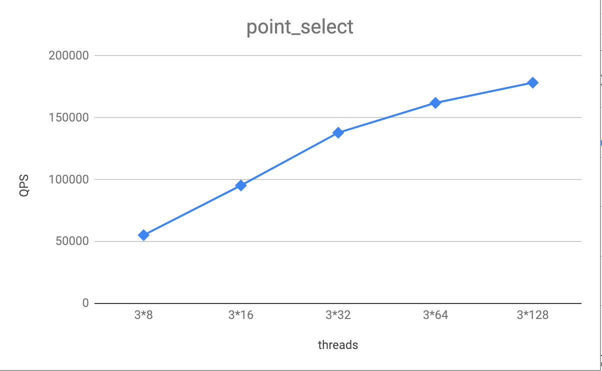
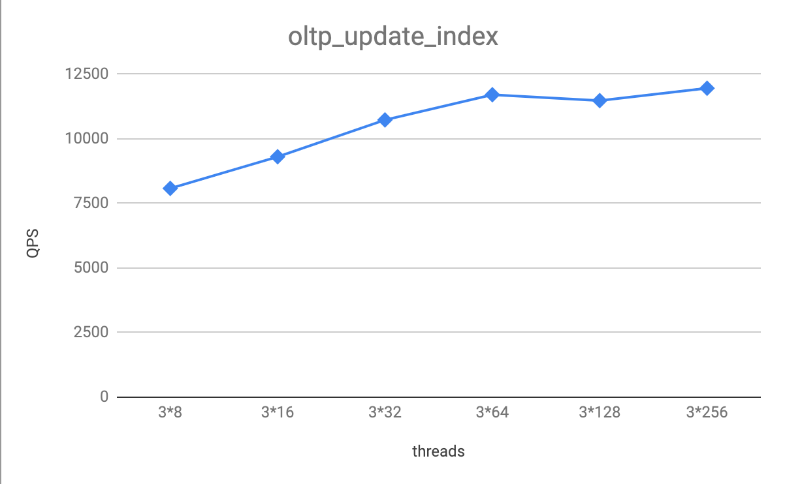
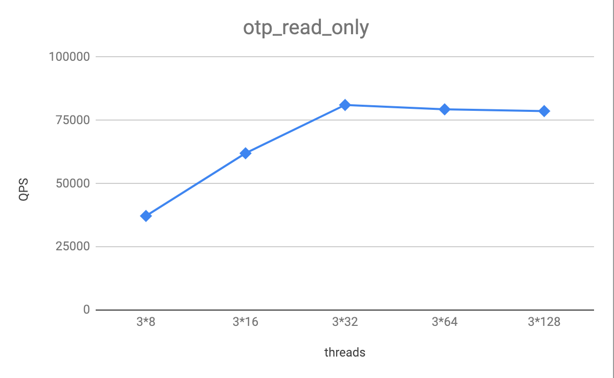

# Sysbench Test Result of TiDB 2.1.3 on NVMe SSD  

## Sysbench
In this test result, Sysbench 1.0.14 is used. It is recommended to use Sysbench with the versions later than 1.0, which can be downloaded [here](https://github.com/akopytov/sysbench/releases/tag/1.0.14).

## Test purpose
To test the performance of TiDB 2.1.3 on NVMe SSD.

## Test version, time, and place
TiDB version：v2.1.3

Time：Feburary, 2019

Place：Beijing

## Test environment
+ [Hardware requirements](https://pingcap.com/docs/op-guide/recommendation/)
+ The TiDB cluster is deployed according to the [TiDB Deployment Guide](https://pingcap.com/docs/op-guide/ansible-deployment/). Suppose there are 3 servers in total. It is recommended to deploy 1 TiDB, 1 PD and 1 TiKV on each server. As for disk space, suppose that there are 32 tables and 10M rows of data on each table, it is recommended that the disk space where TiKV's data directory resides is larger than 512 GB.
+ The number of concurrent connections to a single TiDB cluster is recommended to be under 500. If you need to increase the concurrency pressure on the entire system, you can add TiDB instances to the cluster whose number depends on the pressure of the test.

IDC machines

| Type | Name |
| --- | --- |
| OS | Linux (CentOS 7.3.1611) |
| CPU | 40 vCPUs, Intel® Xeon® CPU E5-2630 v4 @ 2.20GHz |
| RAM | 128GB |
| DISK| Intel Optane SSD P4800X 375G * 1 |
| NIC | 10Gb Ethernet |

## Test plan

### Information on TiDB versions

| Component | GitHash |
| --- | --- |
| TiDB | d842dc373a4bf9e19c1a756e1409a3ad60787d01 |
| TiKV | f8c478ad646d045fb99cdf06274a7ad229e8b822 |
| PD | e4124210b3cb423997e71c19f1830567f39329aa |

### Cluster topology

| Machine IP |	Deployment instance |
| --- | --- |
| 172.16.30.31 |	3*sysbench |
|172.16.30.33 |	1\*tidb 1\*pd 1\*tikv |
|172.16.30.34 |	1\*tidb 1\*pd 1\*tikv |
|172.16.30.35 |	1\*tidb 1\*pd 1\*tikv |

### TiDB configuration

Higher log level means fewer logs to be printed and thus positively influence TiDB performance. Turn on the `prepared plan cache` in the TiDB configuration to lower the cost of optimizing execution plan. Specifically, you can add the following command in the TiDB configuration file:

```
[log] level = "error"
```

### TiKV configuration

Higher log level also means better performance for TiKV.

As TiKV is deployed in clusters, the Raft algorithm can guarantee that data is written into most of the nodes. Therefore, apart from the scenarios where data security is extremely sensitive, the `sync-log` can be turned off in raftstore.

There are 2 Column Families (Default CF and Write CF) on TiKV cluster which are mainly used to store different types of data. For the Sysbench test, the Column Family that is used to import data has a constant proportion among TiDB clusters: 

Default CF : Write CF = 4 : 1

Configuring the block cache of RocksDB on TiKV should be based on the machine’s memory size, in order to make full use of the memory. To deploy a TiKV cluster on a 40GB virtual machine, it is suggested to configure the block cache as follows:

```
log-level = "error" [raftstore] sync-log = false [rocksdb.defaultcf] block-cache-size = "24GB" [rocksdb.writecf] block-cache-size = "6GB"
```

For more detailed information on TiKV performance tuning, see [Tune TiKV Performance](https://pingcap.com/docs/op-guide/tune-tikv/).

## Process

**Note**: This test was performed without load balancing tools such as HAproxy. We run the Sysbench test on individual TiDB node and added the results up. The load balancing tools and the parameters of different versions might also impact the performance.

### Sysbench configuration

This is an example of Sysbench configuration file:

```
mysql-host={TIDB_HOST}
mysql-port=4000
mysql-user=root
mysql-db=sbtest
time=600
threads={8, 16, 32, 64, 128, 256}
report-interval=10
db-driver=mysql
```

The above parameters can be adjusted according to actual needs. Among them, `TIDB_HOST` is the IP address of the TiDB server (because we cannot include multiple addresses in the configuration file), `threads` is the number of concurrent connections in the test, which can be adjusted in "8, 16, 32, 64, 128, 256". When importing data, it is recommended to set threads = 8 or 16. After adjusting `threads`, save the file named **config**.

See the following as a sample config **file**:

```
mysql-host=172.16.30.33
mysql-port=4000
mysql-user=root
mysql-db=sbtest
time=600
threads=16
report-interval=10
db-driver=mysql
```

### Data import

Create the `sbtest` table using the following statement in the MySQL:

```
create database sbtest;
```

Adjust the order in which Sysbench scripts create indexes. Sysbench imports data in the order of "Build Table -> Insert Data -> Create Index", which takes more time for TiDB to import data. Users can adjust the order to speed up the import of data. Suppose that you use Sysbench version https://github.com/akopytov/sysbench/tree/1.0.14. You can adjust the order in the following two ways.

 1. Download the TiDB-modified [oltp_common.lua](https://raw.githubusercontent.com/pingcap/tidb-bench/master/sysbench-patch/oltp_common.lua) file and overwrite the /usr/share/sysbench/oltp_common.lua file with it. 
 2. Move the 235th to 240th lines of /usr/share/sysbench/oltp_common.lua to be right behind 198th lines.

**Note**: this operation is optional and is only to save time from data import. 

At the command line, enter the following command to start importing data. The config file is the one configured in the previous step:

```
sysbench --config-file=config oltp_point_select --tables=32 --table-size=10000000 prepare
```

### Warming data and collecting statistics

To warm data, we load data from disk into the block cache of memory. The warmed data has significantly improved the overall performance of the system. It is recommended to warm data once after restarting the cluster.

Sysbench does not provide data warming, so it must be done manually. 

Take a table sbtest7 in Sysbench as an example. Execute the following SQL to warming up data:

```
SELECT COUNT(pad) FROM sbtest7 USE INDEX (k_7);
```

Collecting statistics helps the optimizer choose a more accurate execution plan. The `analyze` command can be used to collect statistics on the table sbtest. Each table needs statistics.

```
ANALYZE TABLE sbtest7;
```

### Point check command

```
sysbench --config-file=config oltp_point_select --tables=32 --table-size=10000000 run
```

### Update index command

```
sysbench --config-file=config oltp_update_index --tables=32 --table-size=10000000 run
```

### Read-only command

```
sysbench --config-file=config oltp_read_only --tables=32 --table-size=10000000 run
```

## Test results

32 tables are tested, each with 10M of data. 

Sysbench test was carried on each of the tidb-servers. And the final result was a sum of all the results.


### oltp_point_select：

| Type         | thread | TPS       | QPS       | avg.latency(ms) | .95.latency(ms) | max.latency(ms) |
| ------------ | ------ | --------- | --------- | --------------- | --------------- | --------------- |
| point_select | 3*8    | 55200.83  | 55200.83  | 0.43            | 0.57            | 10.56           |
| point_select | 3*16   | 95342.53  | 95342.53  | 0.50            | 0.92            | 11.94           |
| point_select | 3*32   | 137974.72 | 137974.72 | 0.69            | 1.67            | 13.92           |
| point_select | 3*64   | 162045.89 | 162045.89 | 1.18            | 3.07            | 23.05           |
| point_select | 3*128  | 178407.72 | 178407.72 | 2.14            | 5.37            | 44.08           |




### oltp_update_index:

| Type              | thread | TPS      | QPS      | avg.latency(ms) | .95.latency(ms) | max.latency(ms) |
| ----------------- | ------ | -------- | -------- | --------------- | --------------- | --------------- |
| oltp_update_index | 3*8    | 8081.40  | 8081.40  | 2.99            | 4.74            | 181.72          |
| oltp_update_index | 3*16   | 9305.74  | 9305.74  | 5.20            | 9.91            | 150.97          |
| oltp_update_index | 3*32   | 10731.12 | 10731.12 | 8.95            | 18.95           | 4823.34         |
| oltp_update_index | 3*64   | 11706.67 | 11706.67 | 16.38           | 37.56           | 5058.63         |
| oltp_update_index | 3*128  | 11480.50 | 11480.50 | 33.41           | 78.60           | 4854.81         |
| oltp_update_index | 3*256  | 11958.88 | 11958.88 | 64.19           | 153.02          | 4560.66         |




### oltp_read_only:

| Type |thread|TPS|QPS|avg.latency(ms) |.95.latency(ms)| max.latency(ms)|
| -------------- | ---------- | -------- | -------- | ------------------- | ------------------- | ------------------- |
| oltp_read_only | 3*8        | 2324.73  | 37195.69 | 10.32               | 13.22               | 113.72              |
| oltp_read_only | 3*16 | 3873.53 | 61976.50 | 12.25          | 16.12          | 56.94 |
| oltp_read_only | 3*32   | 5066.88 | 81070.16 | 19.42          | 26.20         | 123.41 |
| oltp_read_only | 3*64   | 4958.76 | 79340.27 | 39.35          | 56.84         | 231.19 |
| oltp_read_only | 3*128 | 4916.50 | 78663.92 | 78.77           | 114.72        | 479.39 |



## Common issues

### TiDB and TiKV are both properly configured under high concurrency, why is the overall performance still so low?

This issue often has things to do with the use of a proxy. You can add pressure on single TiDB server, sum each result up and compare the summed result with the result with proxy.
Take HAproxy as an example. The parameter `nbproc` can increase the number of processes it can start at most. Later versions of HAproxy also support `nbthread` and `cpu-map`. All of these can mitigate the negative impact of proxy use on performance.

### Under high concurrency, why is the CPU usage of TiKV still low?

Although the overall CPU usage is low for TiKV, CPU usage on some modules of the cluster may be high.

`raftstore`, `async apply`, and `scheduler` are the 3 modules on TiKV. These modules are single-threaded modules that can only use up to one CPU core. The maximum concurrency limits for other modules on TiKV, such as storage readpool, coprocessor, and gRPC, can be adjusted through the TiKV configuration file.

The actual CPU usage can be observed through Grafana's TiKV Thread CPU monitor panel.

+ If there is a bottleneck on single-threaded modules, TiKV nodes can be added to balance load;
+ If there is a bottleneck on multi-threaded modules, it can be adjusted by increasing the concurrency of the modules.

### Given that TiKV has not yet reached the CPU usage bottleneck under high concurrency, why is TiDB's CPU usage still low?

The TiDB parameter `grpc-concurrency` is used to control the concurrency when TiDB sends gRPC requests to TiKV. If messages are crowded on the network, you can increase this parameter to solve the problem.

CPU of NUMA architecture is used on some high-end equipment where cross-CPU access to remote memory will greatly reduce performance. By default, TiDB will use all CPUs of the server, and goroutine scheduling will inevitably lead to cross-CPU memory access.

Therefore, it is recommended to deploy n TiDBs (n is the number of NUMA CPUs) on the server of NUMA architecture, and meanwhile set the TiDB parameter `max-procs` to a value that is the same as the number of NUMA CPU cores.  

