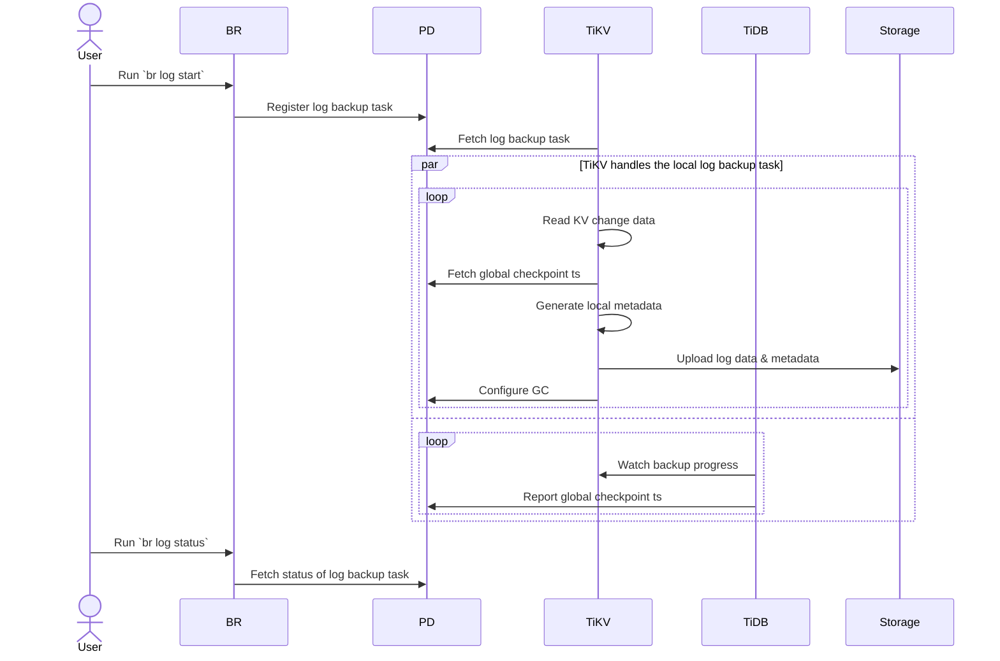
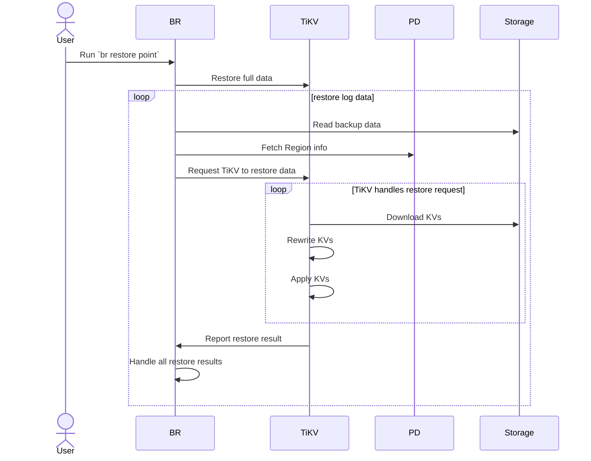

# TiDBログバックアップとPITRアーキテクチャ {#tidb-log-backup-and-pitr-architecture}

このドキュメントでは、バックアップ＆リストア（ BR ）ツールを例として、TiDBログのバックアップとポイントインタイムリカバリ（PITR）のアーキテクチャとプロセスを紹介します。

## アーキテクチャ {#architecture}

ログバックアップおよびPITRのアーキテクチャは以下のとおりです。

## ログバックアップのプロセス {#process-of-log-backup}

クラスタログのバックアップ手順は以下のとおりです。

ログバックアッププロセスに関わるシステムコンポーネントと主要概念：

-   **ローカルメタデータ**：ローカルチェックポイントts、グローバルチェックポイントts、バックアップファイル情報など、単一のTiKVノードによってバックアップされたメタデータを示します。
-   **ローカルチェックポイント ts** (ローカルメタデータ内): この TiKV ノードでローカルチェックポイント ts より前に生成されたすべてのログがターゲットストレージにバックアップされたことを示します。
-   **グローバルチェックポイント ts** ：すべての TiKV ノードでグローバルチェックポイント ts より前に生成されたすべてのログがターゲットストレージにバックアップされたことを示します。TiDB コーディネーターは、すべての TiKV ノードのローカルチェックポイント ts を収集してこのタイムスタンプを計算し、PD に報告します。
-   **TiDBコーディネーター**：TiDBノードがコーディネーターとして選出され、ログバックアップタスク全体（グローバルチェックポイントタスク）の進捗状況を収集および計算する役割を担います。このコンポーネントはステートレスな設計となっており、障害発生後は、稼働中のTiDBノードから新しいコーディネーターが選出されます。
-   **TiKVログバックアップオブザーバー**：TiDBクラスタ内の各TiKVノードで実行され、ログデータのバックアップを担当します。TiKVノードに障害が発生した場合、リージョンリーダーの再選出後、他のTiKVノードがそのノードのデータ範囲のバックアップを引き継ぎ、グローバルチェックポイントtsから始まる障害範囲のデータをバックアップします。

バックアップの全手順は以下のとおりです。

1.  BR は`br log start`コマンドを受信します。

    -   BRは、バックアップタスクのチェックポイントts（ログバックアップの開始時刻）とストレージパスを解析します。
    -   **ログバックアップタスクの登録**： BRはPDにログバックアップタスクを登録します。

2.  TiKVは、ログバックアップタスクの作成と更新を監視します。

    -   **ログバックアップタスクの取得**：各TiKVノードのログバックアップオブザーバーは、PDからログバックアップタスクを取得し、指定された範囲のログデータをバックアップします。

3.  ログバックアップオブザーバーは、KVの変更ログを継続的にバックアップします。

    -   **Read kv Change data** : KV 変更データを読み取り、変更ログ[カスタム形式でバックアップファイル](#log-backup-files)に保存します。
    -   **グローバルチェックポイントtsの取得**：PDからグローバルチェックポイントtsを取得します。
    -   **ローカルメタデータの生成**：ローカルチェックポイントts、グローバルチェックポイントts、バックアップファイル情報など、バックアップタスクのローカルメタデータを生成します。
    -   **ログデータとメタデータのアップロード**：バックアップファイルとローカルメタデータを定期的にターゲットストレージにアップロードします。
    -   **GC の設定**: PD に対して、バックアップされていないデータ (ローカル チェックポイント ts より大きいデータ) が[TiDB GCメカニズム](/garbage-collection-overview.md)によって再利用されないように要求します。

4.  TiDBコーディネーターは、ログバックアップタスクの進行状況を監視します。

    -   **バックアップの進行状況を監視する**: すべての TiKV ノードをポーリングすることにより、各リージョン(リージョンチェックポイント ts) のバックアップの進行状況を取得します。
    -   **グローバルチェックポイントtsの報告**：リージョンチェックポイントtsに基づいてログバックアップタスク全体（グローバルチェックポイントts）の進行状況を計算し、グローバルチェックポイントtsをPDに報告します。

5.  PD はログバックアップタスクの状態を保持しており、 `br log status`を使用して表示できます。

## PITRのプロセス {#process-of-pitr}

PITRのプロセスは以下のとおりです。

PITRの全プロセスは以下のとおりです。

1.  BR は`br restore point`コマンドを受信します。

    -   BRは、フルバックアップデータのアドレス、ログバックアップデータのアドレス、およびポイントインタイムリカバリ時間を解析します。
    -   バックアップデータ内の復元対象（データベースまたはテーブル）を照会し、復元対象のテーブルが存在し、復元要件を満たしているかどうかを確認します。

2.  BRはバックアップデータを完全に復元します。

    -   完全なバックアップ データを復元します。スナップショットバックアップデータの復元プロセスの詳細については、 [スナップショットバックアップデータを復元する](/br/br-snapshot-architecture.md#process-of-restore)を参照してください。

3.  BRはログバックアップデータを復元します。

    -   **バックアップデータの読み取り**：ログバックアップデータを読み取り、復元する必要のあるログバックアップデータを計算します。
    -   **リージョン情報の取得**: PD にアクセスして、すべてのリージョンのディストリビューションを取得します。
    -   **TiKVにデータ復元を要求する**：ログ復元要求を作成し、対応するTiKVノードに送信します。ログ復元要求には、復元するログバックアップデータの情報が含まれています。

4.  TiKVはBRからの復元要求を受け入れ、ログ復元ワーカーを起動します。

    -   ログ復元ワーカーは、復元する必要のあるログバックアップデータを取得します。

5.  TiKVはログバックアップデータを復元します。

    -   **KVのダウンロード**：ログ復元ワーカーは、ログ復元要求に従って、バックアップストレージから対応するバックアップデータをローカルディレクトリにダウンロードします。
    -   **KVの書き換え**：ログ復元ワーカーは、復元クラスタテーブルのテーブルIDに基づいてバックアップデータのKVデータを書き換えます。つまり、 [キー値](/tidb-computing.md#mapping-table-data-to-key-value)内の元のテーブルIDを新しいテーブルIDに置き換えます。復元ワーカーは、インデックスIDも同様に書き換えます。
    -   **KVの適用**：ログ復元ワーカーは、処理されたKVデータをRaftインターフェースを介してストア（RocksDB）に書き込みます。
    -   **レポート復元結果**: ログ復元ワーカーは復元結果をBRに返します。

6.  BRは各TiKVノードから復元結果を受け取ります。

    -   例えば ​​TiKV ノードがダウンしている場合など、 `RegionNotFound`または`EpochNotMatch`が原因でデータの復元に失敗した場合、 BR は復元を再試行します。
    -   復元に失敗し、再試行もできない場合、復元タスクは失敗します。
    -   すべてのデータが復元されると、復元タスクは成功します。

## ログバックアップファイル {#log-backup-files}

ログバックアップでは、以下の種類のファイルが生成されます。

-   `{flushTs}-{minDefaultTs}-{minTs}-{maxTs}.meta`ファイル: 各 TiKV ノードがログ バックアップ データをアップロードするたびに生成され、今回アップロードされたすべてのログ バックアップ データ ファイルのメタデータが保存されます。ファイル名の各フィールドの意味については、[バックアップファイルの構造](#structure-of-backup-files)を参照してください。
-   `{store_id}.ts`ファイル: 各 TiKV ノードがログバックアップデータをアップロードするたびに、グローバルチェックポイント ts で更新されます。 `{store_id}`は TiKV ノードのストア ID です。
-   `{min_ts}-{uuid}.log`ファイル: バックアップ タスクの KV 変更ログ データを格納します。 `{min_ts}`は、ファイル内の KV 変更ログ データの最小 TSO タイムスタンプであり、 `{uuid}`はファイル作成時にランダムに生成されます。
-   `v1_stream_truncate_safepoint.txt`ファイル: `br log truncate`によって削除されたストレージ内の最新のバックアップデータに対応するタイムスタンプを保存します。

### バックアップファイルの構造 {#structure-of-backup-files}

    .
    ├── v1
    │   ├── backupmeta
    │   │   ├── ...
    │   │   └── {flushTs}-{minDefaultTs}-{minTs}-{maxTs}.meta
    │   ├── global_checkpoint
    │   │   └── {store_id}.ts
    │   └── {date}
    │       └── {hour}
    │           └── {store_id}
    │               ├── ...
    │               └── {min_ts}-{uuid}.log
    └── v1_stream_truncate_safepoint.txt

バックアップファイルディレクトリ構造の説明：

-   `backupmeta`ディレクトリ: バックアップメタデータファイルを保存します。v8.5.3 以降、これらのファイルの命名規則は`{resolved_ts}-{uuid}.meta`から`{flushTs}-{minDefaultTs}-{minTs}-{maxTs}.meta`に変更されます。ファイル名には、次のタイムスタンプフィールドが含まれます。

    -   `flushTs` : バックアップファイルが定期的に外部ストレージにアップロードされる際のタイムスタンプ。この値はPDから取得され、グローバルに一意です。
    -   `minDefaultTs` （書き込みCFファイルのみに適用）：このバックアップでカバーされる最も早いトランザクション開始時刻。
    -   `minTs`および`maxTs` : バックアップ ファイルに含まれるすべてのキー値データの最小および最大タイムスタンプ。

    これらのタイムスタンプはすべて、長さが一定になるように左側にゼロを埋め込んだ、固定長の16桁の16進数文字列としてエンコードされます。このエンコード方式により、ファイル名が自然に辞書順にソートされるため、外部ストレージシステムでのバッチリスト表示や範囲フィルタリング操作を効率的に実行できます。

-   `global_checkpoint` : グローバルバックアップの進行状況を表します。これは`br restore point`を使用してデータを復元できる最新の時点を記録します。

-   `{date}/{hour}` ：対応する日付と時刻のバックアップデータを保存します。ストレージをクリーンアップする際は、手動でデータを削除するのではなく、必ず`br log truncate`を使用してください。これは、メタデータがこのディレクトリ内のデータを参照しているため、手動で削除すると復元失敗や復元後のデータ不整合が発生する可能性があるためです。

以下は一例です。

    .
    ├── v1
    │   ├── backupmeta
    │   │   ├── ...
    │   │   ├── 060c4bc7b0cdd582-06097a780d1ba138-060ab960016d2f00-060c0b9e47d4787b.meta
    │   │   ├── 06123bc6a0cdd591-060c3d24585be000-060c4453954a4000-060c4bc7b0cdcfa4.meta
    │   │   └── 063c2ac1c0cdd5c3-0609d2e6b3bcb064-060ab960016d2f84-060c0b9e47d47a77.meta
    │   ├── global_checkpoint
    │   │   ├── 1.ts
    │   │   ├── 2.ts
    │   │   └── 3.ts
    │   └── 20220811
    │       └── 03
    │           ├── 1
    │           │   ├── ...
    │           │   ├── 435213866703257604-60fcbdb6-8f55-4098-b3e7-2ce604dafe54.log
    │           │   └── 435214023989657606-72ce65ff-1fa8-4705-9fd9-cb4a1e803a56.log
    │           ├── 2
    │           │   ├── ...
    │           │   ├── 435214102632857605-11deba64-beff-4414-bc9c-7a161b6fb22c.log
    │           │   └── 435214417205657604-e6980303-cbaa-4629-a863-1e745d7b8aed.log
    │           └── 3
    │               ├── ...
    │               ├── 435214495848857605-7bf65e92-8c43-427e-b81e-f0050bd40be0.log
    │               └── 435214574492057604-80d3b15e-3d9f-4b0c-b133-87ed3f6b2697.log
    └── v1_stream_truncate_safepoint.txt
