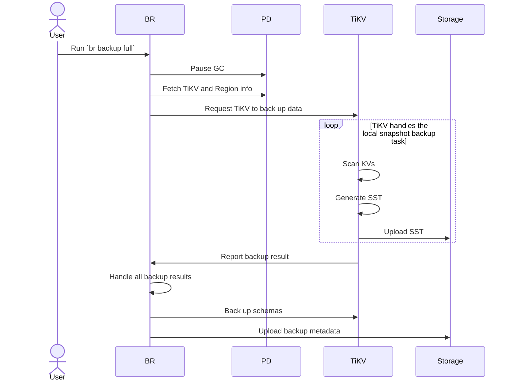
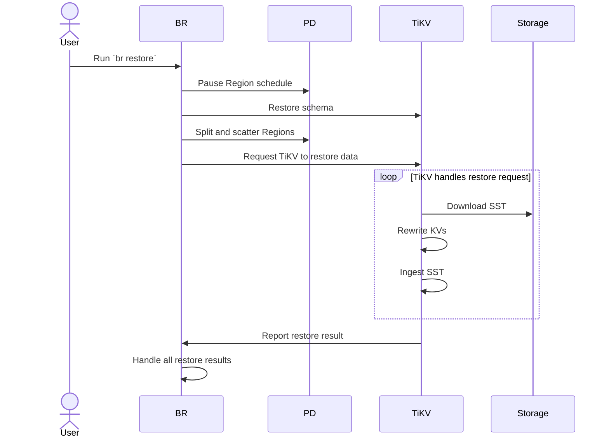

# TiDBスナップショットバックアップおよびリストアアーキテクチャ {#tidb-snapshot-backup-and-restore-architecture}

このドキュメントでは、バックアップ＆リストア（ BR ）ツールを例として、TiDBスナップショットのバックアップとリストアのアーキテクチャとプロセスについて説明します。

## アーキテクチャ {#architecture}

TiDBのスナップショットバックアップおよびリストアのアーキテクチャは以下のとおりです。

## バックアップのプロセス {#process-of-backup}

クラスタスナップショットバックアップの手順は以下のとおりです。

バックアップの全手順は以下のとおりです。

1.  BR は`br backup full`コマンドを受け取ります。

    -   バックアップの日時とストレージパスを取得します。

2.  BRはバックアップデータのスケジュールを設定します。

    -   **GCの一時停止**： BRは、TiDB [TiDB GCメカニズム](/garbage-collection-overview.md)によってバックアップデータがクリーンアップされないように、TiDB GCの時間を設定します。
    -   **TiKV とリージョン情報の取得**: BR はPD にアクセスして、すべての TiKV ノードのアドレスとデータの[リージョン](/tidb-storage.md#region)分布を取得します。
    -   **TiKVにデータバックアップを依頼する**： BRはバックアップ依頼を作成し、すべてのTiKVノードに送信します。バックアップ依頼には、バックアップのタイミング、バックアップ対象のリージョン、およびストレージパスが含まれます。

3.  TiKVはバックアップ要求を受け入れ、バックアップワーカーを起動します。

4.  TiKVはデータをバックアップします。

    -   **KVのスキャン**：バックアップワーカーは、リーダーが存在するリージョンから、バックアップ時点に対応するデータを読み取ります。
    -   **SST の生成**: バックアップ ワーカーはデータを SST ファイルに保存し、メモリに保存します。
    -   **SSTファイルのアップロード**：バックアップワーカーがSSTファイルをストレージパスにアップロードします。

5.  BRは各TiKVノードからバックアップ結果を受け取ります。

    -   リージョン変更（例えば、TiKVノードがダウンした場合）により一部のデータのバックアップが失敗した場合、 BRはバックアップを再試行します。
    -   バックアップに失敗したデータがあり、再試行もできない場合、バックアップタスクは失敗します。
    -   すべてのデータのバックアップが完了した後、 BRはメタデータのバックアップを行います。

6.  BRはメタデータをバックアップします。

    -   **スキーマのバックアップ**： BRはテーブルスキーマをバックアップし、テーブルデータのチェックサムを計算します。
    -   **メタデータのアップロード**： BRはバックアップメタデータを生成し、ストレージパスにアップロードします。バックアップメタデータには、バックアップタイムスタンプ、テーブルと対応するバックアップファイル、データチェックサム、およびファイルチェックサムが含まれます。

## 復元プロセス {#process-of-restore}

クラスタスナップショットの復元プロセスは以下のとおりです。

完全な復元手順は以下のとおりです。

1.  BR は`br restore`コマンドを受け取ります。

    -   復元するデータストレージパスとデータベースまたはテーブルを取得します。
    -   復元対象のテーブルが存在するか、また復元要件を満たしているかを確認します。

2.  BRは復元データのスケジュールを設定します。

    -   **リージョンスケジュールの一時停止**： BRは、復元中に自動リージョンスケジューリングを一時停止するようPDに要求します。
    -   **スキーマの復元**： BRはバックアップデータのスキーマ、および復元対象のデータベースとテーブルを取得します。新しく作成されたテーブルのIDは、バックアップデータのIDと異なる場合があることに注意してください。
    -   **リージョンの分割と分散**： BRはPDにバックアップデータに基づいてリージョンを分割（Split）するよう要求し、ストレージノードに均等に分散（Scatter）されるようにリージョンをスケジュールします。各リージョンには、指定されたデータ範囲`[start key, end key)`があります。
    -   **TiKVにデータ復元を依頼する**： BRは復元依頼を作成し、リージョン分割の結果に応じて対応するTiKVノードに送信します。復元依頼には、復元するデータと書き換えルールが含まれます。

3.  TiKVは復元要求を受け入れ、復元ワーカーを起動します。

    -   リストアワーカーは、リストアのために読み込む必要のあるバックアップデータを計算します。

4.  TiKVはデータを復元します。

    -   **SSTファイルのダウンロード**：復元ワーカーは、ストレージパスから対応するSSTファイルをローカルディレクトリにダウンロードします。
    -   **KVの書き換え**：復元ワーカーは、新しいテーブルIDに基づいてKVデータを書き換えます。つまり、 [キー値](/tidb-computing.md#mapping-table-data-to-key-value)内の元のテーブルIDを新しいテーブルIDに置き換えます。復元ワーカーは、インデックスIDも同様に書き換えます。
    -   **SSTの取り込み**: リストアワーカーは、処理済みの SST ファイルを RocksDB に取り込みます。
    -   **復元結果の報告**: 復元ワーカーは復元結果をBRに報告します。

5.  BRは各TiKVノードから復元結果を受け取ります。

    -   例えば ​​TiKV ノードがダウンしている場合など、 `RegionNotFound`または`EpochNotMatch`が原因でデータの復元に失敗した場合、 BR は復元を再試行します。
    -   復元に失敗し、再試行もできない場合、復元タスクは失敗します。
    -   すべてのデータが復元されると、復元タスクは成功します。

## バックアップファイル {#backup-files}

### バックアップファイルの種類 {#types-of-backup-files}

スナップショットバックアップでは、以下の種類のファイルが生成されます。

-   `SST`ファイル: TiKV ノードがバックアップするデータを格納します。 `SST`ファイルのサイズは、リージョンのサイズと同じです。
-   `backupmeta`ファイル: バックアップ タスクのメタデータを格納します。これには、すべてのバックアップ ファイルの数、キー範囲、サイズ、および各バックアップ ファイルのハッシュ (sha256) 値が含まれます。
-   `backup.lock`ファイル: 複数のバックアップ タスクが同じディレクトリにデータを保存するのを防ぎます。

### SSTファイルの命名形式 {#naming-format-of-sst-files}

データが Google Cloud Storage (GCS) または Azure Blob Storage にバックアップされる場合、SST ファイルは`storeID_regionID_regionEpoch_keyHash_timestamp_cf`の形式で命名されます。名前に含まれるフィールドについては、以下のように説明します。

-   `storeID`は TiKV ノード ID です。
-   `regionID`はリージョンID です。
-   `regionEpoch`はリージョンのバージョン番号です。
-   `keyHash`は、範囲の開始キーのハッシュ (sha256) 値であり、ファイルの一意性を保証します。
-   `timestamp`は、TiKV によって生成された SST ファイルの Unix タイムスタンプです。
-   `cf` RocksDB のカラムファミリーを示します ( `cf`が`default`または`write`であるデータのみを復元します)。

データがAmazon S3またはネットワークディスクにバックアップされる場合、SSTファイルは`regionID_regionEpoch_keyHash_timestamp_cf`という形式で命名されます。名前に含まれるフィールドについては、以下のように説明します。

-   `regionID`はリージョンID です。
-   `regionEpoch`はリージョンのバージョン番号です。
-   `keyHash`は、範囲の開始キーのハッシュ (sha256) 値であり、ファイルの一意性を保証します。
-   `timestamp`は、TiKV によって生成された SST ファイルの Unix タイムスタンプです。
-   `cf` RocksDB のカラムファミリーを示します ( `cf`が`default`または`write`であるデータのみを復元します)。

### SSTファイルの保存形式 {#storage-format-of-sst-files}

-   SST ファイルのストレージ形式の詳細については、 [RocksDBブロックベーステーブル形式](https://github.com/facebook/rocksdb/wiki/Rocksdb-BlockBasedTable-Format)を参照してください。
-   SST ファイルのバックアップ データのエンコード形式の詳細については、[テーブルデータのキー値へのマッピング](/tidb-computing.md#mapping-table-data-to-key-value)を参照してください。

### バックアップファイルの構造 {#structure-of-backup-files}

データを GCS または Azure Blob Storage にバックアップすると、SST ファイル、 `backupmeta`ファイル、および`backup.lock`ファイルは、次の構造で同じディレクトリに保存されます。

    .
    └── 20220621
        ├── backupmeta
        |—— backup.lock
        ├── {storeID}-{regionID}-{regionEpoch}-{keyHash}-{timestamp}-{cf}.sst
        ├── {storeID}-{regionID}-{regionEpoch}-{keyHash}-{timestamp}-{cf}.sst
        └── {storeID}-{regionID}-{regionEpoch}-{keyHash}-{timestamp}-{cf}.sst

データをAmazon S3またはネットワークディスクにバックアップすると、SSTファイルは`storeID`に基づいてサブディレクトリに保存されます。構造は次のとおりです。

    .
    └── 20220621
        ├── backupmeta
        |—— backup.lock
        ├── store1
        │   └── {regionID}-{regionEpoch}-{keyHash}-{timestamp}-{cf}.sst
        ├── store100
        │   └── {regionID}-{regionEpoch}-{keyHash}-{timestamp}-{cf}.sst
        ├── store2
        │   └── {regionID}-{regionEpoch}-{keyHash}-{timestamp}-{cf}.sst
        ├── store3
        ├── store4
        └── store5

## 関連項目 {#see-also}

-   [TiDBスナップショットのバックアップと復元ガイド](/br/br-snapshot-guide.md)
