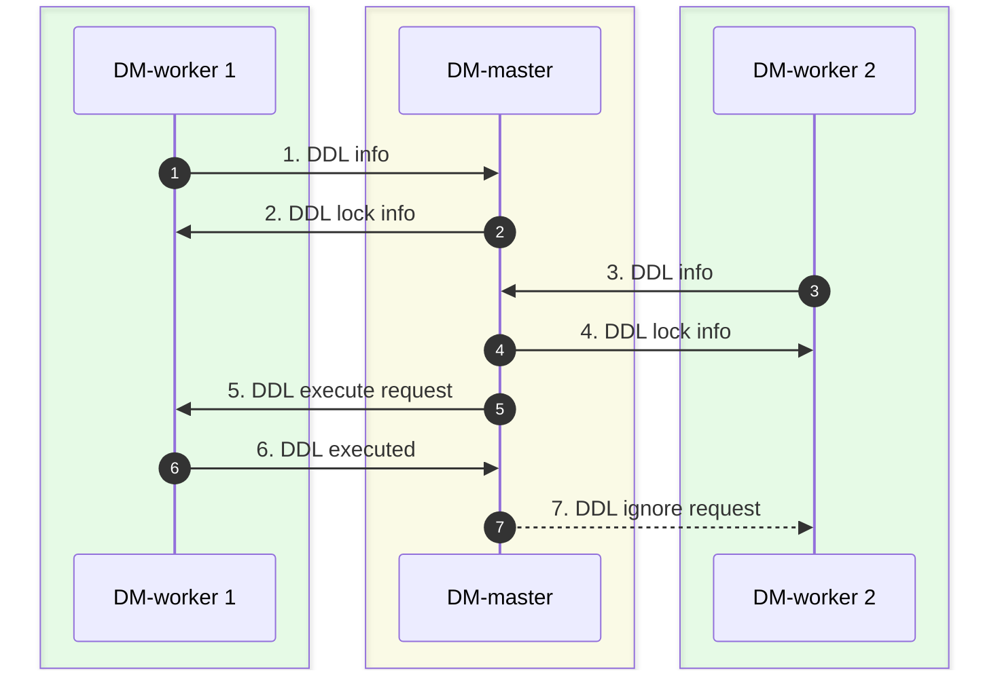

# 悲観的モードでシャーディングされたテーブルからデータをマージおよび移行する {#merge-and-migrate-data-from-sharded-tables-in-the-pessimistic-mode}

このドキュメントでは、データ移行（DM）の悲観的モード（デフォルトモード）で提供されるシャーディングサポート機能について説明します。この機能を使用すると、上流のMySQLまたはMariaDBインスタンスで同じテーブルスキーマを持つテーブルのデータを、下流のTiDBの同じテーブルにマージして移行できます。

## 制限 {#restrictions}

DM の悲観的モードでは、シャーディング DDL の使用に関して以下の制限があります。

-   論理**シャーディンググループ**（マージして同一のダウンストリームテーブルに移行する必要のあるすべてのシャーディングテーブルで構成される）の場合、移行を実行するために使用できるタスクは、シャーディングテーブルのソースを正確に含む1つのタスクに限定されます。
-   論理**シャーディンググループ**では、すべてのアップストリームのシャーディングテーブル（スキーマ名とテーブル名は異なっていても構いません）において、同じDDLステートメントを同じ順序で実行する必要があり、現在のDDL操作が完全に完了するまで、次のDDLステートメントを実行することはできません。
    -   例えば、 `column A`を`table_1`に追加してから`column B`を追加した場合、 `column B`を`table_2`に追加してから`column A` } を追加することはできません。DDL ステートメントを異なる順序で実行することはサポートされていません。
-   シャーディンググループでは、対応するDDLステートメントは、すべてのアップストリームのシャーディングテーブルで実行される必要があります。
    -   例えば、 `DM-worker-2`に対応する 1 つ以上のアップストリーム シャーディング テーブルで DDL ステートメントが実行されない場合、DDL ステートメントを実行した他の DM-worker は移行タスクを一時停止し、 `DM-worker-2`がアップストリーム DDL ステートメントを受信するのを待ちます。
-   シャーディング グループ移行タスクは`DROP DATABASE` / `DROP TABLE`をサポートしていません。
    -   DM-worker の同期ユニットは、アップストリームのシャーディングされたテーブルの`DROP DATABASE` / `DROP TABLE`ステートメントを自動的に無視します。
-   シャーディンググループ移行タスクは`TRUNCATE TABLE`をサポートしていません。
    -   DM-worker の同期ユニットは、アップストリームのシャーディングされたテーブルの`TRUNCATE TABLE`ステートメントを自動的に無視します。
-   シャーディンググループ移行タスクは`RENAME TABLE`をサポートしていますが、以下の制限があります（オンライン DDL は別のソリューションでサポートされています）。
    -   テーブルの名前は、他のテーブルで使用されていない新しい名前にのみ変更できます。
    -   単一の`RENAME TABLE`ステートメントには、単一の`RENAME`操作しか含めることができません。
-   シャーディンググループの移行タスクでは、各DDLステートメントが1つのテーブルに対する操作のみを含む必要があります。
-   増分レプリケーションタスクの開始時点では、各シャーディングテーブルのテーブルスキーマは同じである必要があります。これにより、異なるシャーディングテーブルのDMLステートメントが明確なテーブルスキーマでダウンストリームに移行され、後続のシャーディングDDLステートメントが正しくマッチングおよび移行されることが保証されます。
-   [テーブルルーティング](/dm/dm-table-routing.md)ルールを変更する必要がある場合は、すべてのシャーディング DDL ステートメントの移行が完了するまで待つ必要があります。
    -   シャーディング DDL ステートメントの移行中に、 `dmctl`を使用して`router-rules`変更するとエラーが報告されます。
-   DDL ステートメントが実行されるシャーディング グループに新しいテーブルを`CREATE`追加する必要がある場合は、テーブル スキーマが新しく変更されたテーブル スキーマと同じであることを確認する必要があります。
    -   例えば、元の`table_1`と`table_2`はどちらも最初は 2 つの列 (a、b) を持ち、シャーディング DDL 操作後には 3 つの列 (a、b、c) を持つため、移行後に新しく作成されたテーブルも 3 つの列 (a、b、c) を持つ必要があります。
-   DDLステートメントを受信したDMワーカーは、他のDMワーカーがDDLステートメントを受信するまでタスクを一時停止するため、データ移行の遅延が増加します。

## 背景 {#background}

現在、DM は`ROW`形式のbinlogを使用して移行タスクを実行します。binlogにはテーブルスキーマ情報は含まれていません。 `ROW`binlogを使用してデータを移行する場合、複数の上流テーブルを同じ下流テーブルに移行していない限り、下流テーブルのテーブルスキーマを更新できる上流テーブルの DDL 操作は 1 つしか存在しません。 `ROW`binlogは自己記述的な性質を持つと考えられます。移行プロセス中に、列の値と下流テーブルのスキーマに応じて DML ステートメントを構築できます。

ただし、シャーディングされたテーブルのマージと移行の過程で、テーブルスキーマを変更するために上流テーブルでDDLステートメントが実行された場合、列の値によって生成されたDMLステートメントと実際の下流テーブルスキーマとの間の不整合を回避するために、DDLステートメントを移行するための追加操作を実行する必要があります。

簡単な例を挙げましょう。

上記の例では、マージ処理が簡略化されており、上流には 2 つの MySQL インスタンスのみが存在し、各インスタンスには 1 つのテーブルしかありません。移行が開始されると、2 つのシャーディングされたテーブルのテーブル スキーマ バージョンは`schema V1`とマークされ、DDL ステートメントの実行後のテーブル スキーマ バージョンは`schema V2`とマークされます。

ここで、移行プロセスにおいて、上流の2つのシャーディングされたテーブルから受信したbinlogデータが、以下の時間シーケンスを持つと仮定します。

1.  移行が開始されると、DM-worker の同期ユニットは、2 つのシャーディングされたテーブルから`schema V1`の DML イベントを受信します。
2.  `t1`では、インスタンス 1 からのシャーディング DDL イベントが受信されます。
3.  `t2`以降、同期ユニットはインスタンス1から`schema V2`のDMLイベントを受信しますが、インスタンス2からは引き続き`schema V1`のDMLイベントを受信します。
4.  `t3`では、インスタンス 2 からのシャーディング DDL イベントが受信されます。
5.  `t4`以降、同期ユニットはインスタンス2からの`schema V2`のDMLイベントも受信します。

シャーディングされたテーブルの DDL ステートメントは、移行プロセス中に処理されないものとします。インスタンス 1 の DDL ステートメントがダウンストリームに移行された後、ダウンストリームのテーブル スキーマは`schema V2`に変更されます。しかし、インスタンス 2 では、DM-worker の同期ユニットは`schema V1`から`t2`への`t3`の DML イベントをまだ受信しています。そのため、 `schema V1`の DML ステートメントがダウンストリームに移行される際に、DML ステートメントとテーブル スキーマの不整合によりエラーが発生し、データが正常に移行されない可能性があります。

## 原則 {#principles}

このセクションでは、上記の例に基づき、悲観的モードでシャーディングされたテーブルをマージするプロセスにおいて、DM が DDL ステートメントをどのように移行するかを示します。

この例では、 `DM-worker-1`が MySQL インスタンス 1 からデータを移行し、 `DM-worker-2`が MySQL インスタンス 2 からデータを移行します。 `DM-master`複数の DM-worker 間で DDL 移行を調整します。 `DM-worker-1`が DDL ステートメントを受信すると、DDL 移行プロセスは次のように簡略化されます。

1.  `DM-worker-1` `t1`の MySQL インスタンス 1 から DDL ステートメントを受信し、対応する DDL および DML ステートメントのデータ移行を一時停止し、DDL 情報を`DM-master`に送信します。
2.  `DM-master`受信した DDL 情報に基づいてこの DDL ステートメントの移行を調整する必要があると判断し、この DDL ステートメントのロックを作成し、DDL ロック情報を`DM-worker-1`に送り返し、同時に`DM-worker-1`このロックの所有者としてマークします。
3.  `DM-worker-2` 、 `t3`の MySQL インスタンス 2 から DDL ステートメントを受信するまで DML ステートメントの移行を継続し、この DDL ステートメントのデータ移行を一時停止し、DDL 情報を`DM-master`に送信します。
4.  `DM-master`受信した DDL 情報に基づいて、この DDL ステートメントのロックが既に存在すると判断し、ロック情報を`DM-worker-2`に直接送信します。
5.  タスクの開始時の構成情報、アップストリームの MySQL インスタンスのシャーディングされたテーブル情報、およびデプロイメント トポロジ情報に基づいて、 `DM-master`マージされるすべてのアップストリームのシャーディングされたテーブルのこの DDL ステートメントを受信したと判断し、DDL ロックの所有者 ( `DM-worker-1` ) にこの DDL ステートメントをダウンストリームに移行するように要求します。
6.  `DM-worker-1` 、ステップ #2 で受信した DDL ロック情報に基づいて DDL ステートメント実行要求を検証し、この DDL ステートメントをダウンストリームに移行し、結果を`DM-master`に送信します。この操作が成功した場合、 `DM-worker-1`は後続の ( `t2`のbinlogから始まる) DML ステートメントの移行を続行します。
7.  `DM-master`ロック所有者から DDL が正常に実行されたという応答を受け取り、DDL ロックを待機している他のすべての DM-worker ( `DM-worker-2` ) に、この DDL ステートメントを無視し、後続の ( `t4`のbinlogから始まる) DML ステートメントの移行を続行するように要求します。

複数のDMワーカー間でシャーディングDDL移行を処理するDMの特性は、以下のようにまとめられます。

-   タスク構成とDMクラスター展開トポロジ情報に基づいて、DDL移行を調整するための論理シャーディンググループ`DM-master`に構築されます。グループメンバーは、移行タスクから分割された各サブタスクを処理するDMワーカーです。
-   binlogイベントから DDL ステートメントを受け取った後、各 DM-worker は DDL 情報を`DM-master`に送信します。
-   `DM-master`各 DM-worker から受信した DDL 情報とシャーディング グループ情報に基づいて、DDL ロックを作成または更新します。
-   シャーディンググループのすべてのメンバーが同じ特定のDDLステートメントを受信した場合、これは、アップストリームのシャーディングされたテーブルでのDDL実行前のすべてのDMLステートメントが完全に移行されたことを示しており、このDDLステートメントを実行できます。その後、DMは後続のDMLステートメントの移行を続行できます。
-   [テーブルルーター](/dm/dm-table-routing.md)によって変換された後、上流のシャーディングされたテーブルのDDLステートメントは、下流で実行されるDDLステートメントと一致している必要があります。したがって、このDDLステートメントはDDL所有者によって一度だけ実行されればよく、他のすべてのDMワーカーはこのDDLステートメントを無視できます。

上記の例では、各DMワーカーに対応するアップストリームのMySQLインスタンスでマージする必要があるのは、シャーディングされたテーブル1つだけです。しかし、実際のシナリオでは、複数のシャーディングされたスキーマに複数のシャーディングされたテーブルが存在し、それらを1つのMySQLインスタンスでマージする必要がある場合があります。このような場合、シャーディングDDLの移行を調整するのがより複雑になります。

`table_1`と`table_2`という 2 つのシャーディングされたテーブルを、1 つの MySQL インスタンスにマージすると仮定します。

データはすべて同じMySQLインスタンスから取得されるため、すべてのデータは同じbinlogストリームから取得されます。この場合、時間的な順序は次のようになります。

1.  DM-worker の同期ユニットは、移行が開始されると、両方のシャーディングされたテーブルから`schema V1`の DML ステートメントを受け取ります。
2.  `t1`では、DM-worker の同期ユニットが`table_1`の DDL ステートメントを受け取ります。
3.  `t2`から`t3`までの受信データには、 `schema V2`からの`table_1`の DML ステートメントと、 `schema V1`からの`table_2` } の DML ステートメントが含まれます。
4.  `t3`では、DM-worker の同期ユニットが`table_2`の DDL ステートメントを受け取ります。
5.  `t4`以降、DM-workerの同期ユニットは、両方のテーブルから`schema V2`のDMLステートメントを受け取ります。

データ移行中に特にDDLステートメントが処理されない場合、 `table_1`のDDLステートメントがダウンストリームに移行され、ダウンストリームのテーブルスキーマが変更されると、 `schema V1`からの`table_2` }のDMLステートメントは正常に移行されません。そのため、単一のDMワーカー内で、 `DM-master`内のものと同様の論理シャーディンググループが作成されますが、このグループのメンバーは、同じアップストリームMySQLインスタンス内の異なるシャーディングテーブルになります。

しかし、DMワーカーがシャーディンググループの移行を内部で調整する場合、それは`DM-master`によって実行されるものとは完全に同じではありません。理由は以下のとおりです。

-   DM-worker が`table_1`の DDL ステートメントを受信すると、移行を一時停止することはできず、binlogの解析を続行して、後続の`table_2`の DDL ステートメントを取得する必要があります。つまり`t2`と`t3`の間の解析を続行する必要があります。
-   `t2`と`t3`間のbinlog解析処理中、シャーディング DDL ステートメントが移行され、正常に実行されるまで、 `schema V2`の`table_1`の DML ステートメントはダウンストリームに移行できません。

DMでは、DMワーカー内でDDLステートメントをシャーディングする簡略化された移行プロセスは次のとおりです。

1.  `table_1`で`t1`の DDL ステートメントを受信すると、DM-worker は DDL 情報とbinlogの現在の位置を記録します。
2.  DM-worker は`t2`と`t3`の間のbinlogの解析を続行します。
3.  DM-worker は`schema V2`に属する`table_1`スキーマの DML ステートメントを無視し、 `schema V1`に属する`table_2`スキーマの DML ステートメントをダウンストリームに移行します。
4.  `table_2`で`t3`の DDL ステートメントを受信すると、DM-worker は DDL 情報とbinlogの現在の位置を記録します。
5.  DMワーカーは、移行タスク構成と上流のスキーマおよびテーブルの情報に基づいて、MySQLインスタンス内のすべてのシャーディングされたテーブルのDDLステートメントが受信されたと判断し、下流に移行して下流のテーブルスキーマを変更します。
6.  DM-workerは、新しいbinlogストリームの解析開始点を、ステップ1で保存された位置に設定します。
7.  DM-worker は`t2`と`t3`の間のbinlogの解析を再開します。
8.  DM-worker は`schema V2`に属する`table_1`スキーマの DML ステートメントをダウンストリームに移行し、 `schema V1`に属する`table_2`スキーマの DML ステートメントを無視します。
9.  ステップ4で保存されたbinlogの位置を解析した後、DMワーカーは、ステップ3で無視されたすべてのDMLステートメントが再びダウンストリームに移行されたと判断します。
10. DM-worker は`t4`のbinlog位置から移行を再開します。

上記の分析から、DMはシャーディングDDLの移行処理において、調整と制御のために主に2レベルのシャーディンググループを使用していることがわかります。以下に簡略化したプロセスを示します。

1.  各DMワーカーは、アップストリームのMySQLインスタンス内の複数のシャーディングテーブルで構成される対応するシャーディンググループに対して、DDLステートメントの移行を個別に調整します。
2.  DMワーカーは、シャーディングされたすべてのテーブルのDDLステートメントを受け取った後、DDL情報を`DM-master`に送信します。
3.  `DM-master`受信した DDL 情報に基づいて、DM-workers で構成されるシャーディング グループの DDL 移行を調整します。
4.  すべての DM-worker から DDL 情報を受信した後、 `DM-master` DDL ロック所有者 (特定の DM-worker) に DDL ステートメントを実行するように要求します。
5.  DDLロックの所有者はDDLステートメントを実行し、結果を`DM-master`に返します。その後、所有者はDDL移行の内部調整中に以前に無視されたDMLステートメントの移行を再開します。
6.  `DM-master`は、所有者が DDL ステートメントを正常に実行したことを確認した後、他のすべての DM-worker に移行を続行するように要求します。
7.  他のすべてのDMワーカーは、DDL移行の内部調整中に、以前に無視されたDMLステートメントの移行を個別に再開します。
8.  無視されたDMLステートメントの移行が完了すると、すべてのDMワーカーは通常の移行プロセスを再開します。
