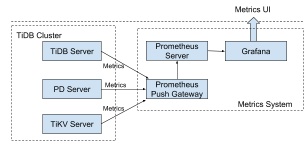
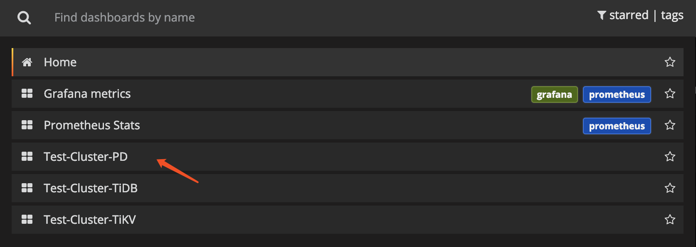

# Monitor a TiDB Cluster

You can use the following two types of interfaces to monitor the TiDB cluster state:

- [The state interface](#use-the-state-interface): this interface uses the HTTP interface to get the component information.
- [The metrics interface](#use-the-metrics-interface): this interface uses Prometheus to record the detailed information of the various operations in components and view these metrics using Grafana.

## Use the state interface

The state interface monitors the basic information of a specific component in the TiDB cluster. It can also act as the monitor interface for Keepalive messages. In addition, the state interface for the Placement Driver (PD) can get the details of the entire TiKV cluster.

### TiDB server

- TiDB API address: `http://${host}:${port}`
- Default port: `10080`
- Details about API names: see [TiDB HTTP API](https://github.com/pingcap/tidb/blob/master/docs/tidb_http_api.md)

The following example uses `http://${host}:${port}/status` to get the current state of the TiDB server and to determine whether the server is alive. The result is returned in the JSON format.

```bash
curl http://127.0.0.1:10080/status
{
    connections: 0,  # The current number of clients connected to the TiDB server.
    version: "5.7.25-TiDB-v3.0.0-beta-250-g778c3f4a5",  # The TiDB version number.
    git_hash: "778c3f4a5a716880bcd1d71b257c8165685f0d70"  # The Git Hash of the current TiDB code.
}
```

### PD server

- PD API address: `http://${host}:${port}/pd/api/v1/${api_name}`
- Default port: `2379`
- Details about API names: see [PD API doc](https://cdn.rawgit.com/pingcap/docs/master/op-guide/pd-api-v1.html)

The PD interface provides the state of all the TiKV servers and the information about load balancing. See the following example for the information about a single-node TiKV cluster:

```bash
curl http://127.0.0.1:2379/pd/api/v1/stores
{
  "count": 1,  # The number of TiKV nodes.
  "stores": [  # The list of TiKV nodes.
    # The details about the single TiKV node.
    {
      "store": {
        "id": 1,
        "address": "127.0.0.1:20160",
        "version": "3.0.0-beta",
        "state_name": "Up"
      },
      "status": {
        "capacity": "20 GiB",  # The total capacity.
        "available": "16 GiB",  # The available capacity.
        "leader_count": 17,
        "leader_weight": 1,
        "leader_score": 17,
        "leader_size": 17,
        "region_count": 17,
        "region_weight": 1,
        "region_score": 17,
        "region_size": 17,
        "start_ts": "2019-03-21T14:09:32+08:00",  # The starting timestamp.
        "last_heartbeat_ts": "2019-03-21T14:14:22.961171958+08:00",  # The timestamp of the last heartbeat.
        "uptime": "4m50.961171958s"
      }
    }
  ]
```

## Use the metrics interface

The metrics interface monitors the state and performance of the entire TiDB cluster.

- If you use Ansible to deploy the TiDB cluster, the monitoring system (Prometheus and Grafana) is deployed at the same time.
- If you use other deployment ways, [deploy Prometheus and Grafana](#deploy-prometheus-and-grafana) before using this interface.

> **Note:** In TiDB 3.0 Beta and 2.1, Prometheus Pushgateway (an intermediary service which allows you to push metrics from jobs which cannot be scraped) is not used and not supported in the PD server and the TiDB server, while it is optional in the TiKV server. In earlier TiDB versions, the Prometheus Pushgateway is used by default, but you can also choose to not use it.
>
> - If you want to use Pushgateway, see [Use Pushgateway](#use-pushgateway).
> - If you do not want to use Pushgateway, make sure Prometheus and Grafana are deployed and then [configure Grafana](#configure-grafana).

### Deploy Prometheus and Grafana

Assume that the TiDB cluster topology is as follows:

| Name  | Host IP | Services |
| :-- | :-- | :-------------- |
| Node1 | 192.168.199.113| PD1, TiDB, node_export, Prometheus, Grafana |
| Node2 | 192.168.199.114| PD2, node_export |
| Node3 | 192.168.199.115| PD3, node_export |
| Node4 | 192.168.199.116| TiKV1, node_export |
| Node5 | 192.168.199.117| TiKV2, node_export |
| Node6 | 192.168.199.118| TiKV3, node_export |

1. Download the binary package.

    ```bash
    # Downloads the package.
    $ wget https://github.com/prometheus/prometheus/releases/download/v2.2.1/prometheus-2.2.1.linux-amd64.tar.gz
    $ wget https://github.com/prometheus/node_exporter/releases/download/v0.15.2/node_exporter-0.15.2.linux-amd64.tar.gz
    $ wget https://s3-us-west-2.amazonaws.com/grafana-releases/release/grafana-4.6.3.linux-x64.tar.gz

    # Extracts the package.
    $ tar -xzf prometheus-2.2.1.linux-amd64.tar.gz
    $ tar -xzf node_exporter-0.15.2.linux-amd64.tar.gz
    $ tar -xzf grafana-4.6.3.linux-x64.tar.gz
    ```

2. Start `node_exporter` on Node1, Node2, Node3, and Node4.

    ```bash
    $ cd node_exporter-0.15.2.linux-amd64

    # Starts the node_exporter service.
    $ ./node_exporter --web.listen-address=":9100" \
        --log.level="info" &
    ```

3. Start Prometheus in Node1.

    1. Edit the Prometheus configuration file.

        ```bash
        $ cd prometheus-2.2.1.linux-amd64
        $ vi prometheus.yml

        ...
        global:
        scrape_interval:     15s # By default, scrape targets every 15 seconds.
        evaluation_interval: 15s # By default, scrape targets every 15 seconds.
        # scrape_timeout is set to the global default value (10s).
        external_labels:
            cluster: 'test-cluster'
            monitor: "prometheus"

        scrape_configs:
        - job_name: "overwritten-nodes"
            honor_labels: true # Do not overwrite job & instance labels.
            static_configs:
            - targets:
            - '192.168.199.113:9100'
            - '192.168.199.114:9100'
            - '192.168.199.115:9100'
            - '192.168.199.116:9100'
            - '192.168.199.117:9100'
            - '192.168.199.118:9100'

        - job_name: "tidb"
            honor_labels: true # Do not overwrite job & instance labels.
            static_configs:
            - targets:
            - '192.168.199.113:10080'

        - job_name: "pd"
            honor_labels: true # Do not overwrite job & instance labels.
            static_configs:
            - targets:
            - '192.168.199.113:2379'
            - '192.168.199.114:2379'
            - '192.168.199.115:2379'

        - job_name: "tikv"
            honor_labels: true # Do not overwrite job & instance labels.
            static_configs:
            - targets:
            - '192.168.199.116:20180'
            - '192.168.199.117:20180'
            - '192.168.199.118:20180'
        ...
        ```

    2. Start the Prometheus service.

        ```bash
        # Starts Prometheus.
        $ ./prometheus \
            --config.file="./prometheus.yml" \
            --web.listen-address=":9090" \
            --web.external-url="http://192.168.199.113:9090/" \
            --web.enable-admin-api \
            --log.level="info" \
            --storage.tsdb.path="./data.metrics" \
            --storage.tsdb.retention="15d" &
        ```

4. Start Grafana in Node1.

    1. Edit the Grafana configuration file.

        ```
        $ cd grafana-4.6.3
        $ vi conf/grafana.ini

        ...

        [paths]
        data = ./data
        logs = ./data/log
        plugins = ./data/plugins
        [server]
        http_port = 3000
        domain = 192.168.199.113
        [database]
        [session]
        [analytics]
        check_for_updates = true
        [security]
        admin_user = admin
        admin_password = admin
        [snapshots]
        [users]
        [auth.anonymous]
        [auth.basic]
        [auth.ldap]
        [smtp]
        [emails]
        [log]
        mode = file
        [log.console]
        [log.file]
        level = info
        format = text
        [log.syslog]
        [event_publisher]
        [dashboards.json]
        enabled = false
        path = ./data/dashboards
        [metrics]
        [grafana_net]
        url = https://grafana.net
        ...
        ```

    2. Start the Grafana service.

        ```bash
        $ ./bin/grafana-server \
            --config="./conf/grafana.ini"
        ```

### Use Pushgateway

This section introduces the deployment architecture with Pushgateway, and describes the setting up and configuration of the monitoring system.

#### The deployment architecture



#### Set up the monitoring system

See the following links for your reference:

- Prometheus Pushgateway: [https://github.com/prometheus/pushgateway](https://github.com/prometheus/pushgateway)
- Prometheus Server: [https://github.com/prometheus/prometheus#install](https://github.com/prometheus/prometheus#install)
- Grafana: [http://docs.grafana.org](http://docs.grafana.org/)

#### Configure TiDB, PD and TiKV

You need to add the Prometheus Pushgateway addresses to the startup parameters of the TiDB, PD and TiKV components.

+ TiDB: set the two parameters: `--metrics-addr` and `--metrics-interval`.

    - Set the Pushgateway address as the `--metrics-addr` parameter.
    - Set the push frequency as the `--metrics-interval` parameter. The unit is s, and the default value is 15.

+ PD: update the toml configuration file with the Pushgateway address and the push frequency:

    ```toml
    [metric]
    # Prometheus client push interval, set "0s" to disable prometheus.
    interval = "15s"
    # Prometheus Pushgateway address, leaves it empty will disable prometheus.
    address = "host:port"
    ```

+ TiKV: update the toml configuration file with the Pushgateway address and the the push frequency. Set the job field as "tikv".

    ```toml
    [metric]
    # the Prometheus client push interval. Setting the value to 0s stops Prometheus client from pushing.
    interval = "15s"
    # the Prometheus Pushgateway address. Leaving it empty stops Prometheus client from pushing.
    address = "host:port"
    # the Prometheus client push job name. Note: A node id will automatically append, e.g., "tikv_1".
    job = "tikv"
    ```

#### Configure PushServer

Generally, the PushServer does not need to be configured, since the default port of `9091` can be used.

#### Configure Prometheus

Add the Pushgateway address to the yaml configuration file:

```yaml
 scrape_configs:
# The job name is added as a label `job=<job_name>` to any time series scraped from this config.
- job_name: 'TiDB'

  # Overrides the global default and scrape targets from this job every 5 seconds.
  scrape_interval: 5s

  honor_labels: true

  static_configs:
 - targets: ['host:port'] # Use the Pushgateway address.
labels:
  group: 'production'
```

### Configure Grafana

This section describes how to configure Grafana.

#### Step 1: Add a Prometheus data source

1. Log in to the Grafana Web interface.

    - Default address: [http://localhost:3000](http://localhost:3000)
    - Default account: admin
    - Default password: admin

2. Click the Grafana logo to open the sidebar menu.

3. Click **Data Source** in the sidebar.

4. Click **Add data source**.

5. Specify the data source information.

    - Specify a **Name** for the data source.
    - For **Type**, select **Prometheus**.
    - For **URL**, specify the Prometheus address.
    - Specify other fields as needed.

6. Click **Add** to save the new data source.

#### Step 2: Import a Grafana dashboard

To import a Grafana dashboard for the PD server, the TiKV server, and the TiDB server, take the following steps respectively:

1. Click the Grafana logo to open the sidebar menu.

2. On the sidebar menu, click **Dashboards** -> **Import** to open the **Import Dashboard** window.

3. Click **Upload .json File** to upload a JSON file (Download [TiDB Grafana Config](https://grafana.com/tidb)).

4. Click **Load**.

5. Select a Prometheus data source.

6. Click **Import**. A Prometheus dashboard is imported.

### View component metrics

Click **New dashboard** in the top menu and choose the dashboard you want to view.



You can get the following metrics for cluster components:

+ **TiDB server:**

    - Query processing time to monitor the latency and throughput
    - The DDL process monitoring
    - TiKV client related monitoring
    - PD client related monitoring

+ **PD server:**

    - The total number of times that the command executes
    - The total number of times that a certain command fails
    - The duration that a command succeeds
    - The duration that a command fails
    - The duration that a command finishes and returns result

+ **TiKV server:**

    - Garbage Collection (GC) monitoring
    - The total number of times that the TiKV command executes
    - The duration that Scheduler executes commands
    - The total number of times of the Raft propose command
    - The duration that Raft executes commands
    - The total number of times that Raft commands fail
    - The total number of times that Raft processes the ready state
