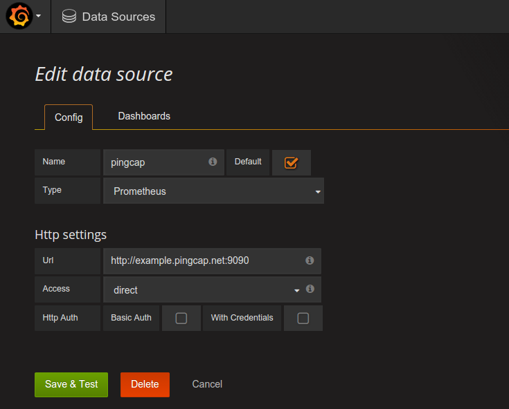

# Use prometheus in TiDB

this page shows you how to deploy prometheus and grafana.

##Preparation
Before you start, make sure that: 

+ Installed the [Pushgateway](https://github.com/prometheus/pushgateway) and [Prometheus](https://prometheus.io/docs/introduction/install)
+ Started the TiDB with [metrics-addr](https://github.com/pingcap/docs/blob/master/op-guide/configuration.md#--metrics-addr)

## Step 1. Configure the Prometheus

As an example of `prometheus.yml`:

```
#global config
global:
  scrape_interval:     15s # By default, scrape targets every 15 seconds.

# A scrape configuration containing exactly one endpoint to scrape:
# Here it's Prometheus itself.

# scrape_configs:
# The job name is added as a label `job=<job_name>` to any timeseries scraped from this config.
#  - job_name: 'prometheus'

#    Override the global default and scrape targets from this job every 5 seconds.
#    scrape_interval: 5s
#    static_configs:
#      - targets: ['localhost:9090']

scrape_configs:
  - job_name: "cluster"

    # Override the global default and scrape targets from this job every 5 seconds.
    # scrape_interval: "5s"

    # honor_labels controls how Prometheus handles conflicts between labels that are
    # already present in scraped data and labels that Prometheus would attach
    # server-side ("job" and "instance" labels, manually configured target
    # labels, and labels generated by service discovery implementations).
    #
    # If honor_labels is set to "true", label conflicts are resolved by keeping label
    # values from the scraped data and ignoring the conflicting server-side labels.
    #
    # If honor_labels is set to "false", label conflicts are resolved by renaming
    # conflicting labels in the scraped data to "exported_<original-label>" (for
    # example "exported_instance", "exported_job") and then attaching server-side
    # labels. This is useful for use cases such as federation, where all labels
    # specified in the target should be preserved.
    
    honor_labels: true

    # metrics_path defaults to '/metrics'
    # scheme defaults to 'http'.
    # here target used pushgateway address.
    static_configs:
      - targets: ['192.168.199.118:9091'] 

```

set `honor_labels:true` if you use pushgateway. and if you use docker start tidb, you should add option `-h $HOSTNAME` to define hostname in docker. After that, you can start prometheus with `prometheus.yml`.


## Step 2. To monitor TiDB with Grafana/Prometheus
Grafana supports querying Prometheus.we use grafana to show result of querying.

Install the [Grafana](http://docs.grafana.org/)

By default, Grafana will be listening on [http://localhost:3000](). The default login is "admin" / "admin".Now,open grafana address in browser.

###Creating a Prometheus data source

- To create a Prometheus data source:
    -. Click on the Grafana logo to open the sidebar menu.
    -. Click on "Data Sources" in the sidebar.
    -. Click on "Add New".
    -. Select "Prometheus" as the type.
    -. Set the appropriate Prometheus server URL (for example, http://localhost:9090/)
    -. Adjust other data source settings as desired (for example, turning the proxy access off).
    -. Click "Add" to save the new data source.

- The following shows an example data source configuration:
    

**Note**:set datasource name as `pingcap`.we will use it in Grafana graph

###Creating a Prometheus graph in Grafana

- Follow the import way of adding a new Grafana graph. Then:
    -. Click on the Grafana logo to open the sidebar menu.
    -. Click on "Dashboards" in the sidebar.
    -. Click on "Import".
    -. Click on "Upload .json File".
    -. Upload a json file in `docs/etc`.such as [tidb-grafana.json](https://github.com/pingcap/docs/blob/master/etc/tidb-grafana.json)

