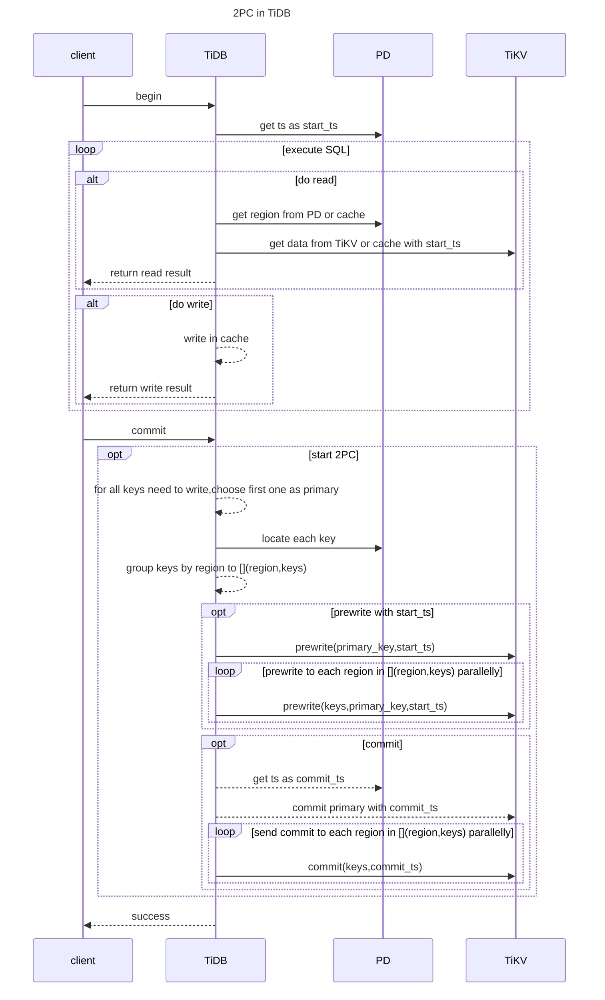

# TiDBの楽観的トランザクションモデル {#tidb-optimistic-transaction-model}

楽観的トランザクションでは、競合する変更はトランザクションのコミットの一部として検出されます。これにより、同時実行トランザクションが同じ行をまれに変更する場合にパフォーマンスが向上します。行ロックを取得するプロセスをスキップできるためです。同時実行トランザクションが同じ行を頻繁に変更する場合（競合）、楽観的トランザクションは[悲観的取引](/pessimistic-transaction.md)よりもパフォーマンスが低下する可能性があります。

楽観的トランザクションを有効にする前に、アプリケーションがステートメント`COMMIT`がエラーを返す可能性を正しく処理していることを確認してください。アプリケーションがこれをどのように処理するか不明な場合は、悲観的トランザクションを使用することをお勧めします。

> **注記：**
>
> TiDBはバージョン3.0.8以降、デフォルトで[悲観的取引モード](/pessimistic-transaction.md)を使用します。ただし、既存のクラスタをバージョン3.0.7以前から3.0.8以降にアップグレードしても、この変更は影響しません。つまり、**悲観的トランザクションモードがデフォルトで使用されるのは、新しく作成されたクラスタのみです**。

## 楽観的取引の原則 {#principles-of-optimistic-transactions}

分散トランザクションをサポートするため、TiDBは楽観的トランザクションにおいて2フェーズコミット（2PC）を採用しています。その手順は以下のとおりです。



1.  クライアントが取引を開始します。

    TiDB は、現在のトランザクションの一意のトランザクション ID として、PD からタイムスタンプ (時間とともに単調増加し、グローバルに一意) を取得します。これを`start_ts`と呼びます。TiDB はマルチバージョン同時実行制御を実装しているため、 `start_ts`このトランザクションによって取得されたデータベース スナップショットのバージョンとしても機能します。つまり、トランザクションは`start_ts`のデータベースからのみデータを読み取ることができます。

2.  クライアントは読み取りリクエストを発行します。

    1.  TiDBはPDからルーティング情報（TiKVノード間でデータがどのように分散されるか）を受け取ります。
    2.  TiDBはTiKVからバージョン`start_ts`のデータを受信する。

3.  クライアントが書き込みリクエストを発行します。

    TiDBは、書き込まれたデータが制約を満たしているかどうかを確認します（データ型が正しいこと、NOT NULL制約が満たされていることなど）。**有効なデータは、TiDB内のこのトランザクションのプライベートメモリに格納されます**。

4.  クライアントはコミット要求を発行します。

5.  TiDBは2PC方式を採用し、トランザクションの原子性を保証すると同時に、データをストア内に永続化します。

    1.  TiDBは、書き込むデータからプライマリキーを選択します。
    2.  TiDBはPDからリージョン分布情報を受け取り、それに応じてすべてのキーをリージョンごとにグループ化します。
    3.  TiDBは、関係するすべてのTiKVノードに書き込み前リクエストを送信します。その後、TiKVは競合や期限切れのバージョンがないかを確認します。有効なデータはロックされます。
    4.  TiDBはプリライトフェーズで全ての応答を受信し、プリライトは成功しました。
    5.  TiDB は PD からコミット バージョン番号を受け取り、それを`commit_ts`とマークします。
    6.  TiDBは、プライマリキーが格納されているTiKVノードへの2回目のコミットを開始します。TiKVはデータをチェックし、書き込み前フェーズで残されたロックを解除します。
    7.  TiDBは、第2フェーズが正常に完了したことを報告するメッセージを受信する。

6.  TiDBは、トランザクションが正常にコミットされたことをクライアントに通知するメッセージを返します。

7.  TiDBは、このトランザクションに残っているロックを非同期的にクリアします。

## メリットとデメリット {#advantages-and-disadvantages}

上記のTiDBにおけるトランザクション処理から、TiDBトランザクションには以下の利点があることが明らかです。

-   理解しやすい
-   単一行トランザクションに基づくクロスノードトランザクションを実装する
-   分散型ロック管理

しかし、TiDBトランザクションには次のような欠点もあります。

-   2PCによるトランザクションレイテンシー
-   タイムスタンプ割り当てを一元管理するサービスが必要
-   メモリに大量のデータが書き込まれたときに発生するOOM（メモリ不足）エラー

## トランザクションの再試行 {#transaction-retries}

> **注記：**
>
> バージョン8.0.0以降、 [`tidb_disable_txn_auto_retry`](/system-variables.md#tidb_disable_txn_auto_retry)システム変数は非推奨となり、TiDBは楽観的トランザクションの自動再試行をサポートしなくなりました。[悲観的な取引モード](/pessimistic-transaction.md)使用をお勧めします。楽観的トランザクションの競合が発生した場合は、エラーを捕捉してアプリケーションでトランザクションを再試行できます。

楽観的トランザクションモデルでは、競合が激しいシナリオで書き込み競合が発生し、トランザクションのコミットが失敗する可能性があります。TiDBはv3.0.8以降、MySQLと同様にデフォルトで[悲観的取引モード](/pessimistic-transaction.md)を使用します。これは、TiDBとMySQLが書き込みタイプのSQLステートメントの実行中にロックを追加し、Repeatable Read分離レベルによって現在の読み取りが可能になるため、コミット時に例外が発生しないことを意味します。

### 自動再試行 {#automatic-retry}

> **注記：**
>
> -   TiDB v3.0.0以降、トランザクションの自動再試行はデフォルトで無効になっています。これは、**トランザクション分離レベルを損なう**可能性があるためです。
> -   TiDB v8.0.0以降、楽観的トランザクションの自動再試行はサポートされなくなりました。

トランザクションのコミット中に書き込み競合が発生した場合、TiDB は書き込み操作を含む SQL ステートメントを自動的に再試行します。自動再試行を有効にするには、 `tidb_disable_txn_auto_retry` ～ `OFF`を設定し、再試行回数の上限を`tidb_retry_limit`に設定してください。

```toml
# Whether to disable automatic retry. ("on" by default)
tidb_disable_txn_auto_retry = OFF
# Set the maximum number of the retires. ("10" by default)
# When "tidb_retry_limit = 0", automatic retry is completely disabled.
tidb_retry_limit = 10
```

自動再試行は、セッションレベルまたはグローバルレベルのいずれかで有効にできます。

1.  セッションレベル:

    ```sql
    SET tidb_disable_txn_auto_retry = OFF;
    ```

    ```sql
    SET tidb_retry_limit = 10;
    ```

2.  世界レベル：

    ```sql
    SET GLOBAL tidb_disable_txn_auto_retry = OFF;
    ```

    ```sql
    SET GLOBAL tidb_retry_limit = 10;
    ```

> **注記：**
>
> 変数`tidb_retry_limit`は、再試行の最大回数を決定します。この変数を`0`に設定すると、自動的にコミットされる暗黙的な単一ステートメントトランザクションを含め、どのトランザクションも自動的に再試行されません。これは、TiDBの自動再試行メカニズムを完全に無効にする方法です。自動再試行が無効になると、競合するすべてのトランザクションは、エラー（メッセージ`try again later`を含む）をアプリケーションレイヤーに最速で報告します。

### 再試行の制限 {#limits-of-retry}

デフォルトでは、TiDB はトランザクションを再試行しません。これは、更新の損失や[`REPEATABLE READ`分離](/transaction-isolation-levels.md)破損につながる可能性があるためです。 。

その理由は、再試行の手順から明らかである。

1.  新しいタイムスタンプを割り当てて、それを`start_ts`とマークします。
2.  書き込み操作を含むSQL文を再試行してください。
3.  2フェーズコミットを実装する。

ステップ2では、TiDBは書き込み操作を含むSQLステートメントのみを再試行します。ただし、再試行中に、TiDBはトランザクションの開始を示す新しいバージョン番号を受け取ります。つまり、TiDBは新しいバージョン`start_ts`のデータを使用してSQLステートメントを再試行します。この場合、トランザクションが他のクエリ結果を使用してデータを更新すると、分離レベル`REPEATABLE READ`が侵害されるため、結果に矛盾が生じる可能性があります。

アプリケーションが更新の損失を許容でき、 `REPEATABLE READ`分離整合性を必要としない場合は、 `tidb_disable_txn_auto_retry = OFF`設定することでこの機能を有効にできます。

## 競合検出 {#conflict-detection}

分散データベースであるTiDBは、主に書き込み前段階で、TiKVレイヤーにおいてインメモリ競合検出を実行します。TiDBインスタンスはステートレスであり、互いの存在を認識しないため、自身の書き込みがクラスタ全体で競合を引き起こすかどうかを知ることはできません。したがって、競合検出はTiKVレイヤーで実行されます。

構成は以下のとおりです。

```toml
# Controls the number of slots. ("2048000" by default）
scheduler-concurrency = 2048000
```

さらに、TiKVはスケジューラにおける待機ラッチに費やされた時間の監視をサポートしています。


`Scheduler latch wait duration`値が高く、低速書き込みがない場合、現時点で多くの書き込み競合が発生していると安全に結論付けることができます。
