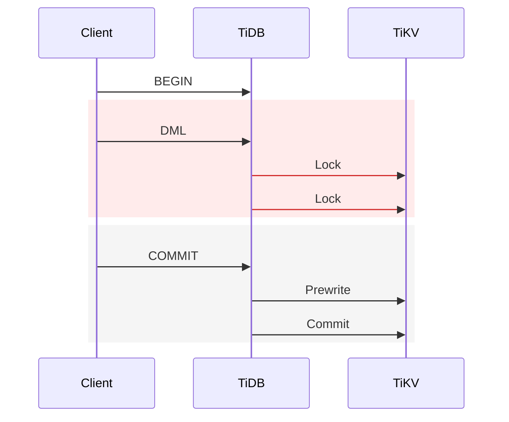
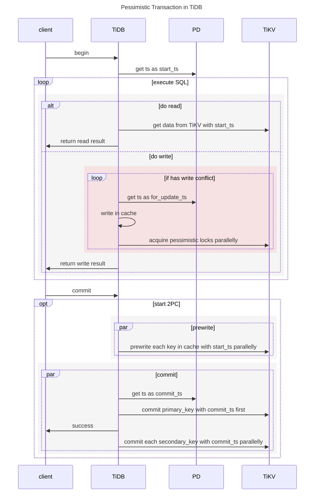
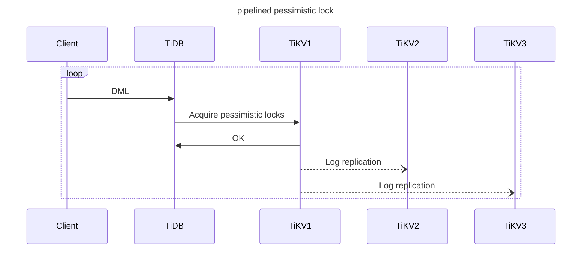

# TiDB悲観的トランザクションモード {#tidb-pessimistic-transaction-mode}

TiDBを従来のデータベースに近い形で利用できるようにし、移行コストを削減するため、バージョン3.0以降、TiDBは楽観的トランザクションモデルに加えて悲観的トランザクションモードをサポートしています。このドキュメントでは、TiDBの悲観的トランザクションモードの機能について説明します。

> **Note:**
>
> バージョン3.0.8以降、新規作成されたTiDBクラスタはデフォルトで悲観的トランザクションモードを使用します。ただし、既存のクラスタをバージョン3.0.7以前から3.0.8以降にアップグレードする場合は、この変更は影響しません。つまり、**悲観的トランザクションモードがデフォルトで使用されるのは、新規作成されたクラスタのみです**。

## トランザクションモードを切り替える {#switch-transaction-mode}

トランザクションモードは、システム変数[`tidb_txn_mode`](/system-variables.md#tidb_txn_mode)を設定することで変更できます。以下のコマンドは、クラスタ内で新しく作成されたセッションによって実行されるすべての明示的トランザクション（つまり、自動コミットされないトランザクション）を悲観的トランザクションモードに設定します。

```sql
SET GLOBAL tidb_txn_mode = 'pessimistic';
```

以下のSQL文を実行することで、悲観的トランザクションモードを明示的に有効にすることもできます。

```sql
BEGIN PESSIMISTIC;
```

```sql
BEGIN /*T! PESSIMISTIC */;
```

`BEGIN PESSIMISTIC;`および`BEGIN OPTIMISTIC;`ステートメントは`tidb_txn_mode`システム変数よりも優先されます。これらの 2 つのステートメントで開始されたトランザクションは、システム変数を無視し、悲観的トランザクションモードと楽観的トランザクションモードの両方をサポートします。

## 行動 {#behaviors}

TiDB の悲観的なトランザクションは、MySQL のトランザクションと同様に動作します。 [MySQL InnoDBとの違い](#differences-from-mysql-innodb)小さな違いを参照してください。

-   悲観的トランザクションの場合、TiDBはスナップショット読み取りと現在の読み取りを導入します。

    -   スナップショット読み取り：これは、トランザクション開始前にコミットされたバージョンを読み取る、ロックされていない読み取りです。 `SELECT`ステートメントの読み取りは、スナップショット読み取りです。
    -   現在の読み取り: これは、最新のコミット済みバージョンを読み取るロックされた読み取りです。 `UPDATE` 、 `DELETE` 、 `INSERT` 、または`SELECT FOR UPDATE`ステートメントの読み取りは、現在の読み取りです。

    以下の例は、スナップショット読み取りと現在の読み取りについて詳細に説明しています。

    | セッション1                                                                                                                | セッション2                                                                                      | セッション3                                                       |
    | :-------------------------------------------------------------------------------------------------------------------- | :------------------------------------------------------------------------------------------ | :----------------------------------------------------------- |
    | テーブル t (a INT) を作成します。                                                                                                |                                                                                             |                                                              |
    | INSERT INTO T VALUES(1);                                                                                              |                                                                                             |                                                              |
    | 悲観的な見通しから始める。                                                                                                         |                                                                                             |                                                              |
    | UPDATE t SET a = a + 1;                                                                                               |                                                                                             |                                                              |
    |                                                                                                                       | 悲観的な見通しから始める。                                                                               |                                                              |
    |                                                                                                                       | SELECT * FROM t; -- スナップショット読み取りを使用して、現在のトランザクションが開始される前にコミットされたバージョンを読み取ります。結果は a=1 を返します。 |                                                              |
    |                                                                                                                       |                                                                                             | 悲観的な見通しから始める。                                                |
    |                                                                                                                       |                                                                                             | SELECT * FROM t FOR UPDATE; -- 現在の読み取りを使用します。ロックが完了するまで待ちます。 |
    | COMMIT; -- ロックを解放します。セッション 3 の SELECT FOR UPDATE 操作がロックを取得し、TiDB は現在の読み取りを使用して最新のコミット済みバージョンを読み取ります。結果として a=2 が返されます。 |                                                                                             |                                                              |
    |                                                                                                                       | SELECT * FROM t; -- スナップショット読み取りを使用して、現在のトランザクションが開始される前にコミットされたバージョンを読み取ります。結果は a=1 を返します。 |                                                              |

-   `UPDATE` 、 `DELETE`または`INSERT`ステートメントを実行すると、**最後に**コミットされたデータが読み込まれ、データが変更され、変更された行に悲観的ロックが適用されます。

-   `SELECT FOR UPDATE`ステートメントの場合、変更された行ではなく、コミットされたデータの最新バージョンに対して悲観的ロックが適用されます。

-   トランザクションがコミットまたはロールバックされると、ロックが解除されます。データの変更を試みる他のトランザクションはブロックされ、ロックが解除されるまで待機する必要があります。TiDBはマルチバージョン同時実行制御（MVCC）を使用しているため、データの*読み取り*を試みるトランザクションはブロックされません。

-   システム変数[`tidb_constraint_check_in_place_pessimistic`](/system-variables.md#tidb_constraint_check_in_place_pessimistic-new-in-v630)設定することで、一意制約チェックによる悲観的ロックをスキップするかどうかを制御できます。[制約](/constraints.md#pessimistic-transactions)は、を参照してください。

-   複数のトランザクションが互いのロックを取得しようとすると、デッドロックが発生します。これは自動的に検出され、いずれかのトランザクションがランダムに終了し、MySQL互換のエラーコード`1213`が返されます。

-   トランザクションは、新しいロックを取得するために最大`innodb_lock_wait_timeout`秒 (デフォルト: 50) 待機します。このタイムアウトに達すると、MySQL 互換のエラー コード`1205`が返されます。複数のトランザクションが同じロックを待機している場合、優先順位はトランザクションの`start ts`に基づいておおよそ決定されます。

-   TiDBは、同一クラスタ内で楽観的トランザクションモードと悲観的トランザクションモードの両方をサポートしています。トランザクションの実行には、どちらのモードでも指定できます。

-   TiDBは`FOR UPDATE NOWAIT`構文をサポートしており、ロックが解放されるまでブロックして待機しません。代わりに、MySQL互換のエラーコード`3572`が返されます。

-   `Point Get`および`Batch Point Get`演算子がデータを読み取らない場合でも、指定された主キーまたは一意キーをロックし、他のトランザクションが同じ主キーまたは一意キーをロックしたりデータを書き込んだりすることをブロックします。

    > **Note:**
    >
    > この動作は、[Repeatable Read](/transaction-isolation-levels.md#repeatable-read-isolation-level) 分離レベルにのみ適用されます。[Read Committed](/transaction-isolation-levels.md#read-committed-isolation-level) 分離レベルでは、`Point Get`および`Batch Point Get`演算子は存在しないキーをロックしません。

-   TiDB は`FOR UPDATE OF TABLES`構文をサポートしています。複数のテーブルを結合するステートメントの場合、TiDB は`OF TABLES`内のテーブルに関連付けられている行にのみ悲観的ロックを適用します。

## MySQL InnoDBとの違い {#differences-from-mysql-innodb}

1.  TiDB が WHERE 句で範囲を使用する DML または`SELECT FOR UPDATE`ステートメントを実行する場合、範囲内の同時実行 DML ステートメントはブロックされません。

    例えば：

    ```sql
    CREATE TABLE t1 (
     id INT NOT NULL PRIMARY KEY,
     pad1 VARCHAR(100)
    );
    INSERT INTO t1 (id) VALUES (1),(5),(10);
    ```

    ```sql
    BEGIN /*T! PESSIMISTIC */;
    SELECT * FROM t1 WHERE id BETWEEN 1 AND 10 FOR UPDATE;
    ```

    ```sql
    BEGIN /*T! PESSIMISTIC */;
    INSERT INTO t1 (id) VALUES (6); -- blocks only in MySQL
    UPDATE t1 SET pad1='new value' WHERE id = 5; -- blocks waiting in both MySQL and TiDB
    ```

    この動作は、TiDBが現在*ギャップロック*をサポートしていないためです。

2.  TiDB は`SELECT LOCK IN SHARE MODE`をサポートしていません。

    TiDB はデフォルトでは`SELECT LOCK IN SHARE MODE`構文をサポートしていません。tidb_enable_noop_functions [`tidb_enable_noop_functions`](/system-variables.md#tidb_enable_noop_functions-new-in-v40)有効にすることで、TiDB を`SELECT LOCK IN SHARE MODE`構文と互換性を持たせることができます。 `SELECT LOCK IN SHARE MODE`を実行しても、ロックなしの場合と同じ効果が得られるため、他のトランザクションの読み取りまたは書き込み操作をブロックすることはありません。

    TiDB は v8.3.0 以降、 [`tidb_enable_shared_lock_promotion`](/system-variables.md#tidb_enable_shared_lock_promotion-new-in-v830)システム変数を使用して`SELECT LOCK IN SHARE MODE`ステートメントを有効にしてロックを追加することをサポートしています。ただし、この時点で追加されるロックは真の共有ロックではなく、 `SELECT FOR UPDATE`と互換性のある排他ロックであることに注意してください。読み取り中に並列書き込みトランザクションによってデータが変更されないように書き込みをブロックしつつ、TiDB を`SELECT LOCK IN SHARE MODE`構文と互換性を維持したい場合は、この変数を有効にできます。この変数を有効にすると、 [`tidb_enable_noop_functions`](/system-variables.md#tidb_enable_noop_functions-new-in-v40)が有効になっているかどうかに関係なく、 `SELECT LOCK IN SHARE MODE`ステートメントに影響します。

3.  DDLは、悲観的トランザクションコミットの失敗につながる可能性があります。

    MySQL で DDL を実行すると、実行中のトランザクションによってブロックされる可能性があります。しかし、このシナリオでは、TiDB で DDL 操作がブロックされないため、悲観的トランザクション コミット`ERROR 1105 (HY000): Information schema is changed. [try again later]`が失敗します。TiDB はトランザクションの実行中に`TRUNCATE TABLE`ステートメントを実行するため、 `table doesn't exist`エラーが発生する可能性があります。

4.  `START TRANSACTION WITH CONSISTENT SNAPSHOT`を実行した後でも、MySQL は他のトランザクションで後から作成されたテーブルを読み取ることができますが、TiDB はできません。

5.  自動コミットトランザクションは、楽観的ロックを優先します。

    悲観的モデルを使用する場合、自動コミット トランザクションはまずオーバーヘッドの少ない楽観的モデルを使用してステートメントのコミットを試みます。書き込み競合が発生した場合は、トランザクションの再試行に悲観的モデルが使用されます。したがって、 `tidb_retry_limit`が`0`に設定されていても、書き込み競合が発生すると自動コミット トランザクションは`Write Conflict`エラーを報告します。

    autocommit `SELECT FOR UPDATE`ステートメントはロックを待ちません。

6.  ステートメント内の`EMBEDDED SELECT`によって読み取られたデータはロックされていません。

7.  TiDB では、オープンなトランザクションはガベージコレクション(GC) をブロックしません。デフォルトでは、これにより悲観的トランザクションの最大実行時間が 1 時間に制限されます。この制限は、TiDB 設定ファイルの`max-txn-ttl`の下にある`[performance]`編集することで変更できます。

## 隔離レベル {#isolation-level}

TiDBは、悲観的トランザクションモードにおいて、以下の2つの分離レベルをサポートしています。

-   デフォルトでは[繰り返し読み取り可能](/transaction-isolation-levels.md#repeatable-read-isolation-level)、これは MySQL と同じです。

    > **Note:**
    >
    > この分離レベルでは、最新のコミットされたデータに基づいて DML 操作が実行されます。動作は MySQL と同じですが、TiDB の楽観的トランザクション モードとは異なります。 [TiDBとMySQLのリピータブルリードの違い](/transaction-isolation-levels.md#difference-between-tidb-and-mysql-repeatable-read)参照してください。

-   [コミット済みを読む](/transaction-isolation-levels.md#read-committed-isolation-level)。この分離レベルは[`SET TRANSACTION`](/sql-statements/sql-statement-set-transaction.md)ステートメントを使用して設定できます。

## 悲観的なトランザクションコミットプロセス {#pessimistic-transaction-commit-process}

トランザクションのコミット処理において、悲観的トランザクションと楽観的トランザクションは同じロジックを持つ。どちらのトランザクションも2フェーズコミット（2PC）方式を採用する。悲観的トランザクションの重要な特徴は、DML実行である。



悲観的トランザクションでは、2PC の前に`Acquire Pessimistic Lock`フェーズが追加されます。このフェーズには、以下の手順が含まれます。

1.  (楽観的トランザクションモードと同じ) TiDB はクライアントから`begin`リクエストを受信し、現在のタイムスタンプはこのトランザクションの start_ts です。
2.  TiDBサーバーがクライアントから書き込み要求を受信すると、TiDBサーバーはTiKVサーバーに対して悲観的ロック要求を開始し、ロックはTiKVサーバーに永続化されます。
3.  （楽観的トランザクションモードと同様）クライアントがコミット要求を送信すると、TiDB は楽観的トランザクションモードと同様に 2 フェーズコミットを実行します。



## パイプラインによるロック処理 {#pipelined-locking-process}

悲観的ロックを追加するには、TiKVにデータを書き込む必要があります。ロックの追加が成功したという応答は、 Raftを介してコミットおよび適用された後にのみTiDBに返されます。したがって、楽観的トランザクションと比較すると、悲観的トランザクションモードは必然的にレイテンシーが高くなります。

ロックのオーバーヘッドを削減するため、TiKV はパイプライン ロック プロセスを実装しています。データがロックの要件を満たすと、TiKV は直ちに TiDB に通知して後続のリクエストを実行させ、悲観的ロックに非同期で書き込みます。このプロセスにより、レイテンシーが大幅に削減され、悲観的トランザクションのパフォーマンスが大幅に向上します。ただし、TiKV でネットワーク 分断が発生した場合、または TiKV ノードがダウンした場合、悲観的ロックへの非同期書き込みが失敗し、次の点に影響が出る可能性があります。

-   同じデータを変更する他のトランザクションはブロックできません。アプリケーションロジックがロックまたはロック待機メカニズムに依存している場合、アプリケーションロジックの正確性に影響が出ます。

-   トランザクションのコミットが失敗する確率は低いが、トランザクションの正当性には影響しない。

<CustomContent platform="tidb">

アプリケーションロジックがロックまたはロック待機メカニズムに依存している場合、あるいはTiKVクラスタの異常が発生した場合でもトランザクションコミットの成功率を可能な限り保証したい場合は、パイプラインロック機能を無効にする必要があります。



この機能はデフォルトで有効になっています。無効にするには、TiKVの設定を変更してください。

```toml
[pessimistic-txn]
pipelined = false
```

TiKV クラスターが v4.0.9 以降の場合は、 [TiKV構成を動的に変更する](/dynamic-config.md#modify-tikv-configuration-dynamically)ことでこの機能を動的に無効にすることもできます。

```sql
set config tikv pessimistic-txn.pipelined='false';
```

</CustomContent>

<CustomContent platform="tidb-cloud">

アプリケーション ロジックがロックまたはロック待機メカニズムに依存している場合、または TiKV クラスター異常の場合でもトランザクション コミットの成功率をできる限り保証したい場合は、 [TiDB Cloudサポートにお問い合わせください](/tidb-cloud/tidb-cloud-support.md)。

</CustomContent>

## インメモリ悲観的ロック {#in-memory-pessimistic-lock}

TiKV v6.0.0では、インメモリ悲観的ロック機能が導入されました。この機能が有効になっている場合、悲観的ロックは通常、リージョンリーダーのメモリにのみ保存され、ディスクに永続化されたり、 Raftを介して他のレプリカに複製されたりすることはありません。この機能により、悲観的ロックの取得にかかるオーバーヘッドを大幅に削減し、悲観的トランザクションのスループットを向上させることができます。

<CustomContent platform="tidb">

メモリ内の悲観的ロックのメモリ使用量が[リージョン](/tikv-configuration-file.md#in-memory-peer-size-limit-new-in-v840)または[TiKVノード](/tikv-configuration-file.md#in-memory-instance-size-limit-new-in-v840)のメモリしきい値を超えると、悲観的ロックの取得は[パイプライン化されたロック処理](#pipelined-locking-process)に変わります。リージョンがマージされるか、リーダーが転送されると、悲観的ロックの損失を避けるために、TiKV はメモリ内の悲観的ロックをディスクに書き込み、それを他のレプリカに複製します。

</CustomContent>

<CustomContent platform="tidb-cloud">

メモリ内の悲観的ロックのメモリ使用量が[リージョン](https://docs.pingcap.com/tidb/dev/tikv-configuration-file#in-memory-peer-size-limit-new-in-v840)または[TiKVノード](https://docs.pingcap.com/tidb/dev/tikv-configuration-file#in-memory-instance-size-limit-new-in-v840)のメモリしきい値を超えると、悲観的ロックの取得は[パイプライン化されたロック処理](#pipelined-locking-process)に変わります。リージョンがマージされるか、リーダーが転送されると、悲観的ロックの損失を避けるために、TiKV はメモリ内の悲観的ロックをディスクに書き込み、それを他のレプリカに複製します。

</CustomContent>

インメモリ悲観的ロックは、パイプラインによるロック処理と同様の動作をし、クラスタが正常な状態ではロックの取得に影響を与えません。しかし、TiKVでネットワーク分離が発生した場合、またはTiKVノードがダウンした場合、取得した悲観的ロックが失われる可能性があります。

アプリケーションロジックがロック取得またはロック待機メカニズムに依存している場合、あるいはクラスタが異常状態にある場合でもトランザクションコミットの成功率を可能な限り保証したい場合は、インメモリ悲観的ロック機能**を無効にする**必要があります。

この機能はデフォルトで有効になっています。無効にするには、TiKVの設定を変更してください。

```toml
[pessimistic-txn]
in-memory = false
```

この機能を動的に無効にするには、TiKVの設定を動的に変更します。

```sql
set config tikv pessimistic-txn.in-memory='false';
```

<CustomContent platform="tidb">

バージョン8.4.0以降では、 [`pessimistic-txn.in-memory-peer-size-limit`](/tikv-configuration-file.md#in-memory-peer-size-limit-new-in-v840)またはpessimistic-txn.in-memory-instance-size-limitを使用して、リージョンまたはTiKVインスタンスのインメモリ悲観的ロックのメモリ使用量制限を[`pessimistic-txn.in-memory-instance-size-limit`](/tikv-configuration-file.md#in-memory-instance-size-limit-new-in-v840) 。

```toml
[pessimistic-txn]
in-memory-peer-size-limit = "512KiB"
in-memory-instance-size-limit = "100MiB"
```

これらの制限を動的に変更するには、次のように[TiKV構成を動的に変更する](/dynamic-config.md#modify-tikv-configuration-dynamically)。

```sql
SET CONFIG tikv `pessimistic-txn.in-memory-peer-size-limit`="512KiB";
SET CONFIG tikv `pessimistic-txn.in-memory-instance-size-limit`="100MiB";
```

</CustomContent>
