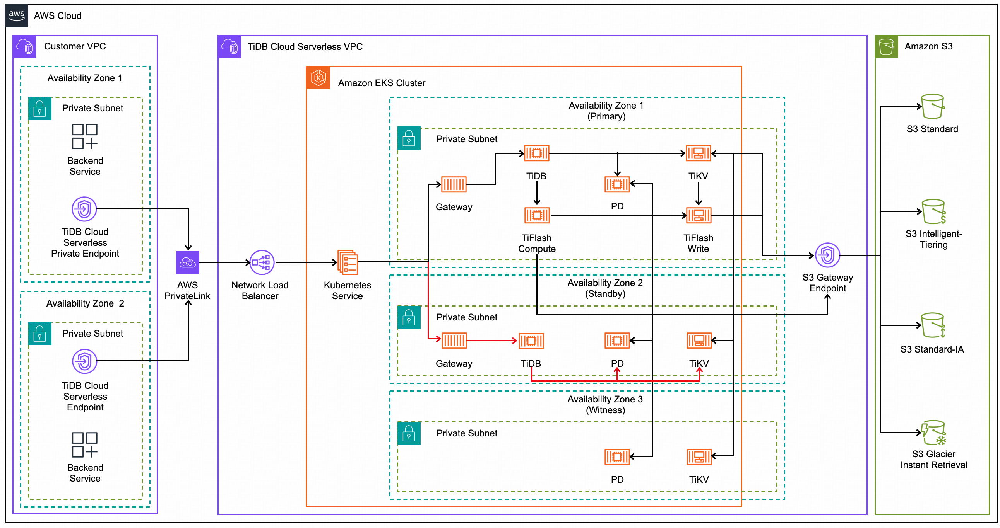

# Overview of High Availability in TiDB Cloud Serverless

TiDB Cloud Serverless is designed with robust mechanisms to maintain high availability and data durability by default, preventing single points of failure and ensuring continuous service even in the face of disruptions. As a fully managed service based on the battle-tested TiDB Open Source product, it inherits TiDB's core high availability (HA) features and augments them with additional cloud-native capabilities.

TiDB provides high availability and data durability using the Raft consensus algorithm, ensuring consistent replication of all data changes across multiple nodes. This allows TiDB to continue servicing both read and write requests, even during node failures or network partitions, guaranteeing high data durability and fault tolerance. TiDB Cloud Serverless enhances these foundational capabilities by offering two types of high availability to meet different operational requirements:

- **Zonal (Default)**: This option places all nodes in the same availability zone, resulting in lower network latency. It ensures high availability without requiring application redundancy across zones, making it ideal for applications achieving the highest availability within a single zone with minimal latency. Available in all regions supporting TiDB Cloud Serverless.

- **Regional**. This option distributes nodes across multiple availability zones, offering maximum infrastructure isolation and redundancy. While it provides the highest level of availability, it requires configuring application-level redundancy across zones. Recommended for organizations that requires the highest availability against infrastructure failures within a zone at the cost of increased latency and potential cross-zone data transfer fees. Available  in selected regions supporting multiple availability zones and can only be enabled during cluster creation.

## Zonal High Availability Architecture

When you create a cluster with default Zonal High Availability, all components, including Gateway, TiDB, TiKV, and TiFlash compute/write nodes, reside within the same avaliability zone. The placement of these components in the data plane offer infrastructure redundancy with virtual machine pools, which minimizes failover time and network latency due to colocation.

> **Note:**
>
> This is the default option and is available in all AWS regions that support TiDB Cloud Serverless.

In Zonal High Availability architecture:

- The Placement Driver (PD) is deployed across multiple availability zones, and data is always replicated redundantly across zones to ensure the highest level of availability.
- Data is replicated across TiKV servers and TiFlash write nodes within the local availability zone.
- TiDB servers and TiFlash compute nodes read from and write to these TiKV and TiFlash write nodes, which are safeguarded by storage-level replication.

### Failover Process

TiDB Cloud Serverless ensures that failover remains transparent to your applications. In the event of a failover:

- A new replica is created to replace the failed one.

- Servers offering storage services recover local cache from the persisted data on S3 and bring it online to a consistent state with their replicas.

In the storage layer, persisted data is regularly pushed to S3 for high durability. Moreover, immediate updates are not only replicated across multiple TiKV servers but also stored on the EBS of each server, which further replicates the data for even greater durability. TiDB automatically handles any issues by backing off and retrying in milliseconds. This ensures that the failover process remains transparent to the client application, requiring no intervention from the user.
The gateway and computing layer are stateless, so failover is as simple as restarting them immediately elsewhere. Applications should use retry logic for their connections. Though the Zonal setup provides excellent availability, it is limited if the entire zone is down, which would result in downtime until dependent services in that zone are restored.

## Regional High Availability Architecture

When you create a cluster with Regional High Availability, critical OLTP workload components such as Placement Driver (PD) and TiKV are deployed across multiple availability zones to ensure redundant replication and maximizing availability. During normal operations, components like Gateway, TiDB, and TiFlash compute/write nodes are located within the Primary Availability Zone. These components in data plane offer infrastructure redundancy through virtual machine pools, which minimizes failover time and network latency due to colocation.

> **Note:**
>
> Regional HA can only be enabled during cluster creation and is available in selected regions that support multiple availability zones.

In Regional High Availability architecture:

- The Placement Driver (PD) and TiKV are deployed across multiple availability zones, and data is always replicated redundantly across zones to ensure the highest level of availability.
- Data is replicated across TiFlash write nodes within the primary availability zone.
- TiDB servers and TiFlash compute nodes read from and write to these TiKV and TiFlash write nodes, which are safeguarded by storage-level replication.

### Failover Process

In the unlikely event of a primary zone failure scenario, which could be caused by a natural disaster, a configuration change, a software issue, or a hardware component failure. Critical OLTP workload components, including Gateway and TiDB, are automatically launched in the Standby Availability Zone. Traffic is then automatically redirected there. This process ensures a swift recovery to normal operations and maintains business continuity.

TiDB Cloud Serverless ensures business continuity with minimal service disruption. In the event of primary zone failure:

- New replicas of Gateway and TiDB are automatically created in the standby availability zone.
- The elastic load balancer detects the active gateway replicas in the standby availability zone and redirects the OLTP traffic from the failed primary zone.

In addition to high availability through TiKV replication, TiKV instances are deployed and configured to place each data replica in a different availability zone. As long as two zones are operating normally, the system remains available to serve your application. Data persistence is ensured by regularly pushing data to S3 for high durability. Even if two zones fail, your data on S3 remains accessible and can be recovered.

Applications remain unaffected by non-primary zone failures and are unaware of such issues. In the event of a primary zone failure, both Gateway and TiDB are launched in the standby zone to handle the workload. Applications should implement retry logic for connections to redirect new requests to the active servers in the standby zone.

## Automatic Backups and Durability

Database backups are a critical component of any business continuity and disaster recovery strategy as they help protect your data from corruption or accidental deletion. With these backups, you can restore your database to a specific point in time within the configured retention period, minimizing potential data loss and downtime.

TiDB Cloud Serverless offers robust, automated backup mechanisms to ensure continuous protection of your data:

- **Daily Full Backups**: A full backup of your database is taken once a day to capture the entire state of the database.
- **Continuous Transaction Log Backups**: Transaction logs are backed up continuously, with backups occurring approximately every 5 minutes. The exact frequency may vary based on the level of database activity.

These automated backups allow you to restore your database either from a full backup or from a specific point-in-time by combining full backups with continuous transaction logs. This flexibility ensures that you can recover your database to a precise point just before an incident occurred. 

> **Note:**
>
> Automatic backups, including snapshot-based and continuous backups for Point-in-Time Recovery (PiTR), are performed on S3, which offers regional-level high durability.

## Impact on Sessions During Failures

In the event of a failure, ongoing transactions on the failed server are affected. Although failover remains transparent to your applications by default, applications need to implement logic to handle recoverable failures in the middle of a transaction. Here's what happens in various failure scenarios:

- **TiDB Failures**: If a TiDB instance fails, the client connection remains unaffected because TiDB Cloud Serverless automatically re-routes traffic through the gateway. Transactions running on the failed TiDB instance may be interrupted, but the system ensures that committed data is not lost, and new transactions can be handled by another available TiDB instance.
- **Gateway Failures**: If the Gateway fails, it disrupts the client connection. TiDB Cloud Serverless gateways are stateless, allowing them to be restarted immediately in a new zone or server. The system also automatically redirects traffic to the new gateway, minimizing downtime.

Applications should handle recoverable failures with retry logic. For specific implementation details and usage, refer to the documentation for your respective driver or ORM (e.g., [JDBC](https://dev.mysql.com/doc/connector-j/en/connector-j-config-failover.html)).

## RTO and RPO

As you develop your business continuity plan, understand the maximum acceptable time before the application fully recovers after the disruptive event. The time required for an application to fully recover is known as the Recovery Time Objective (RTO). Also understand the maximum period of recent data updates (time interval) the application can tolerate losing when recovering from an unplanned disruptive event. The potential data loss is known as Recovery Point Objective (RPO).

The following table compares RPO and RTO of each high availability option:

| High Availability Architecture | RTO (downtime)                | RPO (data loss) |
|--------------------------------|-------------------------------|-----------------|
| Zonal                          | Near 0                        | 0               |
| Regional                       | Typically less than 600 seconds | 0               |

