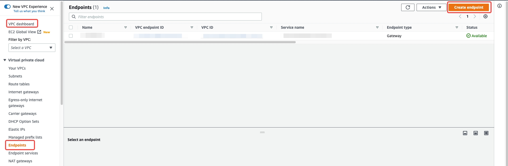
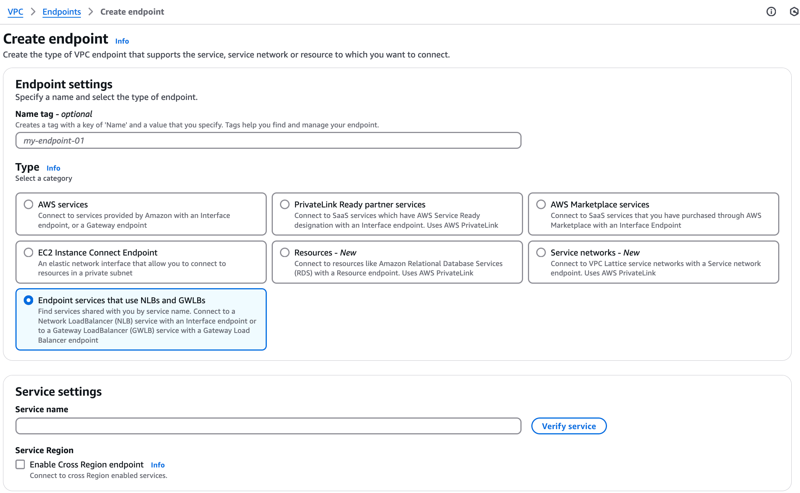
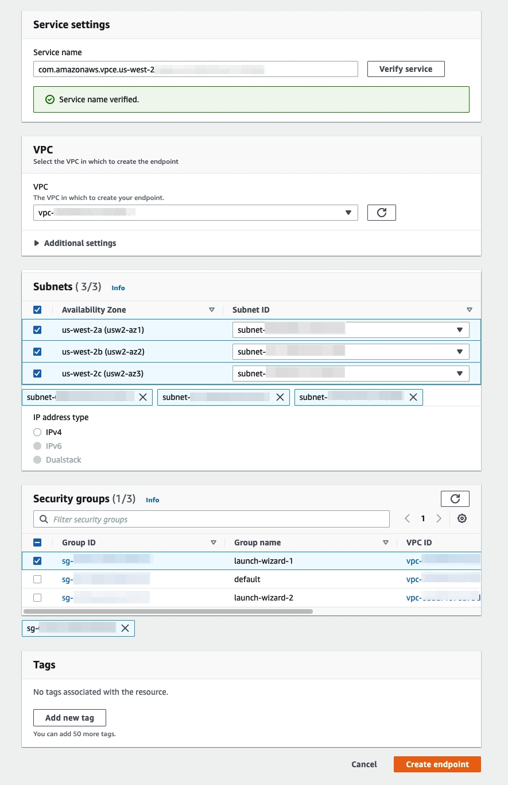
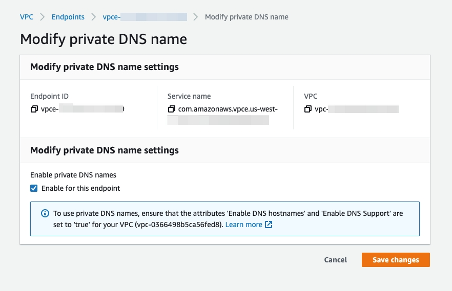
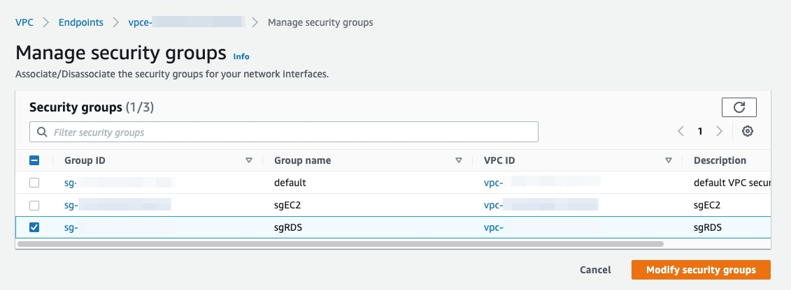

# Set Up Private Endpoint Connections

TiDB Cloud supports highly secure and one-way access to the TiDB Cloud service hosted in an AWS VPC via the [AWS PrivateLink](https://aws.amazon.com/privatelink/?privatelink-blogs.sort-by=item.additionalFields.createdDate&privatelink-blogs.sort-order=desc), as if the service were in your own VPC. A private endpoint is exposed in your VPC and you can create a connection to the TiDB Cloud service via the endpoint with permission.

Powered by AWS PrivateLink, the endpoint connection is secure and private, and does not expose your data to the public internet. In addition, the endpoint connection supports CIDR overlap and is easier for network management.

The architecture of the private endpoint is as follows:


For more detailed definitions of the private endpoint and endpoint service, see the following AWS documents:

- [What is AWS PrivateLink?](https://docs.aws.amazon.com/vpc/latest/privatelink/what-is-privatelink.html)
- [AWS PrivateLink concepts](https://docs.aws.amazon.com/vpc/latest/privatelink/concepts.html)

## Restrictions

- Currently, TiDB Cloud supports private endpoint connection only when the endpoint service is hosted in AWS. If the service is hosted in Google Cloud Platform (GCP), the private endpoint is not applicable.
- The private endpoint support is provided only for the TiDB Cloud Dedicated Tier, not for the Developer Tier.
- Private endpoint connection across regions is not supported.

In most scenarios, you are recommended to use private endpoint connection over VPC peering. However, in the following scenarios, you should use VPC peering instead of private endpoint connection:

- You are using a [TiCDC](https://docs.pingcap.com/tidb/stable/ticdc-overview) cluster to replicate data from a source TiDB cluster to a target TiDB cluster across regions, to get high availability. Currently, private endpoint does not support cross-region connection.
- You are using a TiCDC cluster to replicate data to a downstream cluster (such as Amazon Aurora, MySQL, and Kafka) but you cannot maintain the endpoint service on your own.
- You are connecting to PD or TiKV nodes directly.

## Set up a private endpoint with AWS

This section describes how to set up a private endpoint with AWS PrivateLink.

Take the following steps to set up a private endpoint. If you have multiple clusters, you need to repeat these steps for each cluster that you want to connect to using AWS PrivateLink.

In addition to the [prerequisites](#prerequisites), there are 5 steps to set up a private endpoint connection with AWS PrivateLink:

1. [Choose a TiDB cluster](#step-1-choose-a-tidb-cluster)
2. [Check the service endpoint region](#step-2-choose-the-service-endpoint-region)
3. [Create an AWS interface endpoint](#step-3-create-an-aws-interface-endpoint)
4. [Accept the endpoint connection](#step-4-accept-the-endpoint-connection)
5. [Enable private DNS](#step-5-enable-private-dns)

### Prerequisites

TiDB Cloud supports private endpoints only for Dedicated Tier clusters. You are expected to create a Dedicated Tier cluster before creating a private endpoint. For detailed instructions, see [Create a TiDB Cluster in TiDB Cloud](/tidb-cloud/create-tidb-cluster.md).

To start setting up a private endpoint, open the private endpoint creation page:

1. In the TiDB Cloud console, click the **Project Settings** tab.
2. Click **Private Endpoint** on the left menu.
3. Click **Add** on the **Private Endpoint** page.

### Step 1. Choose a TiDB cluster

1. Click the drop-down list and choose an available TiDB cluster.
2. Click **Next**.

### Step 2. Check the service endpoint region

From the **Select Region** list, make sure that the region in which you want to create the private endpoint is selected. Then, click **Next**.

> **Note:**
>
> The default region is where your cluster is located. Do not change it. Cross-region private endpoint is currently not supported.

### Step 3. Create an AWS interface endpoint

At this stage, TiDB Cloud begins creating an endpoint service, which takes 3 to 4 minutes. When the endpoint service is created, take a note of your endpoint service name from the command.


Then create an AWS interface endpoint either in the AWS Management Console or using the AWS CLI.

<SimpleTab>
<div label="Use AWS Console">

To use the AWS Management Console to create the VPC interface endpoint, perform the following steps:

1. Go to **VPC** > **Endpoints**.

    

2. Click **Create Endpoint**.

    The **Create endpoint** page is displayed.

    

3. Select **Other endpoint services**.
4. Enter the endpoint service name you have obtained from the **Interface endpoint** page of the TiDB Cloud console.
5. Click **Verify service**.
6. Select your VPC in the drop-down list.

    

7. Select the availability zones where your TiDB cluster is located in the **Subnets** area.

    > **Tip:**
    >
    > If your service is spanning across more than three availability zones (AZs), you might not be able to select AZs in the **Subnets** area. This issue occurs when there is an extra AZ in your selected region in addition to the AZs where your TiDB cluster is located. In this case, contact [PingCAP Technical Support](https://docs.pingcap.com/tidbcloud/tidb-cloud-support).

8. Select your security group properly in the **Security groups** area.
9. Click **Create endpoint**.

</div>
<div label="Use AWS CLI">

To use the AWS CLI to create a VPC interface endpoint, perform the following steps:

1. Fill in the **VPC ID** and **Subnet IDs** fields. You can get the IDs from your AWS Management Console.

2. Install AWS Command Line Interface (AWS CLI).

    ```bash
    curl "https://awscli.amazonaws.com/awscli-exe-linux-x86_64.zip" -o "awscliv2.zip"
    unzip awscliv2.zip
    sudo ./aws/install
    ```

3. Configure AWS CLI according to your account information. To get the information, see [AWS CLI configuration basics](https://docs.aws.amazon.com/cli/latest/userguide/cli-configure-quickstart.html).

    ```bash
    aws configure
    ```

4. Copy the command in the lower area of the page and run it in your terminal. Then click **Next**.

After the endpoint service is created, the placeholders in the command are automatically replaced with the real values.

> **Tip:**
>
> - If your service is spanning across more than three availability zones (AZs), you will get an error message indicating that the VPC endpoint service does not support the AZ of the subnet. This issue occurs when there is an extra AZ in your selected region in addition to the AZs where your TiDB cluster is located. In this case, you can contact [PingCAP Technical Support](https://docs.pingcap.com/tidbcloud/tidb-cloud-support).
>
> - You cannot copy the command until TiDB Cloud finishes creating endpoint service in the background.

</div>
</SimpleTab>

### Step 4. Accept the endpoint connection

Go back to the TiDB Cloud console, in the **Create Private Endpoint** page, fill in the box with your VPC endpoint ID and click **Next**.

### Step 5. Enable private DNS

Enable private DNS in AWS. You can either use the AWS Management Console or the AWS CLI.

<SimpleTab>
<div label="Use AWS Console">

To enable private DNS in your AWS Management Console:

1. Go to **VPC** > **Endpoints**.
2. Right-click your endpoint ID and select **Modify private DNS name**.
3. Check the **Enable for this endpoint** box.
4. Click **Save changes**.



</div>
<div label="Use AWS CLI">

To enable private DNS using your AWS CLI, copy the command and run it in your AWS CLI. The `<your_vpc_endpoint_id>` placeholder is automatically replaced with the value you have provided in Step 4.

</div>
</SimpleTab>

In the TiDB Cloud console, click **Create** to finalize the creation of the private endpoint.

Then you can connect to the endpoint service. See [Connect to TiDB cluster via private endpoint](/tidb-cloud/connect-to-tidb-cluster.md#connect-via-private-endpoint) for details.

## Private endpoint status reference

When you use [private endpoint connections](/tidb-cloud/set-up-private-endpoint-connections.md), the statuses of private endpoints or private endpoint services are displayed on the [**Private Endpoint** page](/tidb-cloud/set-up-private-endpoint-connections.md#step-1-open-the-private-endpoint-creation-page).

The possible statuses of a private endpoint are explained as follows:

- **Not Configured**: You have just created an endpoint service but have not yet created a private endpoint. If you click **Edit** of that row, you are directed to the **Interface Endpoint** stage of creating a private endpoint. See [Step 4. Create an endpoint service](/tidb-cloud/set-up-private-endpoint-connections.md#step-4-create-an-aws-interface-endpoint) for details.
- **Pending**: Waiting for processing.
- **Active**: Your private endpoint is ready to use. You cannot edit the private endpoint of this status.
- **Deleting**: The private endpoint is being deleted.
- **Failed**: The private endpoint creation fails. You can click **Edit** of that row to retry the creation.

The possible statuses of a private endpoint service are explained as follows:

- **Creating**: The endpoint service is being created, which takes 3 to 5 minutes.
- **Active**: The endpoint service is created, no matter whether the private endpoint is created or not.
- **Deleting**: The endpoint service or the cluster is being deleted, which takes 3 to 5 minutes.

## Troubleshooting

### I cannot connect to TiDB cluster via private endpoint after enabling private DNS. Why?

You might need to properly set the security group for your VPC endpoint in the AWS Management Console. Go to **VPC** > **Endpoints**. Right-click your VPC endpoint and select **Manage security groups**.



### I cannot enable private DNS. An error is reported indicating that the `enableDnsSupport` and `enableDnsHostnames` VPC attributes are not enabled

Make sure than DNS hostname and DNS resolution are both enabled in your VPC setting. They are disabled by default when you create a VPC in the AWS Management Console.
