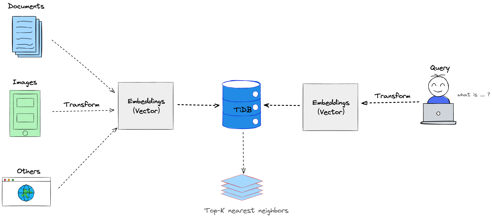

# Vector Search (Beta) Overview

Vector Search (Beta) provides an advanced vector search solution that powers applications to conduct semantic search and similarity search on documents, images, audio, video, or any type of data. It helps developers build scalable generative AI applications easily using familiar MySQL skills.

> **Note**
>
> The Vector Search feature is only available for TiDB Serverless at this moment.

## What is Vector Search?

Vector search is a search method that yields results based on the semantics of your data. In contrast, the traditional full-text search finds text with a strong reliance on exact keyword matching and the frequency of word occurrences.

For example, if you search for the term "a swimming animal", full-text search returns only data that explicitly contains these keywords. However, semantic search might return data that is similar in meaning, such as animals that can swim like fish or duck.

### Key Concepts

#### Vector Embedding

Vector embedding, often just called an embedding, is an array of numbers that represent the real-world objects in a high-dimensional space, it captures the semantics and context of the unstructured data, such as documents, images, audio, or videos.

Vector embeddings play an essential role in machine learning and are foundational to semantic and similarity searches.

To store the vector embeddings, TiDB introduced a new `VECTOR` data type, see [Vector Column](/tidb-cloud/vector-search-vector-column.md) for more details.

#### Embedding Model

Embedding models are algorithms used to transform data into vector embedding. 

Choosing the right embedding model is important for the accuracy and relevance of semantic search results. For unstructured text data, you can find the best-performance text embedding models on the [Massive Text Embedding Benchmark (MTEB) Leaderboard](https://huggingface.co/spaces/mteb/leaderboard).

To learn how to generate embeddings for your various data, you can check the embedding provider integration tutorials or examples.

## How does Vector Search Work?

After embedding and storing the raw data into TiDB, the application can perform a vector search queries to find the most relevant data to the user's query in terms of semantics or features.

Vector search identifies the top-k nearest neighbors vectors by using a [distance function](#) to calculate the distance between a given (vectorized) query and the vectors of the data in the embedding space. The closer vectors to the query represent the most similar data in meaning.

As a relational database with built-in vector search feature, TiDB enables you to store the data and their vector embeddings altogether, in one database. You can store them in the same table using different columns, or separate into different tables and incorporate them with JOIN queries when retrieving.

## Use Cases

### RAG (Retrieval-Augmented Generation)

Retrieval-Augmented Generation (RAG) is an architecture designed to optimize the output of Large Language Models (LLMs). Vector search enables the RAG applications to store vector embeddings into the database and retrieve relevant documents as contextual content when LLM generates answers to improve the quality and relevance of the answer.

## See also

With the basic understanding in mind, you can follow the following guides to get started with the vector search feature:

- [Get Started with Vector Search via SQL](/tidb-cloud/vector-search-get-started-via-sql.md)
- [Get Started with Vector Search via Python Client](/tidb-cloud/vector-search-get-started-via-python-client.md)
