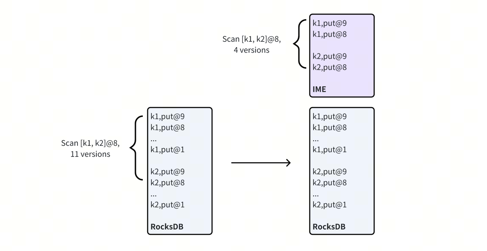

# TiKV MVCC In-Memory Engine

TiKV MVCC In-Memory Engine (IME) is primarily used to accelerate queries that need to scan a large number of MVCC historical versions, i.e., [the total number of versions scanned (total_keys) is much greater than the number of versions processed (processed_keys)](/analyze-slow-queries.md#expired-or-excessive-mvcc-versions).

TiKV MVCC In-Memory Engine is suitable for the following scenarios:

- Business requires frequent queries on frequently updated or deleted records.
- Business requires adjusting the [`tidb_gc_life_time`](/garbage-collection-configuration.md#garbage-collection-configuration) to make TiDB retain historical versions for a longer period (e.g., 24 hours).

## Working Principle

TiKV MVCC In-Memory Engine caches the latest written MVCC versions in memory and implements an MVCC GC mechanism independent of TiDB, allowing it to quickly GC MVCC versions in memory, reducing the number of versions scanned during queries, and achieving the effect of reducing request latency and CPU overhead.

The following diagram illustrates how TiKV organizes MVCC versions.

<div style="text-align: center;"></div>

The diagram shows two rows of records, each with 9 MVCC versions. The behavior is compared between the cases with and without IME enabled:

- On the left, without IME enabled, the table records are stored in RocksDB in ascending order by primary key, with the same row's MVCC versions adjacent to each other.
- On the right, with IME enabled, the data in RocksDB is consistent with the left side, and IME caches the latest 2 MVCC versions of the 2 rows of records.
- When TiKV processes a scan request with a range of `[k1, k2]` and a start timestamp of `8`, the left side without IME enabled needs to process 11 MVCC versions, while the right side with IME enabled only needs to process 4 MVCC versions, reducing request latency and CPU consumption.
- When TiKV processes a scan request with a range of `[k1, k2]` and a start timestamp of `7`, since the right side lacks the historical versions that need to be read, the IME cache becomes invalid, and it falls back to reading data from RocksDB.

## Usage

Enabling IME requires adjusting the TiKV configuration and restarting. The following is the configuration explanation:

```toml
[in-memory-engine]
# This parameter is the switch for the In-memory Engine feature, which is disabled by default. Set it to true to enable.
enable = false
#
# This parameter controls the memory capacity that In-memory Engine can use. The default value is 10% of the system memory, and the maximum value is 5 GiB.
# It can be manually configured to use more memory.
# Note: When in-memory-engine is enabled, block-cache.capacity will be reduced by 10%.
#capacity = "5GiB"
#
# This parameter controls the time interval for In-memory Engine to GC the cached MVCC versions.
# The default is 3 minutes, representing that GC is performed every 3 minutes on the cached MVCC versions.
# Reducing this parameter can speed up the GC frequency, reduce MVCC versions, but will increase GC CPU consumption and increase the probability of cache miss.
#gc-run-interval = "3m"
#
# This parameter controls the threshold for In-memory Engine to select and load Regions based on MVCC read amplification.
# The default is 10, indicating that when the number of MVCC versions processed for a row of records in a Region exceeds 10, it may be loaded into In-memory Engine.
#mvcc-amplification-threshold = 10
```

> **Note:**
>
> + In-memory Engine is disabled by default, and modifying it from disabled to enabled requires restarting TiKV.
> + Except for `enable`, all other configurations can be dynamically adjusted.

### Automatic Loading

After enabling In-memory Engine, Regions will be automatically loaded based on their read traffic and MVCC amplification. The specific process is as follows:

1. Regions are sorted by the number of next (RocksDB Iterator next API) and prev (RocksDB Iterator next API) operations in the recent time period.
2. Regions are filtered using `mvcc-amplification-threshold` (default is `10`, MVCC amplification measures read amplification, calculated as (next + prev) / processed_keys).
3. The top N Regions with severe MVCC amplification are loaded, where N is based on memory estimation.

IME also periodically performs Region eviction. The specific process is as follows:

1. IME evicts Regions with low read traffic or low MVCC amplification.
2. If memory usage reaches 90% of `capacity` and new Regions need to be loaded, IME will filter Regions based on read traffic and perform eviction.

## Compatibility

+ [BR](/br/br-use-overview.md): IME can be used with BR, but BR restore will evict IME Regions involved in the restore. After BR restore is complete, if the corresponding Region is still a hotspot, it will be automatically loaded by IME.
+ [TiDB Lightning](/tidb-lightning/tidb-lightning-overview.md): IME can be used with TiDB Lightning, but TiDB Lightning's physical import mode will evict IME Regions involved in the import. After TiDB Lightning completes the import, if the corresponding Region is still a hotspot, it will be automatically loaded by IME.
+ [Follower Read](/develop/dev-guide-use-follower-read.md) and [Stale Read](/develop/dev-guide-use-stale-read.md): IME can be enabled with these two features, but IME can only accelerate Leader coprocessor requests and cannot accelerate Follower Read and Stale Read.
+ [`FLASHBACK CLUSTER`](/sql-statements/sql-statement-flashback-cluster.md): IME can be used with Flashback, but Flashback will cause IME cache invalidation. After Flashback is complete, IME will automatically load hotspot Regions.

## FAQ

### Can In-memory Engine reduce write latency and increase write throughput?

No, In-memory Engine can only accelerate read requests that scan a large number of MVCC versions.

### How to determine if In-memory Engine can improve my scenario?

You can execute the following SQL statement to check if there are slow queries with `Total_keys` much greater than `Process_keys`.

```sql
SELECT
    Time,
    DB,
    Index_names,
    Process_keys,
    Total_keys,
    CONCAT(
        LEFT(REGEXP_REPLACE(Query, '\\s+', ' '), 20),
        '...',
        RIGHT(REGEXP_REPLACE(Query, '\\s+', ' '), 10)
    ) as Query,
    Query_time,
    Cop_time,
    Process_time
FROM
    INFORMATION_SCHEMA.SLOW_QUERY
WHERE
    Is_internal = 0
    AND Cop_time > 1
    AND Process_keys > 0
    AND Total_keys / Process_keys >= 10
    AND Time >= NOW() - INTERVAL 10 MINUTE
ORDER BY Total_keys DESC
LIMIT 5;
```

Example:

The following result shows that there are queries with severe MVCC amplification on the `db1.tbl1` table. TiKV processed 1358517 MVCC versions and only returned 2 versions.

```
+----------------------------+-----+-------------------+--------------+------------+-----------------------------------+--------------------+--------------------+--------------------+
| Time                       | DB  | Index_names       | Process_keys | Total_keys | Query                             | Query_time         | Cop_time           | Process_time       |
+----------------------------+-----+-------------------+--------------+------------+-----------------------------------+--------------------+--------------------+--------------------+
| 2024-11-18 11:56:10.303228 | db1 | [tbl1:some_index] |            2 |    1358517 |  SELECT * FROM tbl1 ... LIMIT 1 ; | 1.2581352350000001 |         1.25651062 |        1.251837479 |
| 2024-11-18 11:56:11.556257 | db1 | [tbl1:some_index] |            2 |    1358231 |  SELECT * FROM tbl1 ... LIMIT 1 ; |        1.252694002 |        1.251129038 |        1.240532546 |
| 2024-11-18 12:00:10.553331 | db1 | [tbl1:some_index] |            2 |    1342914 |  SELECT * FROM tbl1 ... LIMIT 1 ; |        1.473941872 | 1.4720495900000001 | 1.3666103170000001 |
| 2024-11-18 12:01:52.122548 | db1 | [tbl1:some_index] |            2 |    1128064 |  SELECT * FROM tbl1 ... LIMIT 1 ; |        1.058942591 |        1.056853228 |        1.023483875 |
| 2024-11-18 12:01:52.107951 | db1 | [tbl1:some_index] |            2 |    1128064 |  SELECT * FROM tbl1 ... LIMIT 1 ; |        1.044847031 |        1.042546122 |        0.934768555 |
+----------------------------+-----+-------------------+--------------+------------+-----------------------------------+--------------------+--------------------+--------------------+
5 rows in set (1.26 sec)
```
