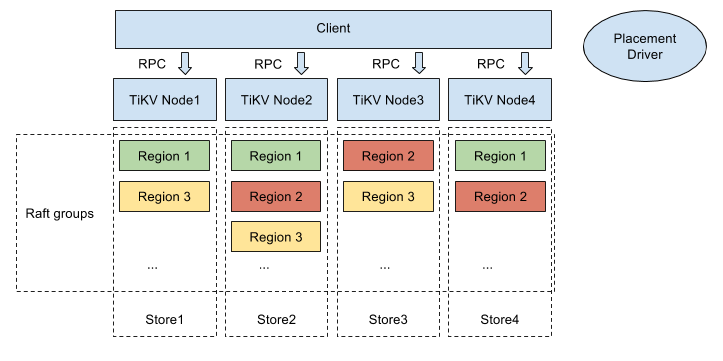

# TiKV Quick Start Guide

TiKV (The pronunciation is: /'taɪkeɪvi:/ tai-K-V, etymology: titanium) is a distributed Key-Value database which is based on the design of Google Spanner and HBase, but it is much simpler without dependency on any distributed file system.

As the storage layer of TiDB, TiKV can work separately and does not depend on the SQL layer of TiDB. TiKV provides two APIs for developers: the Raw Key-Value API and the Transactional Key-Value API. 

This guide describes how to quickly deploy a TiKV cluster on a single machine and how to use the TiKV cluster through APIs written in Go.

The TiKV server software stack is as follows:



## Prepare

TiKV can be deployed in the Intel architecture server and major virtualization environments, and it supports most of the major hardware networks and Linux operating systems.

Currently, TiKV provides two APIs: the Raw Key-Value API and the Transactional Key-Value API. This guide uses the APIs written in Go. To write the API, you need to install Go:

- Make sure ​Go​ (version 1.8+) is installed.
- Ensure your `$GOPATH` is set. (For example, `export GOPATH=$HOME/go`)

## Deploy the TiKV cluster

TiKV provides the official binary installation package that supports Linux.

- To quickly understand and try TiKV, see [Deploy the TiKV cluster on a single machine](#deploy-the-tikv-cluster-on-a-single-machine).
- To try TiKV out and explore the features, see [Deploy the TiKV cluster on multiple nodes for test](#deploy-the-tikv-cluster-on-multiple-nodes-for-test).

### Deploy the TiKV cluster on a single machine

This section describes how to deploy 1 PD instance and 3 TiKV instances on a single machine installed with the Linux system.

> **Note:**
>
> - For the production environment, it is recommended to use multiple nodes cluster deployment. Before you begin, see [Software and Hardware Requirements](op-guide/recommendation.md).
> - Before starting the process, make sure the result of `ulimit -n` is large enough. It is recommended to set the value to `unlimited` or larger than 1000000.

To deploy a TiKV cluster on a single machine for test, take the following steps:

1. Download the official binary package.

    ```bash
    # Download the package.
    wget https://download.pingcap.org/tidb-latest-linux-amd64.tar.gz
    wget http://download.pingcap.org/tidb-latest-linux-amd64.sha256

    # Check the file integrity. If the result is OK, the file is correct.
    sha256sum -c tidb-latest-linux-amd64.sha256

    # Extract the package.
    tar -xzf tidb-latest-linux-amd64.tar.gz
    cd tidb-latest-linux-amd64
    ```

2. Start PD.

    ```bash
    ./bin/pd-server --name=pd1 \
                    --data-dir=pd1 \
                    --client-urls="http://127.0.0.1:2379" \
                    --peer-urls="http://127.0.0.1:2380" \
                    --initial-cluster="pd1=http://127.0.0.1:2380" \
                    --log-file=pd1.log
    ```

3. Start TiKV.

    To start the 3 TiKV instances, open a new terminal tab or window, come to the `tidb-latest-linux-amd64` directory, and start the instances using the following command:

    ```bash
    ./bin/tikv-server --pd-endpoints="127.0.0.1:2379" \
                    --addr="127.0.0.1:20160" \
                    --data-dir=tikv1 \
                    --log-file=tikv1.log

    ./bin/tikv-server --pd-endpoints="127.0.0.1:2379" \
                    --addr="127.0.0.1:20161" \
                    --data-dir=tikv2 \
                    --log-file=tikv2.log

    ./bin/tikv-server --pd-endpoints="127.0.0.1:2379" \
                    --addr="127.0.0.1:20162" \
                    --data-dir=tikv3 \
                    --log-file=tikv3.log
    ```

You can use the [pd-ctl](https://github.com/pingcap/pd/tree/master/pdctl) tool to verify whether PD and TiKV are successfully deployed:

```
./bin/pd-ctl store -d -u http://127.0.0.1:2379
```

To access the data in TiKV, you can [try TiKV using the Raw Key-Value API and Transactional Key-Value API](#try-tikv-using-the-raw-key-value-api-and-transactional-key-value-api).

### Deploy the TiKV cluster on multiple nodes for test

This section describes how to deploy TiKV on multiple nodes. If you want to test TiKV with a limited number of nodes, you can use one PD instance to test the entire cluster.

Assume that you have four nodes, you can deploy 1 PD instance and 3 TiKV instances. For details, see the following table:

| Name | Host IP | Services |
| :-- | :-- | :------------------- |
| Node1 | 192.168.199.113 | PD1 |
| Node2 | 192.168.199.114 | TiKV1 |
| Node3 | 192.168.199.115 | TiKV2 |
| Node4 | 192.168.199.116 | TiKV3 |

To deploy a TiKV cluster with multiple nodes for test, take the following steps:

1. Download the official binary package on each node.

    ```bash
    # Download the package.
    wget https://download.pingcap.org/tidb-latest-linux-amd64.tar.gz
    wget http://download.pingcap.org/tidb-latest-linux-amd64.sha256

    # Check the file integrity. If the result is OK, the file is correct.
    sha256sum -c tidb-latest-linux-amd64.sha256

    # Extract the package.
    tar -xzf tidb-latest-linux-amd64.tar.gz
    cd tidb-latest-linux-amd64
    ```

2. Start PD on Node1.

    ```bash
    ./bin/pd-server --name=pd1 \
                    --data-dir=pd1 \
                    --client-urls="http://192.168.199.113:2379" \
                    --peer-urls="http://192.168.199.113:2380" \
                    --initial-cluster="pd1=http://192.168.199.113:2380" \
                    --log-file=pd1.log
    ```

3. Log in and start TiKV on other nodes: Node2, Node3 and Node4.

    Node2:

    ```bash
    ./bin/tikv-server --pd-endpoints="192.168.199.113:2379" \
                    --addr="192.168.199.114:20160" \
                    --data-dir=tikv1 \
                    --log-file=tikv1.log
    ```

    Node3:

    ```bash
    ./bin/tikv-server --pd-endpoints="192.168.199.113:2379" \
                    --addr="192.168.199.115:20160" \
                    --data-dir=tikv2 \
                    --log-file=tikv2.log
    ```

    Node4:

    ```bash
    ./bin/tikv-server --pd-endpoints="192.168.199.113:2379" \
                    --addr="192.168.199.116:20160" \
                    --data-dir=tikv3 \
                    --log-file=tikv3.log
    ```

You can use the [pd-ctl](https://github.com/pingcap/pd/tree/master/pdctl) tool to verify whether PD and TiKV are successfully deployed:

```
./pd-ctl store -d -u http://192.168.199.113:2379
```

The result displays the store count and detailed information regarding each store.

## Try TiKV using the Raw Key-Value API and Transactional Key-Value API

This section introduces two types of APIs and guides you through how to use the two APIs in TiKV using two examples. The usage examples are based on the [deployment of TiKV on multiple nodes](#deploy-the-tikv-cluster-on-multiple-nodes-for-test) in the above section. You can also quickly try the two APIs on a single machine.

### Two types of APIs

To apply to different scenarios, TiKV provides two types of APIs for developers:

- The Raw Key-Value API

    If your application scenario does not need distributed transactions or MVCC (Multi-Version Concurrency Control) and only need to guarantee the atomicity towards one key, you can use the Raw Key-Value API.

- The Transactional Key-Value API

    If your application scenario requires distributed ACID transactions and the atomicity of multiple keys within a transaction, you can use the Transactional Key-Value API.

Compared to the Transactional Key-Value API, the Raw Key-Value API is more performant with lower latency and easier to use.

### Use the Raw Key-Value API

To use the Raw Key-Value API in applications developed by golang, take the following steps:

1. Install the necessary packages.

    ```bash
    go get -v -u github.com/pingcap/tidb/config
    go get -v -u github.com/pingcap/tidb/store/tikv
    ```

2. Import the dependency packages.

    ```bash
    import (
        "fmt"
        "github.com/pingcap/tidb/config"
        "github.com/pingcap/tidb/store/tikv"
    )
    ```

3. Create a Raw Key-Value client.

    ```bash
    cli, err := tikv.NewRawKVClient([]string{"192.168.199.113:2379"}, config.Security{})
    ```

    Description of two parameters in the above command:

    - `string`: a list of PD servers’ addresses
    - `config.Security`: used for establishing TLS connections, usually left empty when you do not need TLS

4. Call the Raw Key-Value client methods to access the data on TiKV. The Raw Key-Value API contains the following methods, and you can also find them at [GoDoc](https://godoc.org/github.com/pingcap/tidb/store/tikv#RawKVClient).

    ```bash
    type RawKVClient struct
    func (c *RawKVClient) Close() error
    func (c *RawKVClient) ClusterID() uint64
    func (c *RawKVClient) Delete(key []byte) error
    func (c *RawKVClient) Get(key []byte) ([]byte, error)
    func (c *RawKVClient) Put(key, value []byte) error
    func (c *RawKVClient) Scan(startKey []byte, limit int) (keys [][]byte, values [][]byte, err error)
    ```

#### Usage example of the Raw Key-Value API

```bash
package main

import (
    "fmt"

    "github.com/pingcap/tidb/config"
    "github.com/pingcap/tidb/store/tikv"
)

func main() {
    cli, err := tikv.NewRawKVClient([]string{"192.168.199.113:2379"}, config.Security{})
    if err != nil {
        panic(err)
    }
    defer cli.Close()

    fmt.Printf("cluster ID: %d\n", cli.ClusterID())

    key := []byte("Company")
    val := []byte("PingCAP")

    // put key into tikv
    err = cli.Put(key, val)
    if err != nil {
        panic(err)
    }
    fmt.Printf("Successfully put %s:%s to tikv\n", key, val)

    // get key from tikv
    val, err = cli.Get(key)
    if err != nil {
        panic(err)
    }
    fmt.Printf("found val: %s for key: %s\n", val, key)

    // delete key from tikv
    err = cli.Delete(key)
    if err != nil {
        panic(err)
    }
    fmt.Printf("key: %s deleted\n", key)

    // get key again from tikv
    val, err = cli.Get(key)
    if err != nil {
        panic(err)
    }
    fmt.Printf("found val: %s for key: %s\n", val, key)
}
```

The result is like:

```bash
INFO[0000] [pd] create pd client with endpoints [192.168.199.113:2379]
INFO[0000] [pd] leader switches to: http://127.0.0.1:2379, previous:
INFO[0000] [pd] init cluster id 6554145799874853483
cluster ID: 6554145799874853483
Successfully put Company:PingCAP to tikv
found val: PingCAP for key: Company
key: Company deleted
found val:  for key: Company
```

RawKVClient is a client of the TiKV server and only supports the GET/PUT/DELETE/SCAN commands. The RawKVClient can be safely and concurrently accessed by multiple goroutines, as long as it is not closed. Therefore, for one process, one client is enough generally.

### Use the Transactional Key-Value API

The Transactional Key-Value API is complicated than the Raw Key-Value API. Some transaction related concepts are listed as follows. For more details, see the [KV package](https://github.com/pingcap/tidb/tree/master/kv).

- Storage
    
    Like the RawKVClient, a Storage is an abstract TiKV cluster.

- Snapshot

    A Snapshot is the state of a Storage at a particular point of time, which provides some readonly methods. The multiple times read from a same Snapshot is guaranteed consistent.

- Transaction

    Like the Transaction in SQL, a Transaction symbolizes a series of read and write operations performed within the Storage. Internally, a Transaction consists of a Snapshot for reads, and a MemBuffer for all writes. The default isolation level of a Transaction is Snapshot Isolation.

To use the Transactional Key-Value API in applications developed by golang, take the following steps:

1. Install the necessary packages.

    ```bash
    go get -v -u github.com/pingcap/tidb/kv
    go get -v -u github.com/pingcap/tidb/store/tikv
    ```

2. Import the dependency packages.

    ```bash
    import (
        "github.com/pingcap/tidb/kv"
        "github.com/pingcap/tidb/store/tikv"
        "fmt"
    )
    ```

3. Create Storage using a URL scheme.

    ```bash
    driver := tikv.Driver{}
    storage, err := driver.Open("tikv://192.168.199.113:2379")
    ```

4. (Optional) Modify the Storage using a Transaction.

    The lifecycle of a Transaction is: _begin → {get, set, delete, scan} → {commit, rollback}_.

    Here is an example to increase a key-value by 1:

    ```bash
    func increase(storage kv.Storage, key []byte) error {
        txn, err := storage.Begin()
        if err != nil {
            return err
        }
    defer txn.Rollback()
        var oldValue int
        val, err := txn.Get(key)
        if err != nil {
            if !kv.ErrNotExist.Equal(err) {
                return err
            }
        } else {
            oldValue, err = strconv.Atoi(string(val))
            if err != nil {
                return err
            }
        }
        err = txn.Set(key, []byte(strconv.Itoa(oldValue+1)))
        if err != nil {
            return err
        }
        err = txn.Commit(context.Background())
        return err
    }
    ```

    > **Note:** If a key does not exist, `Get` returns a `kv.ErrNotExist` error.

5. Call the Transactional Key-Value API's methods to access the data on TiKV. The Transactional Key-Value API contains the following methods:

    ```bash
    Begin() -> Txn
    Txn.Get(key []byte) -> (value []byte)
    Txn.Set(key []byte, value []byte)
    Txn.Seek(begin []byte) -> Iterator
    Txn.Delete(key []byte)
    Txn.Commit()
    ```

#### Usage example of the Transactional Key-Value API

```bash
package main

import (
    "context"
    "fmt"
    "strconv"

    "github.com/pingcap/tidb/kv"
    "github.com/pingcap/tidb/store/tikv"
)

// if key not found, set value to zero
// else increase the value
func increase(storage kv.Storage, key []byte) error {
    txn, err := storage.Begin()
    if err != nil {
        return err
    }
    defer txn.Rollback()
    var oldValue int
    val, err := txn.Get(key)
    if err != nil {
        if !kv.ErrNotExist.Equal(err) {
            return err
        }
    } else {
        oldValue, err = strconv.Atoi(string(val))
        if err != nil {
            return err
        }
    }

    err = txn.Set(key, []byte(strconv.Itoa(oldValue+1)))
    if err != nil {
        return err
    }
    err = txn.Commit(context.Background())
    return nil
}

// lookup value for key
func lookup(storage kv.Storage, key []byte) (int, error) {
    var value int
    txn, err := storage.Begin()
    if err != nil {
        return value, err
    }
    defer txn.Rollback()
    val, err := txn.Get(key)
    if err != nil {
        return value, err
    }
    value, err = strconv.Atoi(string(val))
    if err != nil {
        return value, err
    }
    return value, nil
}

func main() {
    driver := tikv.Driver{}
    storage, err := driver.Open("tikv://192.168.199.113:2379")
    if err != nil {
        panic(err)
    }
    defer storage.Close()

    key := []byte("Account")
    // lookup account
    account, err := lookup(storage, key)
    if err != nil {
        fmt.Printf("failed to lookup key %s: %v\n", key, err)
    } else {
        fmt.Printf("Account is %d\n", account)
    }

    // increase account
    err = increase(storage, key)
    if err != nil {
        panic(err)
    }

    // lookup account again
    account, err = lookup(storage, key)
    if err != nil {
        fmt.Printf("failed to lookup key %s: %v\n", key, err)
    } else {
        fmt.Printf("Account increased to %d\n", account)
    }
}
```

The result is like:

```bash
INFO[0000] [pd] create pd client with endpoints [192.168.199.113:2379]
INFO[0000] [pd] leader switches to: http://127.0.0.1:2379, previous:
INFO[0000] [pd] init cluster id 6554145799874853483
INFO[0000] [kv] Rollback txn 400197262324006914
failed to lookup key Account: [kv:2]Error: key not exist
INFO[0000] [kv] Rollback txn 400197262324006917
Account increased to 1

# run the program again
INFO[0000] [pd] create pd client with endpoints [192.168.199.113:2379]
INFO[0000] [pd] leader switches to: http://127.0.0.1:2379, previous:
INFO[0000] [pd] init cluster id 6554145799874853483
INFO[0000] [kv] Rollback txn 400198364324954114
Account is 1
INFO[0000] [kv] Rollback txn 400198364324954117
Account increased to  2
```
