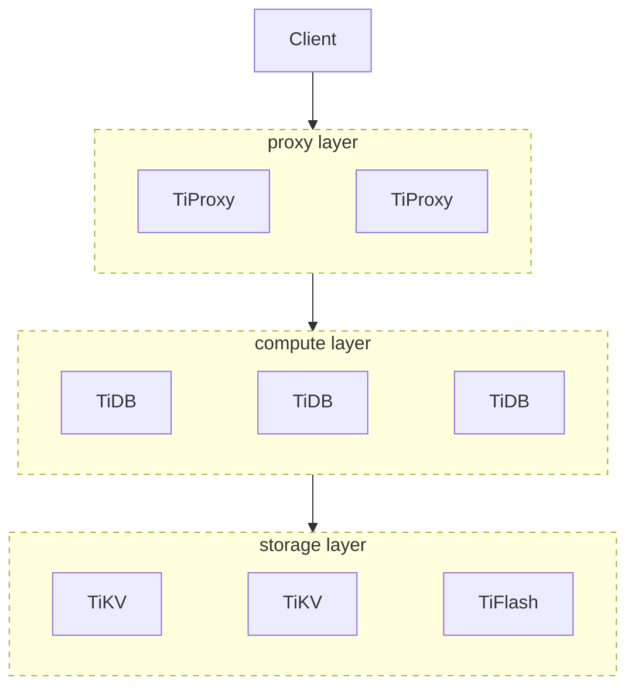
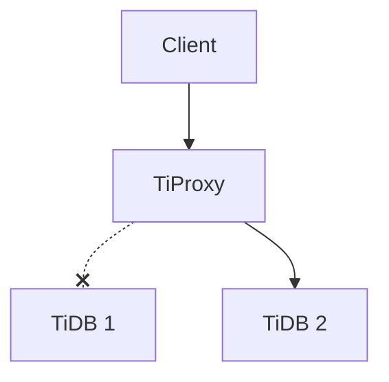

# TiProxyの概要 {#tiproxy-overview}

TiProxyはPingCAPの公式プロキシコンポーネントです。クライアントとTiDBサーバーの間に配置され、TiDBの負荷分散、接続の維持、サービス検出などの機能を提供します。

TiProxyはオプションのコンポーネントです。サードパーティ製のプロキシコンポーネントを使用したり、プロキシを使用せずにTiDBサーバーに直接接続することも可能です。

次の図は、TiProxyのアーキテクチャを示しています。



## 主な特徴 {#main-features}

TiProxyは、接続移行、フェイルオーバー、サービス検出、および迅速な導入機能を提供します。

### 接続移行 {#connection-migration}

TiProxyは、クライアント接続を切断することなく、あるTiDBサーバーから別のTiDBサーバーへ接続を移行できます。

次の図に示すように、クライアントは当初、TiProxy を介して TiDB 1 に接続します。接続移行後、クライアントは実際に TiDB 2 に接続します。TiDB 1 がオフラインになりそうになった場合、または TiDB 1 への接続数と TiDB 2 への接続数の比率が設定されたしきい値を超えた場合に、接続移行がトリガーされます。クライアントは接続移行を認識しません。



接続移行は通常、次のようなシナリオで発生します。

-   TiDBサーバーがスケールイン、ローリングアップグレード、またはローリング再起動を実行する場合、TiProxyはオフラインになりそうなTiDBサーバーから他のTiDBサーバーに接続を移行して、クライアント接続を維持することができます。
-   TiDBサーバーがスケールアウトを実行する際、TiProxyは既存の接続を新しいTiDBサーバーに移行することで、クライアント接続プールをリセットすることなくリアルタイムの負荷分散を実現できます。

### フェイルオーバー {#failover}

TiDBサーバーがメモリ不足（OOM）になる危険性がある場合、またはPDやTiKVへの接続に失敗した場合、TiProxyは問題を自動的に検出し、接続を別のTiDBサーバーに移行することで、クライアントの接続を継続的に確保します。

### サービスディスカバリ {#service-discovery}

TiDBサーバーがスケールインまたはスケールアウトを実行する際、一般的なロードバランサーを使用している場合は、TiDBサーバーリストを手動で更新する必要があります。しかし、TiProxyは手動操作なしでTiDBサーバーリストを自動的に検出できます。

### 迅速な導入 {#quick-deployment}

TiProxyは[TiUP](https://github.com/pingcap/tiup)に統合[グラファナ](/tiproxy/tiproxy-grafana.md)れており、組み込みの仮想IP管理をサポートしている[TiDB Operator](https://github.com/pingcap/tidb-operator) 、導入、運用、管理コスト[TiDBダッシュボード](/dashboard/dashboard-intro.md)削減できます。

## ユーザーシナリオ {#user-scenarios}

TiProxyは、以下のシナリオに適しています。

-   接続の維持：TiDBサーバーがスケールイン、ローリングアップグレード、またはローリング再起動を実行すると、クライアント接続が切断され、エラーが発生します。クライアントに冪等なエラー再試行メカニズムがない場合、エラーを手動で確認して修正する必要があり、作業コストが大幅に増加します。TiProxyはクライアント接続を維持できるため、クライアントはエラーを報告しません。
-   頻繁なスケールインとスケールアウト：アプリケーションのワークロードは定期的に変化する可能性があります。コストを削減するために、TiDBをクラウドにデプロイし、ワークロードに応じてTiDBサーバーを自動的にスケールインおよびスケールアウトすることができます。ただし、スケールインによってクライアントが切断される可能性があり、スケールアウトによって負荷が不均衡になる可能性があります。TiProxyはクライアント接続を維持し、負荷分散を実現できます。
-   CPU負荷の不均衡: バックグラウンドタスクが大量のCPUリソースを消費したり、接続間でワークロードが大きく変動してCPU負荷が不均衡になったりすると、TiProxyはCPU使用率に基づいて接続を移行して負荷分散を実現できます。詳細については、 [CPUベースの負荷分散](/tiproxy/tiproxy-load-balance.md#cpu-based-load-balancing)参照してください。
-   TiDBサーバーのOOM: 暴走クエリによってTiDBサーバーのメモリが不足した場合、TiProxyはOOMリスクを事前に検出し、他の正常な接続を別のTiDBサーバーに移行することで、クライアントの接続を継続的に確保します。詳細については、 [メモリベースの負荷分散](/tiproxy/tiproxy-load-balance.md#memory-based-load-balancing)参照してください。

TiProxyは、以下のシナリオには適していません。

-   パフォーマンスに敏感: TiProxy のパフォーマンスは HAProxy や他のロードバランサーよりも低いため、TiProxy を使用する場合は、同様のパフォーマンスレベルを維持するためにより多くの CPU リソースを確保する必要があります。詳細については、 [TiProxyのパフォーマンステストレポート](/tiproxy/tiproxy-performance-test.md)を参照してください。
-   コストに敏感な場合：TiDBクラスタがハードウェアロードバランサー、仮想IP、またはKubernetesが提供するロードバランサーを使用している場合、TiProxyを追加するとコストが増加します。さらに、クラウド上のアベイラビリティゾーンにまたがってTiDBクラスタをデプロイする場合、TiProxyを追加するとアベイラビリティゾーン間のトラフィックコストも増加します。
-   予期せぬTiDBサーバーのダウンタイムに対するフェイルオーバー：TiProxyは、TiDBサーバーがオフラインになった場合、または計画通りに再起動された場合にのみ、クライアント接続を維持できます。TiDBサーバーが予期せずオフラインになった場合、接続は切断されます。

TiProxyが適しているシナリオではTiProxyを使用し、アプリケーションのパフォーマンスが重要な場合はHAProxyなどの他のプロキシを使用することをお勧めします。

## インストールと使用方法 {#installation-and-usage}

このセクションでは、 TiUPを使用して TiProxy をデプロイおよび変更する方法について説明します。TiProxy をスケールアウトすることで、 [TiProxyを使用して新しいクラスターを作成します](#create-a-cluster-with-tiproxy)または[既存のクラスターで TiProxy を有効にする](#enable-tiproxy-for-an-existing-cluster)いずれかを選択できます。

> **注記：**
>
> TiUPのバージョンが1.16.1以降であることを確認してください。

その他の導入方法については、以下のドキュメントを参照してください。

-   TiDB Operatorを使用して TiProxy をデプロイするには、 [TiDB Operator](https://docs.pingcap.com/tidb-in-kubernetes/stable/deploy-tiproxy)ドキュメントを参照してください。
-   TiUPを使用して TiProxy をローカルにすばやくデプロイするには、 [TiProxyをデプロイ](/tiup/tiup-playground.md#deploy-tiproxy)参照してください。

### TiProxyでクラスターを作成する {#create-a-cluster-with-tiproxy}

以下の手順では、新しいクラスタを作成する際に TiProxy をデプロイする方法について説明します。

1.  TiDBインスタンスを設定します。

    TiProxyを使用する場合は、TiDB用に[`graceful-wait-before-shutdown`](/tidb-configuration-file.md#graceful-wait-before-shutdown-new-in-v50)設定する必要があります。この値は、アプリケーションの最長トランザクションの継続時間より少なくとも10秒長く設定する必要があります。これにより、TiDBサーバーがオフラインになったときにクライアント接続が中断されるのを防ぎます。トランザクションの継続時間は[TiDB監視ダッシュボードのトランザクションメトリクス](/grafana-tidb-dashboard.md#transaction)で確認できます。詳細については、 [制限事項](#limitations)参照してください。

    設定例は以下のとおりです。

    ```yaml
    server_configs:
      tidb:
        graceful-wait-before-shutdown: 30
    ```

2.  TiProxyインスタンスを設定します。

    TiProxyの高い可用性を確保するためには、少なくとも2つのTiProxyインスタンスをデプロイし、 [`ha.virtual-ip`](/tiproxy/tiproxy-configuration.md#virtual-ip)と[`ha.interface`](/tiproxy/tiproxy-configuration.md#interface)を設定して仮想IPを構成し、トラフィックを利用可能なTiProxyインスタンスにルーティングすることをお勧めします。

    以下の点にご注意ください。

    -   ワークロードの種類と最大 QPS に基づいて、TiProxy インスタンスのモデルと数を選択します。詳細については、 [TiProxyのパフォーマンステストレポート](/tiproxy/tiproxy-performance-test.md)参照してください。
    -   TiProxyインスタンスは通常TiDBサーバーインスタンスよりも少ないため、TiProxyのネットワーク帯域幅がボトルネックになりやすくなります。たとえば、AWSでは、同じシリーズのEC2インスタンスのベースラインネットワーク帯域幅はCPUコア数に比例しません。ネットワーク帯域幅がボトルネックになった場合は、TiProxyインスタンスをより多くの小さなインスタンスに分割してQPSを向上させることができます。詳細については、 [ネットワーク仕様](https://docs.aws.amazon.com/ec2/latest/instancetypes/co.html#co_network)参照してください。
    -   トポロジ構成ファイルでTiProxyのバージョンを指定することをお勧めします。これにより、TiDBクラスタをアップグレードするためにコマンド[`tiup cluster upgrade`](/tiup/tiup-component-cluster-upgrade.md)を実行した際にTiProxyが自動的にアップグレードされるのを防ぎ、TiProxyのアップグレードによってクライアント接続が切断されるのを防止できます。

    TiProxy のテンプレートの詳細については、 [TiProxyトポロジーのシンプルなテンプレート](https://github.com/pingcap/docs/blob/master/config-templates/simple-tiproxy.yaml)参照してください。

    TiDBクラスタトポロジファイル内の構成項目の詳細については、 [TiUPを使用したTiDBデプロイメントのトポロジーコンフィグレーションファイル](/tiup/tiup-cluster-topology-reference.md)参照してください。

    設定例は以下のとおりです。

    ```yaml
    component_versions:
      tiproxy: "v1.3.2"
    server_configs:
      tiproxy:
        ha.virtual-ip: "10.0.1.10/24"
        ha.interface: "eth0"
    tiproxy_servers:
      - host: 10.0.1.11
        port: 6000
        status_port: 3080
      - host: 10.0.1.12
        port: 6000
        status_port: 3080
    ```

3.  クラスターを起動します。

    TiUPを使用してクラスターを起動するには、 [TiUPドキュメント](/tiup/tiup-documentation-guide.md)参照してください。

4.  TiProxyに接続します。

    クラスタがデプロイされると、TiDBサーバーポートとTiProxyポートが同時に公開されます。クライアントはTiDBサーバーに直接接続するのではなく、TiProxyポートに接続する必要があります。

### 既存のクラスターでTiProxyを有効にする {#enable-tiproxy-for-an-existing-cluster}

TiProxyがデプロイされていないクラスターの場合、TiProxyインスタンスをスケールアウトすることでTiProxyを有効にできます。

1.  TiProxyインスタンスを設定します。

    TiProxyを別のトポロジーファイルで設定します。例: `tiproxy.toml` :

    ```yaml
    component_versions:
      tiproxy: "v1.3.2"
    server_configs:
      tiproxy:
        ha.virtual-ip: "10.0.1.10/24"
        ha.interface: "eth0"
    tiproxy_servers:
      - host: 10.0.1.11
        deploy_dir: "/tiproxy-deploy"
        port: 6000
        status_port: 3080
      - host: 10.0.1.12
        deploy_dir: "/tiproxy-deploy"
        port: 6000
        status_port: 3080
    ```

2.  TiProxyをスケールアウトする。

    TiProxyインスタンスをスケールアウトするには、 [`tiup cluster scale-out`](/tiup/tiup-component-cluster-scale-out.md)コマンドを使用します。例：

    ```shell
    tiup cluster scale-out <cluster-name> tiproxy.toml
    ```

    TiProxyをスケールアウトすると、 TiUPはTiDB用に自己署名証明書[`security.session-token-signing-cert`](/tidb-configuration-file.md#session-token-signing-cert-new-in-v640)と[`security.session-token-signing-key`](/tidb-configuration-file.md#session-token-signing-key-new-in-v640)自動的に構成します。この証明書は接続の移行に使用されます。

3.  TiDBの設定を変更してください。

    TiProxyを使用する場合は、TiDB用に[`graceful-wait-before-shutdown`](/tidb-configuration-file.md#graceful-wait-before-shutdown-new-in-v50)設定する必要があります。この値は、TiDBサーバーがオフラインになったときにクライアント接続が中断されないように、アプリケーションの最長トランザクションの継続時間より少なくとも10秒長くする必要があります。トランザクションの継続時間は[TiDB監視ダッシュボードのトランザクションメトリクス](/grafana-tidb-dashboard.md#transaction)で確認できます。詳細については、 [制限事項](#limitations)参照してください。

    設定例は以下のとおりです。

    ```yaml
    server_configs:
      tidb:
        graceful-wait-before-shutdown: 30
    ```

4.  TiDBの設定を再読み込みしてください。

    TiDBは自己署名証明書と`graceful-wait-before-shutdown`で構成されているため、それらを有効にするには[`tiup cluster reload`](/tiup/tiup-component-cluster-reload.md)コマンドを使用して構成を再読み込みする必要があります。構成を再読み込みすると、TiDBはローリング再起動を実行し、クライアント接続が切断されることに注意してください。

    ```shell
    tiup cluster reload <cluster-name> -R tidb
    ```

5.  TiProxyに接続します。

    TiProxyを有効にすると、クライアントはTiDBサーバーポートではなく、TiProxyポートに接続するようになります。

### TiProxyの設定を変更します {#modify-tiproxy-configuration}

TiProxy がクライアント接続を維持するようにするため、必要がない限り TiProxy を再起動しないでください。そのため、TiProxy の設定項目のほとんどはオンラインで変更できます。オンラインでの変更をサポートする設定項目のリストについては、 [TiProxyの設定](/tiproxy/tiproxy-configuration.md)参照してください。

TiUPを使用してTiProxyの設定を変更する場合、変更する設定項目がオンライン変更に対応している場合は、オプション[`--skip-restart`](/tiup/tiup-component-cluster-reload.md#--skip-restart)を使用することでTiProxyの再起動を回避できます。

### TiProxyをアップグレードする {#upgrade-tiproxy}

TiProxyをデプロイする際には、TiDBクラスタをアップグレードした際にTiProxyもアップグレードされないように、TiProxyのバージョンを指定することをお勧めします。

TiProxyをアップグレードする必要がある場合は、アップグレードコマンドに[`--tiproxy-version`](/tiup/tiup-component-cluster-upgrade.md#--tiproxy-version)を追加してTiProxyのバージョンを指定してください。

```shell
tiup cluster upgrade <cluster-name> <version> --tiproxy-version <tiproxy-version>
```

> **注記：**
>
> このコマンドは、クラスターのバージョンが変更されない場合でも、TiDBクラスターをアップグレードして再起動します。

### TiDBクラスターを再起動します {#restart-the-tidb-cluster}

[`tiup cluster restart`](/tiup/tiup-component-cluster-restart.md)を使用して TiDB クラスターを再起動すると、TiDB サーバーがローリング再起動されないため、クライアント接続が切断されます。したがって、このコマンドの使用は避けてください。

その代わりに、 [`tiup cluster upgrade`](/tiup/tiup-component-cluster-upgrade.md)使用してクラスターをアップグレードしたり、 [`tiup cluster reload`](/tiup/tiup-component-cluster-reload.md)を使用して構成を再読み込みしたりすると、TiDB サーバーがローリング再起動されるため、クライアント接続には影響しません。

## 他のコンポーネントとの互換性 {#compatibility-with-other-components}

-   TiProxyはTiDB v6.5.0以降のバージョンのみをサポートしています。
-   TiProxy の TLS 接続は TiDB と互換性のない機能を持っています。詳細は[Security](#security)参照してください。
-   TiDB DashboardとGrafanaは、バージョン7.6.0以降でTiProxyをサポートしています。
-   TiUPはv1.14.1以降でTiProxyをサポートし、 TiDB Operatorはv1.5.1以降でTiProxyをサポートしています。
-   TiProxyのステータスポートが提供するインターフェースはTiDBサーバーのものとは異なるため、 [TiDB Lightning](/tidb-lightning/tidb-lightning-overview.md)使用してデータをインポートする場合、ターゲットデータベースはTiProxyのアドレスではなく、TiDBサーバーのアドレスである必要があります。

## Security {#security}

TiProxyはTLS接続を提供します。クライアントとTiProxy間のTLS接続は、以下のルールに従って有効化されます。

-   TiProxy の設定[`security.server-tls`](/tiproxy/tiproxy-configuration.md#server-tls) TLS 接続を使用しないように設定されている場合、クライアントが TLS 接続を有効にしているかどうかに関わらず、クライアントと TiProxy 間の TLS 接続は有効になりません。
-   TiProxyの設定[`security.server-tls`](/tiproxy/tiproxy-configuration.md#server-tls) TLS接続を使用するように設定されている場合、クライアントとTiProxy間のTLS接続は、クライアントがTLS接続を有効にした場合にのみ有効になります。

TiProxyとTiDBサーバー間のTLS接続は、以下のルールに従って有効化されます。

-   TiProxyの[`security.require-backend-tls`](/tiproxy/tiproxy-configuration.md#require-backend-tls) `true`に設定されている場合、クライアントがTLS接続を有効にしているかどうかに関わらず、TiProxyとTiDBサーバーは常にTLS接続を有効にします。TiProxyの[`security.sql-tls`](/tiproxy/tiproxy-configuration.md#sql-tls)がTLSを使用しないように設定されている場合、またはTiDBサーバーがTLS証明書を構成していない場合、クライアントはエラーを報告します。
-   TiProxyの[`security.require-backend-tls`](/tiproxy/tiproxy-configuration.md#require-backend-tls) `false`に設定され、TiProxyの[`security.sql-tls`](/tiproxy/tiproxy-configuration.md#sql-tls)がTLSで構成され、TiDBサーバーがTLS証明書で構成されている場合、TiProxyとTiDBサーバーは、クライアントがTLS接続を有効にした場合にのみTLS接続を有効にします。
-   TiProxyの[`security.require-backend-tls`](/tiproxy/tiproxy-configuration.md#require-backend-tls) `false`に設定されている場合、TiProxyの[`security.sql-tls`](/tiproxy/tiproxy-configuration.md#sql-tls)がTLSを使用しないように設定されている場合、またはTiDBサーバーがTLS証明書を構成していない場合、TiProxyとTiDBサーバーはTLS接続を有効にしません。

TiProxyには、TiDBと互換性のない以下の動作があります。

-   `STATUS`と`SHOW STATUS`ステートメントは異なるTLS情報を返す可能性があります。5 `STATUS`のステートメントはクライアントとTiProxy間のTLS情報を返し、 `SHOW STATUS`ステートメントはTiProxyとTiDBサーバー間のTLS情報を返します。
-   TiProxy は[証明書ベースの認証](/certificate-authentication.md)サポートしていません。そうでない場合、クライアントと TiProxy 間の TLS 証明書が TiProxy と TiDBサーバー間の TLS 証明書と異なるため、クライアントはログインに失敗する可能性があります。TiDBサーバーはTiProxy 上の TLS 証明書に基づいて TLS 証明書を検証します。

## 制限事項 {#limitations}

TiProxyは、以下のシナリオではクライアント接続を維持できません。

-   TiDBが予期せずオフラインになりました。TiProxyは、TiDBサーバーがオフラインまたは計画通りに再起動された場合にのみクライアント接続を維持し、TiDBサーバーのフェイルオーバーはサポートしていません。
-   TiProxyは、スケールイン、アップグレード、または再起動を実行します。TiProxyがオフラインになると、クライアントとの接続は切断されます。
-   TiDBは接続を積極的に切断します。例えば、セッションが`wait_timeout`以上リクエストを送信しない場合、TiDBは接続を積極的に切断し、TiProxyもクライアント接続を切断します。

TiProxyは、以下のシナリオでは接続を移行できないため、クライアント接続が中断されたり、ロードバランシングが失敗したりする可能性があります。

-   長時間実行される単一のステートメントまたは単一のトランザクション：実行時間が、TiDBサーバーで設定されている[`graceful-wait-before-shutdown`](/tidb-configuration-file.md#graceful-wait-before-shutdown-new-in-v50)から10秒を引いた値を超えます。
-   カーソルを使用し、時間内に完了しない場合：セッションはカーソルを使用してデータを読み取りますが、TiDBサーバーで設定された値[`graceful-wait-before-shutdown`](/tidb-configuration-file.md#graceful-wait-before-shutdown-new-in-v50)から10秒を引いた後、データの読み取りを完了するか、カーソルを閉じません。
-   セッションは[ローカル一時テーブル](/temporary-tables.md#local-temporary-tables)を作成します。
-   このセッションでは[ユーザーレベルのロック](/functions-and-operators/locking-functions.md)が行われます。
-   このセッションでは[テーブルロック](/sql-statements/sql-statement-lock-tables-and-unlock-tables.md)が行われます。
-   セッションでエラーコード[プリペアドステートメント](/develop/dev-guide-prepared-statement.md)が作成され、プリペアドステートメントが無効になります。たとえば、プリペアドステートメントに関連付けられたテーブルが、プリペアドステートメントの作成後に削除された場合などです。
-   セッションはセッションレベル[実行計画のバインディング](/sql-plan-management.md#sql-binding)を作成しますが、バインディングが無効です。たとえば、バインディングに関連付けられたテーブルは、バインディングが作成された後で削除されます。
-   セッションが作成された後、そのセッションで使用されているユーザーが削除されるか、ユーザー名が変更されます。

## サポートされているコネクタ {#supported-connectors}

TiProxyでは、クライアントが使用するコネクタが[認証プラグイン](https://dev.mysql.com/doc/refman/8.0/en/pluggable-authentication.html)サポートしている必要があります。そうでない場合、接続が失敗する可能性があります。

以下の表は、サポートされているコネクタの一部を示しています。

| 言語         | コネクタ              | サポートされている最小バージョン |
| ---------- | ----------------- | ---------------- |
| Java       | MySQL Connector/J | 2019年5月1日        |
| C          | libmysqlclient    | 5.5.7            |
| 行く         | Go SQLDriver      | 1.4.0            |
| JavaScript | MySQLコネクタ/Node.js | 1.0.2            |
| JavaScript | mysqljs/mysql     | 2.15.0           |
| JavaScript | node-mysql2       | 1.0.0-rc-6       |
| PHP        | mysqlnd           | 5.4              |
| Python     | MySQLコネクタ/Python  | 1.0.7            |
| Python     | PyMySQL           | 0.7              |

一部のコネクタは共通ライブラリを呼び出してデータベースに接続しますが、これらのコネクタは表には記載されていません。必要なライブラリのバージョンについては、上記の表を参照してください。たとえば、MySQL/Rubyはlibmysqlclientを使用してデータベースに接続するため、MySQL/Rubyで使用されるlibmysqlclientのバージョンは5.5.7以降である必要があります。

## TiProxyリソース {#tiproxy-resources}

-   [TiProxy リリースノート](https://github.com/pingcap/tiproxy/releases)
-   [TiProxyに関する問題](https://github.com/pingcap/tiproxy/issues) : TiProxyのGitHubイシュー一覧
