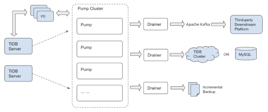

# TiDB-Binlog Cluster User Guide

This document introduces the architecture and the deployment of TiDB-Binlog of the cluster version. If you want to use the local or Kafka version of TiDB-Binlog, see [the deployment document for TiDB-Binlog of the local version](../tools/tidb-binlog.md) and [the deployment document for TiDB-Binlog of the Kafka version](../tools/tidb-binlog-kafka.md).

TiDB-Binlog is an enterprise tool used to collect the binlog data of TiDB and provide real-time backup and synchronization.

TiDB-Binlog has the following features:

* **Data synchronization:** synchronize the data in the TiDB cluster to other databases
* **Real-time backup and restoration:** back up the data in the TiDB cluster and restore the TiDB cluster when the cluster fails

## TiDB-Binlog architecture

The TiDB-Binlog architecture is as follows:



The TiDB-Binlog cluster is composed of Pump and Drainer.

### Pump

Pump is used to record the binlogs generated in TiDB, reorder the binlogs based on the commit time of the transaction, and send binlogs to Drainer for consumption.

### Drainer

Drainer collects and merges binlogs from each Pump, converts the binlog to SQL or data of a specific format, and synchronizes the data to the downstream.

## Main features

* Multiple Pumps form a cluster which can scale out horizontally.
* TiDB uses the built-in Pump Client to send the binlog to each Pump.
* Pump stores binlogs and sends the binlogs to Drainer in order.
* Drainer reads binlogs of each Pump, merges and reorders the binlogs, and sends the binlogs to the downstream.

## Hardware requirements

Pump and Drainer can be deployed and run on the 64-bit general hardware server platform of the Intel x86-64 architecture. 

The server hardware requirements for development, testing, and the production environment are as follows:

| Application     | The Number of Servers       | CPU   | Disk          | Memory   |
| -------- | -------- | --------| --------------- | ------ |
| Pump | 3 | 8 core+    | SSD, 200 GB+ | 16G |
| Drainer | 1 | 8 core+ | SAS, 100 GB+ (If a local file is output, use SSD and increase the disk size) | 16G |

## Notes

* When TiDB is running, you need to guarantee that at least one Pump is running normally.
* Binlog is started by adding the `enable-binlog` startup parameter to TiDB.
* Drainer does not support the `rename` DDL operation on the table of `ignore schemas` (the schemas in the filter list).
* If you want to start Drainer in the existing TiDB cluster, generally, you need to make a full backup of the cluster data, obtain `savepoint`, export the data to the target database, and start Drainer to synchronize the incremental data from `savepoint`.
* Drainer supports synchronizing binlogs to MySQL, TiDB, Kafka or the local files. If you need to synchronize binlogs to other destinations, you can set Drainer to synchronize the binlog to Kafka and read the data in Kafka for customization processing. See [Binlog Slave Client User Guide](../tools/binlog-slave-client.md).
* Pump/Drainer has two states: `paused` and `offline`. If you press Ctrl + C or kill the process, both Pump and Drainer become `paused`. There is no need for paused Pump to send all the binlog data to Drainer. If you need to exit from Pump for long (or do not use Pump any more), you need to use binlogctl to turn Pump offline. The same goes for Drainer.

## TiDB-Binlog deployment

### Deploy TiDB-Binlog using TiDB-Ansible 

#### Step 1: Download TiDB-Ansible

1. Use the TiDB user account to login to the central control machine and go to the `/home/tidb` directory. The information about the branch of TiDB-Ansible and the corresponding TiDB version is as follows. For which version to choose, you can contact info@pingcap.com。

    | TiDB-Ansible Branch | TiDB Version | Note |
    | ---------------- | --------- | --- |
    | release-2.0-new-binlog | 2.0 version | the latest stable version; can be used in the production environment |
    | master | master version | contains the latest features; updated daily |

2. Use the following command to download the corresponding branch of TiDB-Ansible from the [TiDB-Ansible project](https://github.com/pingcap/tidb-ansible) on GitHub. The default folder name is `tidb-ansible`.

    - Download the 2.0 version:
        
        ```
        $ git clone -b release-2.0-new-binlog https://github.com/pingcap/tidb-ansible.git
        ```

    - Download the master version:

        ```
        $ git clone https://github.com/pingcap/tidb-ansible.git
        ```

#### Step 2: Deploy Pump

1. Modify the `tidb-ansible/inventory.ini` file.

    1. Set `enable_binlog = True` to start `binlog` of the TiDB cluster.

        ```
        ## binlog trigger
        enable_binlog = True
        ```

    2. Add the deployment machine IDs for `pump_servers`.

        ```
        ## Binlog Part
        [pump_servers]
        172.16.10.72
        172.16.10.73
        172.16.10.74
        ```

        Pump retains the data of the latest 5 days by default. You can modify the value of the `gc` variable of the `tidb-ansible/conf/pump.yml` file and remove the related comments. Take modifying the variable value to 7 as an example:

        ```
        global:
          # an integer value to control the expiry date of the binlog data, which indicates for how long (in days) the binlog data would be stored
          # must be bigger than 0
          gc: 7
        ```

        Make sure the space of the deployment directory is sufficient for storing Binlog. For more details, see [Configure the deployment directory](../op-guide/ansible-deployment.md#configure-the-deployment-directory). You can also set a separate deployment directory for Pump.

        ```
        ## Binlog Part
        [pump_servers]
        pump1 ansible_host=172.16.10.72 deploy_dir=/data1/pump
        pump2 ansible_host=172.16.10.73 deploy_dir=/data1/pump
        pump3 ansible_host=172.16.10.74 deploy_dir=/data1/pump
        ```

2. Deploy and start the TiDB cluster.

    For how to use Ansible to deploy the TiDB cluster, see [Deploy TiDB Using Ansible](../op-guide/ansible-deployment.md). When Binlog is started, Pump is deployed and started by default.

3. Check the Pump status.

    Use binlogctl to check the Pump status. Change the `pd-urls` parameter to the PD address of the cluster. If `State` is `online`, Pump is started successfully.

    ```
    $ cd /home/tidb/tidb-ansible
    $ resources/bin/binlogctl -pd-urls=http://172.16.10.72:2379 -cmd pumps
    2018/09/21 16:45:54 nodes.go:46: [info] pump: &{NodeID:ip-172-16-10-72:8250 Addr:172.16.10.72:8250 State:online IsAlive:false Score:0 Label:<nil> MaxCommitTS:0 UpdateTS:403051525690884099}
    2018/09/21 16:45:54 nodes.go:46: [info] pump: &{NodeID:ip-172-16-10-73:8250 Addr:172.16.10.73:8250 State:online IsAlive:false Score:0 Label:<nil> MaxCommitTS:0 UpdateTS:403051525703991299}
    2018/09/21 16:45:54 nodes.go:46: [info] pump: &{NodeID:ip-172-16-10-74:8250 Addr:172.16.10.74:8250 State:online IsAlive:false Score:0 Label:<nil> MaxCommitTS:0 UpdateTS:403051525717360643}
    ```

#### Step 3: Deploy Drainer

1. Obtain `initial_commit_ts`. 

    Run the following command to use binlogctl to generate the `tso` information which is needed for the initial start of Drainer:

    ```
    $ cd /home/tidb/tidb-ansible
    $ resources/bin/binlogctl -pd-urls=http://127.0.0.1:2379 -cmd generate_meta
    INFO[0000] [pd] create pd client with endpoints [http://192.168.199.118:32379]
    INFO[0000] [pd] leader switches to: http://192.168.199.118:32379, previous:
    INFO[0000] [pd] init cluster id 6569368151110378289
    2018/06/21 11:24:47 meta.go:117: [info] meta: &{CommitTS:400962745252184065}
    ```

    After this command is executed, a file named `{data-dir}/savepoint` is generated. This file contains `tso`, whose value is used as the value of the `initial-commit-ts` parameter needed for the initial start of Drainer.

2. Backup and restore.

    If the downstream is MySQL/TiDB, you need to guarantee the data integrity, and make a full backup of the data and recover the data before Drainer starts (about 10 minutes after Pump starts to run).

    It is recommended to use mydumper to make a full backup of TiDB and then use Loader to export the data to the downstream. For more details, see [Backup and Restore](https://github.com/pingcap/docs/blob/master/op-guide/backup-restore.md).

3. Modify the `tidb-ansible/inventory.ini` file.

    Add the deployment machine IPs for `drainer_servers`. Set `initial_commit_ts` to the value you have obtained, which is used just for the initial start of Drainer.

    - Assume that the downstream is MySQL with its alias `drainer_mysql`:

        ```
        [drainer_servers]
        drainer_mysql ansible_host=172.16.10.71 initial_commit_ts="402899541671542785"
        ```

    - Assume that the downstream is `pb` with its alias `drainer_pb`:

        ```
        [drainer_servers]
        drainer_pb ansible_host=172.16.10.71 initial_commit_ts="402899541671542785"
        ```

4. Modify the configuration file.

    1. Assume that the downstream is MySQL:

        ```
        $ cd /home/tidb/tidb-ansible/conf
        $ cp drainer.toml drainer_mysql_drainer.toml
        $ vi drainer_mysql_drainer.toml
        ```

        > **Note:** Name the configuration file as `alias_drainer.toml`. Otherwise, the customized configuration file cannot be found during the deployment process.
        
        Set `db-type` to `mysql` and configure the downstream MySQL information:

        ```
        # downstream storage, equal to --dest-db-type
        # Valid values are "mysql", "pb", "tidb", "flash", and "kafka".
        db-type = "mysql"

        # the downstream MySQL protocol database
        [syncer.to]
        host = "172.16.10.72"
        user = "root"
        password = "123456"
        port = 3306
        # Time and size limits for flash batch write
        # time-limit = "30s"
        # size-limit = "100000"
        ```

    2. Assume that the downstream is `pb`:

        ```
        $ cd /home/tidb/tidb-ansible/conf
        $ cp drainer.toml drainer_pb_drainer.toml
        $ vi drainer_pb_drainer.toml
        ```

        Set `db-type` to `pb`.

        ```
        # downstream storage, equal to --dest-db-type
        # Valid values are "mysql", "pb", "tidb", "flash", and "kafka".
        db-type = "pb"

        # Uncomment this if you want to use `pb` or `sql` as `db-type`.
        # `Compress` compresses the output file, like the `pb` and `sql` file. Now it supports the `gzip` algorithm only. 
        # The value can be `gzip`. Leave it empty to disable compression. 
        [syncer.to]
        compression = ""
        # default data directory: "{{ deploy_dir }}/data.drainer"
        # dir = "data.drainer"
        ```

5. Deploy Drainer.

    ```
    $ ansible-playbook deploy_drainer.yml
    ```

6. Starty Drainer.

    ```
    $ ansible-playbook start_drainer.yml
    ```

### Deploy TiDB-Binlog using Binary 

#### Download the official Binary

```bash
TiDB（Pump Client）
wget https://download.pingcap.org/tidb-v2.0.8-binlog-linux-amd64.tar.gz
wget https://download.pingcap.org/tidb-v2.0.8-binlog-linux-amd64.sha256

# Check the file integrity. It should return OK.
sha256sum -c tidb-v2.0.8-binlog-linux-amd64.sha256

Pump && Drainer
wget https://download.pingcap.org/tidb-binlog-cluster-latest-linux-amd64.tar.gz
wget https://download.pingcap.org/tidb-binlog-cluster-latest-linux-amd64.sha256

# Check the file integrity. It should return OK.
sha256sum -c tidb-binlog-cluster-latest-linux-amd64.sha256
```

#### The usage example

Assume that there are three PDs, one TiDB, two machines used for deploying Pump, and one machine used for deploying Drainer. The information for each node is as follows:

```
TiDB="192.168.0.10"
PD1="192.168.0.16"
PD2="192.168.0.15"
PD3="192.168.0.14"
Pump="192.168.0.11"
Pump="192.168.0.12"
Drainer="192.168.0.13"
```

For this example, the following shows how to use Pump/Drainer.

1. Deploy Pump using the binary.

    - Taking deploying Pump on "192.168.0.11" as an example, the description for command line parameters of Pump is as follows:

        ```
        Usage of Pump:
        -L string
            the output information level of logs: debug, info, warn, error, fatal ("info" by default)
        -V
            the print version information
        -addr string
            the RPC address through which Pump provides the service (-addr="192.168.0.11:8250")
        -advertise-addr string
            the RPC address through which Pump provides the external service (-advertise-addr="192.168.0.11:8250")
        -config string
            the configuration file directory. If you have specified the configuration file, Pump reads the configuration file first. If the corresponding configuration exits in the command line parameters, Pump uses the configuration of the command line parameters to cover that of the configuration file.
        -data-dir string
            the directory where the Pump data is stored
        -enable-tolerant
            After `tolerant` is enabled, Pump (enabled by default) does not report an error if it fails to write in the binlog.
        -gc int
            the days of data which Pump saves (7 by default)
        -heartbeat-interval int
            the interval of the heartbeats Pump sends to PD (in seconds)
        -log-file string
            log file directory
        -log-rotate string
            the switch frequency of logs (hour/day)
        -metrics-addr string
            the Prometheus Pushgateway address. If not set, it is forbidden to report the monitoring metrics.
        -metrics-interval int
            the report frequency of the monitoring metrics (15 by default, in seconds)
        -pd-urls string
            the address of the PD cluster nodes (-pd-urls="http://192.168.0.16:2379,http://192.168.0.15:2379,http://192.168.0.14:2379")
        ```

    - Taking deploying Pump on "192.168.0.11" as an example, the Pump configuration file is as follows:

        ```
        # Pump Configuration

        # the bound address of Pump
        addr = "192.168.0.11:8250"

        # the address through which Pump provides the service
        advertise-addr = “192.168.0.11:8250"

        # the days of data which Pump saves (7 by default)
        gc = 7

        # the directory where the Pump data is stored
        data-dir = "data.pump"

        # the interval of the heartbeats Pump sends to PD (in seconds)
        heartbeat-interval = 2
    
        # the address of the PD cluster nodes
        pd-urls = "http://192.168.0.16:2379,http://192.168.0.15:2379,http://192.168.0.14:2379"
        ```

    - The example of starting Pump:

        ```
        ./bin/pump -config pump.toml
        ```
  
        If the command line parameters is the same with the configuration file parameters, the values of command line parameters are used.

2. Deploy Drainer using binary.

    - Taking deploying Drainer on "192.168.0.13" as an example, the description for command line parameters of Drainer is as follows:

        ```
        Usage of Drainer:
        -L string
            the output information level of logs: debug, info, warn, error, fatal ("info" by default)
        -V
            the print version information
        -addr string
            the address through which Drainer provides the service (-addr="192.168.0.13:8249")
        -c int
            the number of the concurrency of the downstream for synchronization. The bigger the value, the better throughput performance of the concurrency (1 by default).
        -config string
            the directory of the configuration file. Drainer reads the configuration file first.
            If the corresponding configuration exists in the command line parameters, Drainer uses the configuration of the command line parameters to cover that of the configuration file.
        -data-dir string
            the directory where the Drainer data is stored ("data.drainer" by default)
        -dest-db-type string
            the downstream service type of Drainer
            The value can be "tidb", "kafka", "pb", and "mysql" ("mysql" by default).
        -detect-interval int
            the interval of checking the online Pump in PD (10 by default, in seconds)
        -disable-detect
            whether to disable the conflict monitoring
        -disable-dispatch
            whether to disable the SQL feature of splitting a single binlog file. If it is set to "true", each binlog file is restored to a single transaction for synchronization based on the order of binlogs. 
            It is set to "False", when the downstream is MySQL.
        -ignore-schemas string
            the db filter list ("INFORMATION_SCHEMA,PERFORMANCE_SCHEMA,mysql,test" by default)
            It does not support the Rename DDL operation on tables of `ignore schemas`.
        -initial-commit-ts
            If Drainer does not have the related breakpoint information, you can configure the related breakpoint information using this parameter.
            0 by default
        -log-file string
            the directory for the log file
        -log-rotate string
            the switch frequency of log files, hour/day
        -metrics-addr string
            the Prometheus Pushgateway address
            It it is not set, the monitoring metrics are not reported.
        -metrics-interval int
            the report frequency of the monitoring metrics (15 by default, in seconds)
        -pd-urls string
            the address of the PD cluster nodes (-pd-urls="http://192.168.0.16:2379,http://192.168.0.15:2379,http://192.168.0.14:2379")
        -safe-mode
            whether to enable the safe mode (divides the Update statement to Delete + Replace)
        -txn-batch int
            the number of SQL statements of a transaction which are output to the downstream database (1 by default)
        ```

    - Taking deploying Drainer on "192.168.0.13" as an example, the Drainer configuration file is as follows:

        ```
        # Drainer Configuration.
 
        # the address through which Drainer provides the service ("192.168.0.13:8249")
        addr = "192.168.0.13:8249"
 
        # the interval of checking the online Pump in PD (10 by default, in seconds)
        detect-interval = 10
 
        # the directory where the Drainer data is stored "data.drainer" by default)
        data-dir = "data.drainer"
 
        # the address of the PD cluster nodes
        pd-urls = "http://192.168.0.16:2379,http://192.168.0.15:2379,http://192.168.0.14:2379"
 
        # the directory of the log file
        log-file = "drainer.log"
 
        # Syncer Configuration
        [syncer]
 
        # the db filter list ("INFORMATION_SCHEMA,PERFORMANCE_SCHEMA,mysql,test" by default)
        # Does not support the Rename DDL operation on tables of `ignore schemas`.
        ignore-schemas = "INFORMATION_SCHEMA,PERFORMANCE_SCHEMA,mysql"
 
        # the number of SQL statements of a transaction which are output to the downstream database (1 by default)
        txn-batch = 1

        # the number of the concurrency of the downstream for synchronization. The bigger the value, 
        # the better throughput performance of the concurrency (1 by default)
        worker-count = 1
 
        # whether to disable the SQL feature of splitting a single binlog file. If it is set to "true", 
        # each binlog file is restored to a single transaction for synchronization based on the order of binlogs.
        # If the downstream service is MySQL, set it to "False".
        disable-dispatch = false
 
        # the downstream service type of Drainer ("mysql" by default)
        # Valid value: "mysql", "pb"
        db-type = "mysql"
 
        # `replicate-do-db` has priority over `replicate-do-table`. When they have the same `db` name,
        # regular expressions are supported for configuration.
        # The regular expression should start with "~".
 
        # replicate-do-db = ["~^b.*","s1"]
 
        # [[syncer.replicate-do-table]]
        # db-name ="test"
        # tbl-name = "log"
 
        # [[syncer.replicate-do-table]]
        # db-name ="test"
        # tbl-name = "~^a.*"
 
        # the server parameters of the downstream database when `db-type` is set to "mysql"
        [syncer.to]
        host = "192.168.0.13"
        user = "root"
        password = ""
        port = 3306
 
        # the directory where the binlog file is stored when `db-type` is set to `pb`
        # [syncer.to]
        # dir = "data.drainer"
 
        # the Kafka configuration when `db-type` is set to "kafka"
        # [syncer.to]
        # zookeeper-addrs = "127.0.0.1:2181"
        # kafka-addrs = "127.0.0.1:9092"
        # kafka-version = "0.8.2.0"
        ```

    - The example of starting Pump:  
        
        > **Note:** If the downstream is MySQL/TiDB, to guarantee the data integrity, you need to obtain the `initial-commit-ts` value and make a full backup of the data and restore the data before the initial start of Drainer. For details, see [Deploy Drainer](#deploy-drainer).
    
        When Pump is started for the first time, use the `initial-commit-ts` parameter.

        ```bash
        ./bin/drainer -config drainer.toml -initial-commit-ts {initial-commit-ts}
        ```

        If the command line parameter and the configuration file parameter are the same, use the parameter value in the command line.

## TiDB-Binlog operations

### Pump/Drainer state

Pump/Drainer state description:

* online: running normally
* pausing: in the pausing process. It turns into this state after you use `kill` or press Ctrl + C to exit from the process
* paused: has been stopped. When Pump is in this state, it denies the request of writing data into the binlog and does not provide the binlog for Drainer any more. When Drainer is in this state, it does not synchronize data to the downstream. After Pump/Drainer exits normally from all the threads, it switches its state to `paused` and then exits from the process
* closing: in the offline process. Binlogctl is used to get Pump/Drainer offline and Pump/Drainer is in this state before the process exits. In this state, Pump does not accept the request of writing data into the binlog and waits for all the binlog data to be consumed by Drainer
* offline: becomes offline. After Pump has sent all the binlog data which has been saved to Drainer, its state is switched to `offline`. Drainer's state can be switched to `offline` when all the threads have exited.

> **Notes:**

  * When Pump/Drainer is `pausing` or `paused`, the data synchronization is interrupted.
  * When Pump is `closing`, it needs to guarantee that all the data has been consumed by all the Drainers that are not `offline`. So before Pump gets offline, it needs to guarantee all the Drainers are `online`; otherwise, Pump cannot get offline normally.
  * The binlog data which Pump saves is processed by GC only when it is consumed by all the Drainers that are not `offline`.
  * Close Drainer only when it will not be used any more.

For how to pause, close, and check and modify the state of Drainer, see the [binlogctl guide](#binlogctl-guide) as follows.

### binlogctl guide

[binlogctl](https://github.com/pingcap/tidb-tools/tree/develop/tidb-binlog/binlogctl) is an operations tool for TiDB-Binlog with the following features:

* Obtains the current `ts`
* Checks the Pump/Drainer state
* Modifies the Pump/Drainer state
* Pause/Close Pump/Drainer

#### Usage scenarios of binlogctl

* The first time you run Drainer and need to obtain the current `ts`
* When Pump/Drainer exits abnormally, its state is not updated and the service is affected
* When a fault occurs in synchronization or you need to check the runtime, and you need to check the Pump/Drainer state
* When you need to maintain the cluster and should pause/close Pump/Drainer

#### Download binlogctl

Download binlogctl via:

```bash
wget https://download.pingcap.org/binlogctl-new-linux-amd64.tar.gz
wget https://download.pingcap.org/binlogctl-new-linux-amd64.sha256

# Check the file integrity. It should return OK.
sha256sum -c tidb-binlog-new-linux-amd64.sha256
```

#### How to use binlogctl 

Command line parameters:

```
Usage of binlogctl:
-V	
Outputs the binlogctl version information
-cmd string
    the command mode, including "generate_meta", "pumps", "drainers", "update-pump" ,"update-drainer", "pause-pump", "pause-drainer", "offline-pump", and "offline-drainer"
-data-dir string
    the directory where the checkpoint file of Drainer is stored ("binlog_position" by default)
-node-id string
    ID of Pump/Drainer
-pd-urls string
    the address of PD. If multiple addresses exist, use "," to separate each ("http://127.0.0.1:2379" by default)
-ssl-ca string
    the directory of SSL CAs
-ssl-cert string
        the directory of X509 certificate file of the PEM format
-ssl-key string
        the directory of X509 key file of the PEM format
-time-zone string
    If a time zone is set, the corresponding time of the obtained `tso` is printed in the "generate_meta" mode. For example, "Asia/Shanghai" is the CST time zone and "Local" is the local time zone
```

Command example:

- Check the state of all the Pump/Drainers:

    ```
    bin/binlogctl -pd-urls=http://127.0.0.1:2379 -cmd pumps/drainers

    2018/06/21 11:24:10 nodes.go:53: [info] pump: &{NodeID:ip-192-168-199-118:8250 Host:127.0.0.1:8250 IsAlive:true IsOffline:false LatestFilePos:{Suffix:0 Offset:15320} LatestKafkaPos:{Suffix:0 Offset:382} OfflineTS:0}
    ```
 
- Modify the Pump/Drainer state:

    ```
    The Pump/Drainer states include `online`, `pausing`, `paused`, `closing` and `offline`. 

    bin/binlogctl -pd-urls=http://127.0.0.1:2379 -cmd update-pump/update-drainer -node-id ip-127-0-0-1:8250/{nodeID} -state {state}
    ```

    This command modifies the Pump/Drainer state saved in PD.
 
- Pause/Close Pump/Drainer:

    ```
    bin/binlogctl -pd-urls=http://127.0.0.1:2379 -cmd pause-pump/pause-drainer/offline-pump/offline-drainer -node-id ip-127-0-0-1:8250/{nodeID}
    ```

    binlogctl sends the HTTP request to Pump/Drainer, and Pump/Drainer exits from the process after receiving the command and sets its state to `paused`/`offline`.

- Generate the meta file which is needed for the Drainer startup:

    ```
    bin/binlogctl -pd-urls=http://127.0.0.1:2379 -cmd generate_meta

    INFO[0000] [pd] create pd client with endpoints [http://192.168.199.118:32379]
    INFO[0000] [pd] leader switches to: http://192.168.199.118:32379, previous:
    INFO[0000] [pd] init cluster id 6569368151110378289
    2018/06/21 11:24:47 meta.go:117: [info] meta: &{CommitTS:400962745252184065}
    ```

    This command generates a `{data-dir}/savepoint` file. This file stores the `tso` information which is needed for the initial start of Drainer.

## TiDB-Binlog monitoring

After you have deployed TiDB-Binlog using Ansible successfully, you can go to the Grafana Web (default address: <http://grafana_ip:3000>, default account: admin, password: admin) to check the state of Pump and Drainer.
